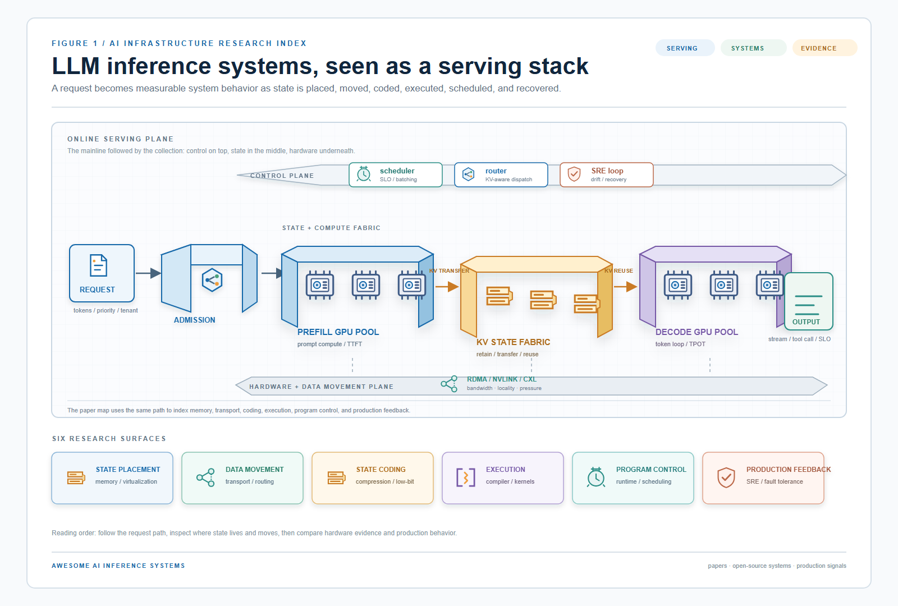

# Awesome AI Inference Systems

<!-- generated from data/papers.jsonl and data/industry.jsonl; do not edit directly -->

    

> **A serving-first research entrance.** Follow the request path from admission to output, then inspect where state lives, how it moves, how kernels execute, and how production systems recover.

A curated, evidence-aware collection of LLM inference serving papers, industrial systems, and open-source AI infrastructure.

## Overview

This repository maps the serving mainline from request state to production operations: memory, transport, execution, runtime scheduling, and reliability.

We prioritize work with system-level mechanisms, real hardware or production evidence, and clear connections to serving ecosystems such as vLLM, SGLang, TensorRT-LLM, Kubernetes, and LMCache.

Out of scope by default: training-only methods, algorithm-only simulations without serving evidence, generic vector databases, and peripheral hardware work without an inference-system connection.

| In scope | Usually excluded unless they directly affect serving |
|---|---|
| LLM serving, KV state, P/D transport, kernels, runtimes, scheduling, SRE, and production infrastructure | Training-only optimization, pure model quality work, generic databases, and hardware papers without an inference path |

## Start Here

| Research entry point | What you get |
|---|---|
| [Paper map](figs/ai-inference-system-map.png) | The six system abstractions and the serving lifecycle in one figure. |
| [Academic papers](papers/README.md) | Formal venues, preprints, legacy imports, and evidence labels kept separate. |
| [Industry systems](industry/README.md) | Runtimes, operators, hardware stacks, transfer layers, and production material. |
| [Machine facts](data/papers.jsonl) | The JSONL records used to regenerate every public view. |

## Contents

| Start here | Purpose |
|---|---|
| [Academic Papers](papers/README.md) | Conference, poster, workshop, preprint, and legacy-import paper records. |
| [Industry & Open-Source Systems](industry/README.md) | Runtimes, operators, hardware stacks, transfer layers, and production material. |
| [System Abstraction Overview](ai-infra-system-abstractions.md) | Cross-collection taxonomy and full system map. |
| [Contribution Guide](CONTRIBUTING.md) | JSONL facts, evidence policy, and generated-view workflow. |

## Coverage

| Papers | Industry systems | Formal paper venues | System abstractions |
|---:|---:|---:|---:|
| 440 | 121 | 216 | 6 |

| Collection | Records | Evidence breakdown |
|---|---:|---|
| Academic papers | 440 | Formal Conference: 61, Formal Conference · Legacy Import: 155, Poster / Workshop: 9, Poster / Workshop · Legacy Import: 28, Preprint: 3, Preprint · Legacy Import: 156, Unclassified · Legacy Import: 28 |
| Industry / open-source systems | 121 | Industrial Material: 2, Industrial Material · Legacy Import: 119 |

## Reading Paths

| Research question | Follow this path |
|---|---|
| **Reduce first-token latency** | P/D disaggregation, KV transfer, prefix reuse ([open](papers/README.md#p-d-disaggregation-kv-transfer)) |
| **Fit longer context** | KV state, offload, compression, and memory tiers ([open](papers/README.md#kv-state-memory)) |
| **Raise decode goodput** | Kernels, compilation, MoE execution, and batching ([open](papers/README.md#kernel-compiler)) |
| **Operate in production** | Runtime policy, SLOs, recovery, and ecosystem bindings ([open](industry/README.md#runtime-serving)) |
| **Deploy beyond CUDA** | AMD, TPU, NPU, Apple, and heterogeneous serving stacks ([open](industry/README.md#hardware-ecosystem)) |

## Taxonomy

| System abstraction | Records | What it covers | Entry points |
|---|---:|---|---|
| **KV State & Memory** | 175 | KV blocks, prefix state, offload, external memory, and memory-aware serving. | [Papers](papers/README.md#kv-state-memory) · [Industry](industry/README.md#kv-state-memory) |
| **P/D Disaggregation & KV Transfer** | 52 | Prefill/decode separation, KV transfer, routing, and distributed transport. | [Papers](papers/README.md#p-d-disaggregation-kv-transfer) · [Industry](industry/README.md#p-d-disaggregation-kv-transfer) |
| **KV Compression & Low-Bit State** | 92 | KV quantization, latent state, sparsity, and quality-cost tradeoffs. | [Papers](papers/README.md#kv-compression-low-bit-state) · [Industry](industry/README.md#kv-compression-low-bit-state) |
| **Kernel & Compiler** | 77 | CUDA, Triton, HIP, attention, GEMM, MoE kernels, and compiler backends. | [Papers](papers/README.md#kernel-compiler) · [Industry](industry/README.md#kernel-compiler) |
| **Runtime & Serving** | 144 | Runtime scheduling, agent graphs, structured generation, and SLO-aware dispatch. | [Papers](papers/README.md#runtime-serving) · [Industry](industry/README.md#runtime-serving) |
| **Reliability & Benchmarks** | 21 | SLOs, drift, recovery, reproducibility, benchmarks, and graceful degradation. | [Papers](papers/README.md#reliability-benchmarks) · [Industry](industry/README.md#reliability-benchmarks) |

## System Map

## Featured Papers

- **[FastServe: Iteration-Level Preemptive Scheduling for Large Language Model Inference](https://www.usenix.org/conference/nsdi26/presentation/wu-bingyang)**
  `NSDI 2026` · `2026` · `Academic paper` · `Formal Conference`
  Tags: `serving` `gpu` `npu` `compiler` `kernel` `agent` `edge` `vllm`
  Large language models (LLMs) power a new generation of interactive AI applications exemplified by ChatGPT. The interactive nature of these applications demands low latency for LLM inference. Existing LLM serving systems use run-tocompletion processing for inference jobs, which suffers from head-of-line blocking and long latency. We present FastServe, a distributed LLM serving system which exploits the autoregressive pattern of LLM inference to enable preemption at the granularity of each output token. FastServe uses preemptive scheduling to minimize latency with a novel skip-join Multi-Level Feedback Queue scheduler. Based on the new semi information-agnostic setting of LLM inference, the scheduler leverages the input length information to assign an appropriate initial queue for each arrival job to join. Queues with higher priority than the one the job joins are skipped to reduce demotions. We design an efficient GPU memory management mechanism that proactively offloads and uploads intermediate state between GPU memory and host memory for LLM inference. Evaluation shows that compared to the state-of-the-art solution vLLM, FastServe improves the throughput by up to 6.1×.
- **[HydraServe: Minimizing Cold Start Latency for Serverless LLM Serving in Public Clouds](https://www.usenix.org/conference/nsdi26/presentation/lou)**
  `NSDI 2026` · `2026` · `Academic paper` · `Formal Conference`
  Tags: `serving` `gpu` `agent` `rag` `latency`
  With the proliferation of large language model (LLM) variants, developers are turning to serverless computing for cost-efficient LLM deployment. However, public cloud providers often struggle to provide performance guarantees for serverless LLM serving due to significant cold start latency caused by substantial model sizes and complex runtime dependencies. To address this problem, we present HydraServe, a serverless LLM serving system designed to minimize cold start latency in public clouds. HydraServe proactively distributes models across servers to quickly fetch them, and overlaps cold-start stages within workers to reduce startup latency. Additionally, HydraServe strategically places workers across GPUs to avoid network contention among cold-start instances. To minimize resource consumption during cold starts, HydraServe further introduces pipeline consolidation that can merge groups of workers into individual serving endpoints. Our comprehensive evaluations under diverse settings demonstrate that HydraServe reduces the cold start latency by 1.7×–4.7× and improves service level objective attainment by 1.43×–1.74× compared to baselines.
- **QoServe: Breaking the Silos of LLM Inference Serving**
  `ASPLOS 2026` · `2026` · `Academic paper` · `Formal Conference`
  Tags: `serving`
  QoServe 统一管理原本割裂的 LLM serving 资源池，以减少不同服务等级和工作负载之间的资源孤岛。
- **[PLA-Serve: A Prefill-Length-Aware LLM Serving System](https://openreview.net/forum?id=dzjCkSEDyG)**
  `MLSys 2026` · `2026` · `Academic paper` · `Formal Conference`
  Tags: `prefill` `serving` `gpu`
  PLA-Serve 将 prefill 长度显式纳入请求分组和批处理决策，减少长短 prompt 混合时的首 token 延迟和 GPU 空闲。
- **[MorphServe: Efficient and Workload-Aware LLM Serving via Runtime Quantized Layer Swapping and KV Cache Resizing](https://openreview.net/pdf?id=1JyePezdlF)**
  `MLSys 2026` · `2026` · `Academic paper` · `Formal Conference`
  Tags: `serving` `compression` `kv-cache`
  MorphServe 在运行时联合调整层级量化换入和 KV cache 大小，使服务配置随负载和内存压力动态变化。
- **[AIRS: Scaling Live Inference in Resource Constrained Environments](https://openreview.net/forum?id=g1RWik4Gy1)**
  `MLSys 2026` · `2026` · `Academic paper` · `Formal Conference`
  Tags: `serving`
  AIRS 面向资源受限的在线推理流水线动态分配加速器与任务优先级，提高多阶段 LLM 评估/预测服务的吞吐和延迟稳定性。
- **[Efficient LLM Serving on Commodity GPU Clusters with Data-Reduced Cross-Instance Orchestration](https://www.usenix.org/conference/osdi26/presentation/du)**
  `OSDI 2026` · `2026` · `Academic paper` · `Formal Conference`
  Tags: `serving` `gpu` `goodput`
  EcoServe uses partially disaggregated macro-instances and adaptive scheduling for commodity GPU clusters; OSDI reports up to 2.51x goodput over representative serving baselines on NVIDIA L20 clusters.
- **SYMPHONY: Enabling Compute-Memory Disaggregation in LLM Serving Systems**
  `NSDI 2026` · `2026` · `Academic paper` · `Formal Conference · Legacy Import`
  Tags: `serving` `kv-cache` `memory`
  SYMPHONY 将计算和 KV cache 存储解耦为 disaggregated memory management layer，以满足多轮会话状态的低延迟访问。

## Featured Industry Systems

- **[Dynamo](https://developer.nvidia.com/blog/introducing-nvidia-dynamo-a-low-latency-distributed-inference-framework-for-scaling-reasoning-ai-models/)**
  `NVIDIA` · `2025` · `Industry / engineering material` · `Industrial Material · Legacy Import`
  Tags: `routing` `serving` `kv-cache`
  分布式/分离式推理框架，组合 disaggregated serving、KV cache-aware routing、KV offloading，并用 NIXL 做低延迟 KV 传输。
- **[NIXL / KV cache transfer](https://docs.nvidia.com/dynamo/archive/0.8.0/backends/trtllm/kv-cache-transfer.html)**
  `NVIDIA` · `2025` · `Industry / engineering material` · `Industrial Material · Legacy Import`
  Tags: `decode` `prefill` `kv-cache`
  面向推理数据移动的传输层，在 prefill/decode 分离时把 KV cache 从 prefill worker 传到 decode worker。
- **[FlashMLA](https://github.com/deepseek-ai/FlashMLA)**
  `DeepSeek` · `2025` · `Industry / engineering material` · `Industrial Material · Legacy Import`
  Tags: `decode` `gpu` `hopper` `kernel` `kv-cache`
  面向 MLA decode 的高性能 kernel，支持 paged KV cache、FP8 KV、Hopper/B200 等 GPU 优化。
- **[vLLM V1 + torch.compile](https://pytorch.org/projects/vllm/)**
  `PyTorch Foundation / vLLM community` · `2025` · `Industry / engineering material` · `Industrial Material · Legacy Import`
  Tags: `prefill` `vllm`
  vLLM 作为 PyTorch Foundation 项目，集成 torch.compile、PagedAttention、prefix caching、chunked prefill 等。
- **[llm-d + LMCache + vLLM](https://research.ibm.com/publications/kv-cache-wins-you-can-feel-building-ai-aware-llm-routing-on-kubernetes)**
  `IBM / Red Hat / llm-d` · `2025` · `Industry / engineering material` · `Industrial Material · Legacy Import`
  Tags: `kubernetes` `llm-d`
  Kubernetes-native distributed LLM inference，把 vLLM、LMCache、Inference Gateway、KV-aware scheduling 组合起来。
- **[LMCache](https://arxiv.org/abs/2510.09665)**
  `LMCache 社区 / 企业采用` · `2025` · `Industry / engineering material` · `Industrial Material · Legacy Import`
  Tags: `gpu` `kv-cache` `rag` `lmcache`
  将 KV cache 抽成独立层，支持跨 engine/query 复用和 GPU/CPU/storage/network 多层编排。

## Evaluation Lens

The collection tracks system behavior beyond isolated token throughput:

| Metric | What to look for |
|---|---|
| **TTFT under Drift** | 首 token 延迟在网络抖动、Spot 切换和基础设施漂移下的恶化边界。 |
| **Generation Stall Rate** | 由验证失败、专家拥塞或 tool-call 挂起造成的生成中断率。 |
| **Numerical Reproducibility** | 混合精度、量化和大规模部署中的数值稳定性与可复现性。 |

## Evidence Policy

Venue status and source type are factual metadata. Technical tags summarize the system surface. Legacy imports are marked explicitly. Internal triage priority is a discovery signal, not a publication-quality ranking.

### Evidence Ladder

| Evidence layer | How it is used |
|---|---|
| **Formal venue** | Conference or journal identity confirmed; publication status is shown as metadata. |
| **Artifact / ecosystem** | A code, runtime, hardware, deployment, or production entry point is linked when available. |
| **Physical evaluation** | Real hardware or end-to-end serving evidence is preferred over algorithm-only simulation. |
| **Legacy import** | Imported during migration and retained for coverage; not an implicit quality ranking. |

## Contributing

Please read [CONTRIBUTING.md](CONTRIBUTING.md) before opening a pull request. Add facts to JSONL and regenerate the Markdown views; do not edit generated tables directly.
