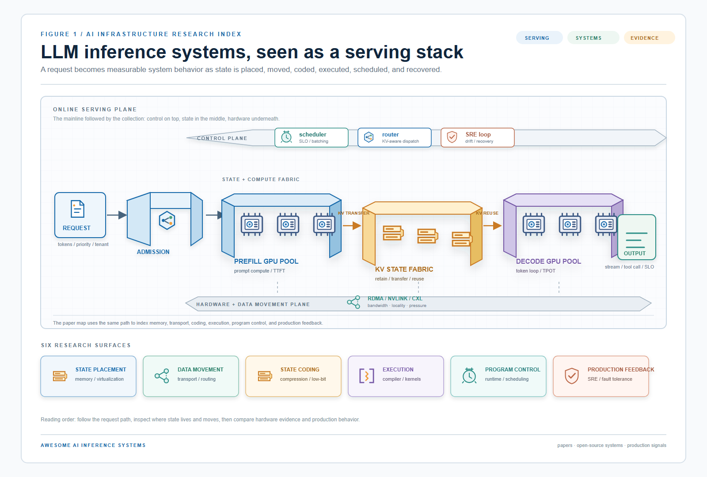

# Awesome AI Inference Systems

<!-- generated from data/papers.jsonl and data/industry.jsonl; do not edit directly -->

    

> **A serving-first research entrance.** Follow the request path from admission to output, then inspect where state lives, how it moves, how kernels execute, and how production systems recover.

A curated, evidence-aware collection of LLM inference serving papers, industrial systems, and open-source AI infrastructure.

## Overview

This repository maps the serving mainline from request state to production operations: memory, transport, execution, runtime scheduling, and reliability. The public reading path follows guide.md and keeps peripheral records in the archive.

We prioritize work with system-level mechanisms, real hardware or production evidence, and clear connections to serving ecosystems such as vLLM, SGLang, TensorRT-LLM, Kubernetes, and LMCache.

Out of scope by default: training-only methods, algorithm-only simulations without serving evidence, generic vector databases, and peripheral hardware work without an inference-system connection.

| In scope | Usually excluded unless they directly affect serving |
|---|---|
| LLM serving, KV state, P/D transport, kernels, runtimes, scheduling, SRE, and production infrastructure | Training-only optimization, pure model quality work, generic databases, and hardware papers without an inference path |

## Start Here

| Research entry point | What you get |
|---|---|
| [Paper map](figs/ai-inference-system-map.png) | The six system abstractions and the serving lifecycle in one figure. |
| [Academic papers](papers/README.md) | Formal venues, preprints, legacy imports, and evidence labels kept separate. |
| [Industry systems](industry/README.md) | Core runtimes, operators, hardware stacks, transfer layers, and production material. |
| [Adjacent / archive](archive/README.md) | Peripheral or lower-priority records retained for audit without occupying the main reading path. |
| [Machine facts](data/papers.jsonl) | The JSONL records used to regenerate every public view. |

## Contents

| Start here | Purpose |
|---|---|
| [Academic Papers](papers/README.md) | Conference, poster, workshop, preprint, and legacy-import paper records. |
| [Industry & Open-Source Systems](industry/README.md) | Core runtimes, operators, hardware stacks, transfer layers, and production material. |
| [Adjacent / Archive](archive/README.md) | Related but non-mainline records, preserved with reasons and links. |
| [System Abstraction Overview](ai-infra-system-abstractions.md) | Cross-collection taxonomy and full system map. |
| [Contribution Guide](CONTRIBUTING.md) | JSONL facts, evidence policy, and generated-view workflow. |

## Coverage

| Papers | Industry systems | Formal paper venues | System abstractions |
|---:|---:|---:|---:|
| 50 | 29 | 46 | 6 |

| Collection | Records | Evidence breakdown |
|---|---:|---|
| Academic papers | 50 | Formal Conference: 26, Formal Conference · Legacy Import: 20, Preprint: 3, Unclassified: 1 |
| Industry / open-source systems | 29 | Industrial Material: 28, Industrial Material · Legacy Import: 1 |

## Reading Paths

| Research question | Follow this path |
|---|---|
| **Reduce first-token latency** | P/D disaggregation, KV transfer, prefix reuse ([open](papers/README.md#p-d-disaggregation-kv-transfer)) |
| **Fit longer context** | KV state, offload, compression, and memory tiers ([open](papers/README.md#kv-state-memory)) |
| **Raise decode goodput** | Kernels, compilation, MoE execution, and batching ([open](papers/README.md#kernel-compiler)) |
| **Operate in production** | Runtime policy, SLOs, recovery, and ecosystem bindings ([open](industry/README.md#runtime-serving)) |
| **Deploy beyond CUDA** | AMD, TPU, NPU, Apple, and heterogeneous serving stacks ([open](industry/README.md#hardware-ecosystem)) |

## Taxonomy

| System abstraction | Records | What it covers | Entry points |
|---|---:|---|---|
| **KV State & Memory** | 22 | KV blocks, prefix state, offload, external memory, and memory-aware serving. | [Papers](papers/README.md#kv-state-memory) · [Industry](industry/README.md#kv-state-memory) |
| **P/D Disaggregation & KV Transfer** | 9 | Prefill/decode separation, KV transfer, routing, and distributed transport. | [Papers](papers/README.md#p-d-disaggregation-kv-transfer) · [Industry](industry/README.md#p-d-disaggregation-kv-transfer) |
| **KV Compression & Low-Bit State** | 21 | KV quantization, latent state, sparsity, and quality-cost tradeoffs. | [Papers](papers/README.md#kv-compression-low-bit-state) · [Industry](industry/README.md#kv-compression-low-bit-state) |
| **Kernel & Compiler** | 15 | CUDA, Triton, HIP, attention, GEMM, MoE kernels, and compiler backends. | [Papers](papers/README.md#kernel-compiler) · [Industry](industry/README.md#kernel-compiler) |
| **Runtime & Serving** | 10 | Runtime scheduling, agent graphs, structured generation, and SLO-aware dispatch. | [Papers](papers/README.md#runtime-serving) · [Industry](industry/README.md#runtime-serving) |
| **Reliability & Benchmarks** | 2 | SLOs, drift, recovery, reproducibility, benchmarks, and graceful degradation. | [Papers](papers/README.md#reliability-benchmarks) · [Industry](industry/README.md#reliability-benchmarks) |

## System Map

## Featured Papers

- **[FastServe: Iteration-Level Preemptive Scheduling for Large Language Model Inference](https://www.usenix.org/conference/nsdi26/presentation/wu-bingyang)**
  `NSDI 2026` · `2026` · `Academic paper` · `Formal Conference` · `Reading priority: frontier`
  Tags: `serving` `gpu` `npu` `compiler` `kernel` `agent` `edge` `vllm`
  Artifact: [source](https://www.usenix.org/system/files/nsdi26-wu-bingyang.pdf)
  以输出 token 为粒度实现可抢占的分布式 LLM serving，提出 skip-join 多级反馈队列，并主动在 GPU/主机内存间搬运中间状态；官方 NSDI 2026 页面报告相对 vLLM 吞吐最高提升 6.1 倍。
- **BOute: Cost-Efficient LLM Serving with Heterogeneous LLMs and GPUs via Multi-Objective Bayesian Optimization**
  `MLSys 2026` · `2026` · `Academic paper` · `Formal Conference · Legacy Import` · `Reading priority: frontier`
  Tags: `serving` `gpu`
  BOute 用多目标贝叶斯优化在异构模型和 GPU 组合中选择 serving 配置，联合降低成本并满足质量和延迟目标。
- **[FlashInfer: Efficient and Customizable Attention Engine for LLM Inference Serving](https://proceedings.mlsys.org/paper_files/paper/2025/hash/dbf02b21d77409a2db30e56866a8ab3a-Abstract-Conference.html)**
  `MLSys 2025` · `2025` · `Academic paper` · `Formal Conference` · `Reading priority: foundation`
  Tags: `serving` `kernel`
  Artifact: [source](https://github.com/flashinfer-ai/flashinfer)
  FlashInfer 用 block-sparse/composable KV format、JIT attention template 和 load-balanced scheduling 提供 serving-oriented kernel。
- **[vAttention: Dynamic Memory Management for Serving LLMs without PagedAttention](https://arxiv.org/abs/2405.04437)**
  `ASPLOS 2025` · `2025` · `Academic paper` · `Formal Conference` · `Reading priority: foundation`
  Tags: `serving` `cuda` `kernel` `memory`
  Artifact: [source](https://github.com/microsoft/vattention)
  vAttention 通过 CUDA virtual memory 保留连续虚拟 KV layout，同时按需分配物理页，避免重写 attention kernel。
- **[DistServe: Disaggregating Prefill and Decoding for Goodput-optimized Large Language Model Serving](https://www.usenix.org/conference/osdi24/presentation/zhong-yinmin)**
  `OSDI 2024` · `2024` · `Academic paper` · `Formal Conference` · `Reading priority: foundation`
  Tags: `decode` `prefill` `gpu` `goodput` `tpot`
  Artifact: [source](https://github.com/LLMServe/DistServe)
  DistServe 将 prefill 和 decode 放到不同 GPU 上，并按 TTFT/TPOT 约束联合优化资源与并行策略。
- **[Llumnix: Dynamic Scheduling for Large Language Model Serving](https://www.usenix.org/conference/osdi24/presentation/sun-biao)**
  `OSDI 2024` · `2024` · `Academic paper` · `Formal Conference` · `Reading priority: foundation`
  Tags: `serving`
  Artifact: [source](https://github.com/AlibabaPAI/llumnix)
  Llumnix 通过请求及其 KV 状态的 live migration，在多实例间动态重调度以改善尾延迟、隔离和负载均衡。
- **[Medusa: Simple LLM Inference Acceleration Framework with Multiple Decoding Heads](https://proceedings.mlr.press/v235/cai24b.html)**
  `ICML 2024` · `2024` · `Academic paper` · `Formal Conference` · `Reading priority: foundation`
  Tags: `kv-cache`
  Artifact: [source](https://github.com/FasterDecoding/Medusa)
  Medusa 在目标模型上添加多个 decoding heads，无需独立 draft model 即可并行预测和验证多个未来 token。
- **[Efficient Memory Management for Large Language Model Serving with PagedAttention](https://arxiv.org/abs/2309.06180)**
  `SOSP 2023` · `2023` · `Academic paper` · `Formal Conference` · `Reading priority: foundation`
  Tags: `serving` `kv-cache` `memory` `vllm`
  Artifact: [source](https://github.com/vllm-project/vllm)
  vLLM/PagedAttention 用块式虚拟内存管理 KV cache，显著减少碎片并支持 beam search、parallel sampling 和前缀共享。

## Featured Industry Systems

- **[vLLM V1 + torch.compile](https://pytorch.org/projects/vllm/)**
  `PyTorch Foundation / vLLM community` · `2025` · `Industry / engineering material` · `Industrial Material` · `Reading priority: foundation`
  Tags: `prefill` `vllm`
  vLLM 作为 PyTorch Foundation 项目，集成 torch.compile、PagedAttention、prefix caching、chunked prefill 等。
- **[Dynamo KVBM](https://docs.dynamo.nvidia.com/dynamo/components/kvbm)**
  `NVIDIA` · `2026` · `Industry / engineering material` · `Industrial Material` · `Reading priority: frontier`
  Tags: `memory` `tensorrt-llm` `vllm`
  KVBM 作为统一 KV block memory layer，支持 vLLM/TensorRT-LLM 的远端共享、offload 和 write-through cache。
- **[ROCm + vLLM/SGLang/TensorRT-LLM ecosystem](https://rocm.docs.amd.com/)**
  `AMD` · `2024` · `Industry / engineering material` · `Industrial Material` · `Reading priority: foundation`
  Tags: `amd` `gpu` `kernel` `sglang` `tensorrt-llm`
  通过 ROCm/HIP、Composable Kernel、Triton 和主流 runtime 支持 MI300/MI350 推理，核心竞争点是大 HBM 容量和开放集群。
- **[SGLang 商业化](https://github.com/sgl-project/sglang)**
  `SGLang maintainers / RadixArk` · `2026` · `Industry / engineering material` · `Industrial Material` · `Reading priority: foundation`
  Tags: `sglang`
  围绕 RadixAttention、KV 复用和结构化生成提供企业化支持，显示 KV-aware runtime 正成为可独立商业化的软件层。
- **[PagedAttention + FlexAttention / FMS](https://arxiv.org/abs/2506.07311)**
  `IBM Research` · `2025` · `Industry / engineering material` · `Industrial Material` · `Reading priority: foundation`
  在 IBM Foundation Model Stack 中把 PagedAttention 与 FlexAttention 融合，处理 scattered KV gather。
- **[FlashInfer kernel ecosystem](https://github.com/flashinfer-ai/flashinfer)**
  `FlashInfer community / NVIDIA` · `2024` · `Industry / engineering material` · `Industrial Material` · `Reading priority: foundation`
  Tags: `decode` `prefill` `kernel` `rag` `sglang` `vllm`
  Milestones: [FlashInfer production integration](https://proceedings.mlsys.org/paper_files/paper/2025/hash/dbf02b21d77409a2db30e56866a8ab3a-Abstract-Conference.html)
  针对 paged/ragged KV、decode、prefill、speculative tree 和 MLA 提供可组合 kernel，并集成 vLLM、SGLang 等 runtime。

## Evaluation Lens

The collection tracks system behavior beyond isolated token throughput:

| Metric | What to look for |
|---|---|
| **TTFT under Drift** | 首 token 延迟在网络抖动、Spot 切换和基础设施漂移下的恶化边界。 |
| **Generation Stall Rate** | 由验证失败、专家拥塞或 tool-call 挂起造成的生成中断率。 |
| **Numerical Reproducibility** | 混合精度、量化和大规模部署中的数值稳定性与可复现性。 |

## Evidence Policy

Venue status and source type are factual metadata. Technical tags summarize the system surface. Legacy imports are marked explicitly. Internal triage priority is a discovery signal, not a publication-quality ranking.

### Evidence Ladder

| Evidence layer | How it is used |
|---|---|
| **Formal venue** | Conference or journal identity confirmed; publication status is shown as metadata. |
| **Artifact / ecosystem** | A code, runtime, hardware, deployment, or production entry point is linked when available. |
| **Physical evaluation** | Real hardware or end-to-end serving evidence is preferred over algorithm-only simulation. |
| **Legacy import** | Imported during migration and retained for coverage; not an implicit quality ranking. |

## Contributing

Please read [CONTRIBUTING.md](CONTRIBUTING.md) before opening a pull request. Add facts to JSONL and regenerate the Markdown views; do not edit generated tables directly.
