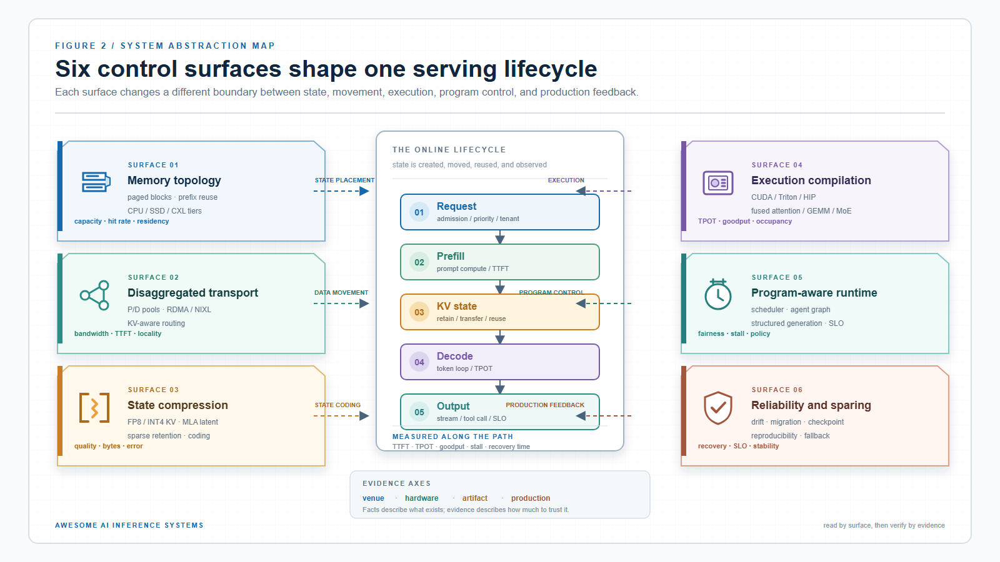

# AI Inference Papers

<!-- generated from data/papers.jsonl and data/industry.jsonl; do not edit directly -->

[Home](../README.md) · [System taxonomy](../ai-infra-system-abstractions.md) · [Industry systems](../industry/README.md)

A complete academic paper collection organized by serving-system abstraction. Formal venues, posters/workshops, preprints, and legacy imports are labeled separately.

> **How to read this page.** Start with the featured entry points, then use the abstraction sections to compare mechanism, artifact, hardware, and serving evidence.

## At a Glance

| Records | Formal venue | With artifact | Tagged records |
|---:|---:|---:|---:|
| 432 | 178 | 0 | 400 |

## Collection Navigation

- [KV State & Memory](#kv-state-memory) (135)
- [P/D Disaggregation & KV Transfer](#p-d-disaggregation-kv-transfer) (39)
- [KV Compression & Low-Bit State](#kv-compression-low-bit-state) (66)
- [Kernel & Compiler](#kernel-compiler) (52)
- [Runtime & Serving](#runtime-serving) (124)
- [Reliability & Benchmarks](#reliability-benchmarks) (16)

## Evidence and Selection

Evidence labels describe the source material. Featured entries are editorial entry points, not a publication-quality ranking.

| Field | Reading rule |
|---|---|
| Venue / channel | What kind of source it is, not a quality score. |
| Technical tags | Searchable system surface; tags may be incomplete for legacy imports. |
| Artifact | A linked implementation, documentation page, or deployment entry point. |
| Featured | A small editorial starting set; all records remain below. |

## Resource List

### KV State & Memory (135)

KV blocks, prefix state, offload, external memory, and memory-aware serving.

#### Featured

- **Featured:** **[FastServe: Iteration-Level Preemptive Scheduling for Large Language Model Inference](https://www.usenix.org/conference/nsdi26/presentation/wu-bingyang)**
  `NSDI 2026` · `2026` · `Academic paper` · `Formal Conference`
  Tags: `serving` `gpu` `npu` `compiler` `kernel` `agent` `edge` `vllm`
  Large language models (LLMs) power a new generation of interactive AI applications exemplified by ChatGPT. The interactive nature of these applications demands low latency for LLM inference. Existing LLM serving systems use run-tocompletion processing for inference jobs, which suffers from head-of-line blocking and long latency. We present FastServe, a distributed LLM serving system which exploits the autoregressive pattern of LLM inference to enable preemption at the granularity of each output token. FastServe uses preemptive scheduling to minimize latency with a novel skip-join Multi-Level Feedback Queue scheduler. Based on the new semi information-agnostic setting of LLM inference, the scheduler leverages the input length information to assign an appropriate initial queue for each arrival job to join. Queues with higher priority than the one the job joins are skipped to reduce demotions. We design an efficient GPU memory management mechanism that proactively offloads and uploads intermediate state between GPU memory and host memory for LLM inference. Evaluation shows that compared to the state-of-the-art solution vLLM, FastServe improves the throughput by up to 6.1×.
#### Full Resource List

- **[DroidSpeak: KV Cache Sharing Across Fine-tuned Model Variants](https://www.usenix.org/conference/nsdi26/presentation/liu-yuhan)**
  `NSDI 2026` · `2026` · `Academic paper` · `Formal Conference`
  Tags: `prefill` `serving` `npu` `kv-cache` `agent` `edge` `throughput`
  Compound AI systems, such as agentic systems, are an emerging trend in large-scale enterprise settings, with multiple LLMs specialized for different users, tasks, and/or roles working together. In these scenarios, different models often process inputs that share the same context prefix. Although much work was done in the past to enable the reuse of prefix KV caches across inputs for a single model, how to enable one model to reuse the prefix KV caches of a different model remains an open question. We introduce DroidSpeak, the first distributed LLM inference system that enables KV cache reuse across distributed nodes running inference of different LLMs, so long as the LLMs have the same architecture. We present the first study that aims at understanding the impact of sharing KV caches across different LLMs, and if/when such sharing affects quality. Inspired by the findings, we present DroidSpeak, which selectively recomputes a few layers of the KV cache produced by another LLM and reuses the remaining layers, with negligible quality loss. Moreover, carefully pipelining the layer-wise re-computation and the loading of reused KV cache further improves the inference performance. Experiments on diverse datasets and model pairs demonstrate that DroidSpeak achieves up to 4x throughput improvement and about 3.1× faster prefill (time to first token), with negligible loss of quality in F1 scores, Rouge-L or code similarity score, compared to the baseline which does not allow any sharing across models.
- **A Cost-Effective Near-Storage Processing Solution for Offline Inference of Long-Context LLMs**
  `ASPLOS 2026` · `2026` · `Academic paper` · `Formal Conference · Legacy Import`
  Tags: `long-context` `rag`
  该工作把长上下文离线推理的数据密集部分下沉到近存储处理器，降低主机内存和 I/O 成本。
- **A Queueing-Theoretic Framework for Stability Analysis of LLM Inference with KV Cache Memory Constraints**
  `ICML 2026` · `2026` · `Academic paper` · `Formal Conference · Legacy Import`
  Tags: `kv-cache` `memory`
  该工作把计算和 KV cache 显存同时纳入排队稳定性分析，给出 LLM inference 系统何时会因内存约束失稳的理论条件。
- **AgenticCache: Cache-Driven Asynchronous Planning for Embodied AI Agents**
  `MLSys 2026` · `2026` · `Academic paper` · `Formal Conference · Legacy Import`
  Tags: `serving` `agent` `rag`
  AgenticCache 用缓存命中和状态复用驱动 embodied agent 的异步规划，减少重复上下文构造和工具调用等待。
- **BlendServe: Optimizing Offline Inference with Resource-Aware Batching**
  `ASPLOS 2026` · `2026` · `Academic paper` · `Formal Conference · Legacy Import`
  BlendServe 用 resource-aware prefix tree 维持 prefix sharing，并将计算密集和带宽密集请求混合执行。
- **Cache What Lasts: Token Retention for Memory-Bounded KV Cache in LLMs**
  `ICLR 2026` · `2026` · `Academic paper` · `Formal Conference · Legacy Import`
  Tags: `kv-cache` `memory`
  TRIM-KV 在 token 生成时预测长期保留价值，并随时间衰减以在固定内存预算下保留最有用的 KV。
- **ContextPilot: Fast Long-Context Inference via Context Reuse**
  `MLSys 2026` · `2026` · `Academic paper` · `Formal Conference · Legacy Import`
  Tags: `prefill` `long-context`
  ContextPilot 识别可复用上下文片段并规划复用路径，把长上下文请求转化为更少的 prefill 和 cache 恢复操作。
- **ECHO: Efficient KV Cache Offloading with Lossless Prefetching for Serving Native Sparse Attention LLMs**
  `OSDI 2026` · `2026` · `Academic paper` · `Formal Conference · Legacy Import`
  Tags: `serving` `kv-cache`
  ECHO 面向原生稀疏注意力模型做无损 KV 预取和 offload，使长上下文解码只把将被访问的 cache 及时拉回。
- **FlexiCache: Leveraging Temporal Stability of Attention Heads for Efficient KV Cache Management**
  `MLSys 2026` · `2026` · `Academic paper` · `Formal Conference · Legacy Import`
  Tags: `kv-cache` `rag`
  FlexiCache 利用 attention head 重要性的时间稳定性动态管理 KV cache，减少长上下文生成中不必要的保留和加载。
- **Hippocampus: An Efficient and Scalable Memory Module for Agentic AI**
  `MLSys 2026` · `2026` · `Academic paper` · `Formal Conference · Legacy Import`
  Tags: `serving` `memory` `agent` `rag`
  Hippocampus 为 agentic AI 提供可扩展长期记忆模块，替代纯向量库或图遍历导致的高延迟记忆访问。
- **Inference in the Shadows: Taming Memory Bandwidth Contention in Mobile LLM Inference with Sereno**
  `OSDI 2026` · `2026` · `Academic paper` · `Formal Conference · Legacy Import`
  Tags: `memory`
  Sereno 针对移动端 LLM 推理中的内存带宽竞争设计缓解机制，降低本地部署在共享移动平台上的推理干扰。
- **LMCache: An Efficient KV Cache Layer for Enterprise-Scale LLM Inference**
  `MLSys 2026` · `2026` · `Academic paper` · `Formal Conference · Legacy Import`
  Tags: `kv-cache` `lmcache`
  LMCache 将 KV cache 抽象为独立可复用层，支持跨请求、跨 engine、跨存储层的 KV offload、传输和复用。
- **Libra: Flexible Request Partitioning and Scheduling for Serving Unbalanced and Dynamic LLM Workloads**
  `NSDI 2026` · `2026` · `Academic paper` · `Formal Conference · Legacy Import`
  Tags: `serving`
  Libra 在任意 token 边界把请求拆为 micro-requests，以全局/局部两级调度和 chunked KV transfer 平衡动态负载。
- **MoE-APEX: An Efficient MoE Inference System with Adaptive Precision Expert Offloading**
  `ASPLOS 2026` · `2026` · `Academic paper` · `Formal Conference · Legacy Import`
  Tags: `moe`
  MoE-APEX 根据 expert 热度和执行需求自适应选择精度与卸载方式，缓解 MoE 权重容量和传输瓶颈。
- **No Buffer, No Bottleneck: Efficient Zero-Copy KV Cache Offloading for Long-Context LLMs**
  `OSDI 2026` · `2026` · `Academic paper` · `Formal Conference · Legacy Import`
  Tags: `gpu` `kv-cache` `long-context`
  该工作用 zero-copy KV offloading 移除长上下文服务中的中间缓冲和额外拷贝，降低 GPU 与主机存储间的 cache 搬运瓶颈。
- **OPKV: A High-Throughput Plugin-Driven Framework for Recallable Sparsity in Paged KV Cache Systems**
  `MLSys 2026` · `2026` · `Academic paper` · `Formal Conference · Legacy Import`
  Tags: `serving` `kv-cache` `throughput`
  OPKV 为 paged KV cache 提供可插拔稀疏召回框架，使不同稀疏策略能在高吞吐 serving runtime 中复用同一数据通路。
- **Ontology-Guided Long-Term Memory for Conversational RAG**
  `MLSys 2026` · `2026` · `Academic paper` · `Formal Conference · Legacy Import`
  Tags: `serving` `memory` `agent` `rag`
  该工作用 ontology 组织 conversational RAG 的长期记忆，使检索、更新和上下文装配更适合长会话与跨轮知识复用。
- **OpenTela**
  `OSDI 2026` · `2026` · `Academic paper` · `Formal Conference · Legacy Import`
  Tags: `serving` `gpu`
  LLMFabric 把去中心化 HPC 集群统一成异构 LLM serving 资源池，在不同网络和 GPU 条件下协调模型部署与请求路由。
- **Ouroboros: Wafer-Scale SRAM CIM with Token-Grained Pipelining for Large Language Model Inference**
  `ASPLOS 2026` · `2026` · `Academic paper` · `Formal Conference · Legacy Import`
  Tags: `memory`
  Ouroboros 以 wafer-scale SRAM compute-in-memory 和 token-grained pipeline 加速大模型推理。
- **RAGBoost: Efficient Retrieval-Augmented Generation with Accuracy-Preserving Context Reuse**
  `MLSys 2026` · `2026` · `Academic paper` · `Formal Conference · Legacy Import`
  Tags: `prefill` `serving` `rag`
  RAGBoost 检测并复用 RAG 请求间重叠检索片段的上下文计算，通过索引、排序和去重减少重复 prefill。
- **REPA: Reconfigurable PIM for the Joint Acceleration of KV Cache Offloading and Processing**
  `ASPLOS 2026` · `2026` · `Academic paper` · `Formal Conference · Legacy Import`
  Tags: `kv-cache`
  REPA 用可重构 PIM 同时加速 KV cache 的卸载传输与就地处理，减少长上下文推理的数据移动。
- **RaidServe: High-performance Resilient Serving**
  `MLSys 2026` · `2026` · `Academic paper` · `Formal Conference · Legacy Import`
  Tags: `serving` `gpu`
  RaidServe 针对 tensor-parallel LLM serving 的单 GPU 故障设计冗余和恢复路径，减少故障后的 KV 复制和模型重载停顿。
- **Simple is Better: Multiplication May Be All You Need for LLM Request Scheduling**
  `OSDI 2026` · `2026` · `Academic paper` · `Formal Conference · Legacy Import`
  Tags: `decode` `prefill`
  该工作用更简单的乘法式请求调度指标协调排队、prefill/decode 负载和 KV 压力，避免过度复杂的在线策略。
- **SkipKV: Selective Skipping of KV Generation and Storage for Efficient Inference with Large Reasoning Models**
  `MLSys 2026` · `2026` · `Academic paper` · `Formal Conference · Legacy Import`
  Tags: `kv-cache` `rag`
  SkipKV 在大推理模型中跳过部分不关键 KV 的生成与存储，减少长 CoT 输出带来的线性 cache 增长。
- **Strata**
  `OSDI 2026` · `2026` · `Academic paper` · `Formal Conference · Legacy Import`
  Tags: `prefill` `serving` `long-context`
  Contextra 构建分层 context cache，在长上下文服务中按复用粒度和存储层级管理 KV 状态，减少重复 prefill 和远端加载。
- **Stream2LLM: Overlap Context Streaming and Prefill for Reduced Time-to-First-Token**
  `MLSys 2026` · `2026` · `Academic paper` · `Formal Conference · Legacy Import`
  Tags: `prefill`
  Stream2LLM 将上下文流式加载与 prefill 计算重叠，把长 prompt 的数据到达时间隐藏到首 token 前的执行流水中。
- **SuperInfer: SLO-Aware Rotary Scheduling and Memory Management for LLM Inference on Superchips**
  `MLSys 2026` · `2026` · `Academic paper` · `Formal Conference · Legacy Import`
  Tags: `memory` `slo`
  SuperInfer 面向 GH200 的 NVLink-C2C 设计请求轮转调度和全双工 KV 搬运，缓解高负载下的 HOL blocking。
- **Towards High-Goodput LLM Serving with Prefill-decode Multiplexing**
  `ASPLOS 2026` · `2026` · `Academic paper` · `Formal Conference · Legacy Import`
  Tags: `decode` `prefill` `gpu` `goodput` `slo`
  MuxWise 在单 GPU 内对 prefill/decode 进行多路复用，并结合估计器和 SLO 调度提升 goodput。
- **Context Parallelism for Scalable Million-Token Inference**
  `MLSys 2025` · `2025` · `Academic paper` · `Formal Conference · Legacy Import`
  Tags: `decode` `prefill`
  该工作用 pass-KV/pass-Q 两种精确 ring attention 在 128 张 H100 上扩展百万 token prefill 和 persistent-KV decode。
- **Efficient LLM Inference using Dynamic Input Pruning and Cache-Aware Masking**
  `MLSys 2025` · `2025` · `Academic paper` · `Formal Conference · Legacy Import`
  Tags: `npu`
  该工作用 predictor-free 动态输入剪枝和 cache-aware masking 减少移动端 SwiGLU 模型的 DRAM 流量。
- **Fast State Restoration in LLM Serving with HCache**
  `EuroSys 2025` · `2025` · `Academic paper` · `Formal Conference · Legacy Import`
  Tags: `prefill` `serving`
  HCache 缓存并恢复模型服务的中间状态，降低实例迁移、抢占或恢复后的重复 prefill 成本。
- **FlexInfer: Flexible LLM Inference with CPU Computations**
  `MLSys 2025` · `2025` · `Academic paper` · `Formal Conference · Legacy Import`
  Tags: `decode` `prefill` `gpu`
  FlexInfer 根据硬件、序列长度和 batch 为 prefill/decode 分别选择 CPU-GPU 执行策略，降低单 GPU offload 延迟。
- **IC-Cache: Efficient Large Language Model Serving via In-context Caching**
  `SOSP 2025` · `2025` · `Academic paper` · `Formal Conference · Legacy Import`
  Tags: `prefill` `serving` `agent` `rag`
  IC-Cache 缓存并组合可复用的 in-context computation，减少 few-shot、RAG 和 agent prompt 的重复 prefill。
- **Jenga: Effective Memory Management for Serving LLM with Heterogeneity**
  `SOSP 2025` · `2025` · `Academic paper` · `Formal Conference · Legacy Import`
  Tags: `serving` `memory`
  Jenga 在不同容量、带宽和互连的设备间联合管理权重与 KV，适配异构 serving 集群。
- **LServe: Efficient Long-sequence LLM Serving with Unified Sparse Attention**
  `MLSys 2025` · `2025` · `Academic paper` · `Formal Conference · Legacy Import`
  Tags: `decode` `prefill`
  LServe 将 prefill 与 decode 的硬件友好结构化稀疏统一起来，以 streaming heads 和层次 KV page selection 加速长序列服务。
- **NEO: Saving GPU Memory Crisis with CPU Offloading for Online LLM Inference**
  `MLSys 2025` · `2025` · `Academic paper` · `Formal Conference · Legacy Import`
  Tags: `gpu` `memory`
  NEO 将部分 attention 计算和 KV 状态卸载到 CPU，并以非对称 GPU-CPU 流水和负载感知调度扩大在线 batch。
- **NanoFlow: Towards Optimal Large Language Model Serving Throughput**
  `OSDI 2025` · `2025` · `Academic paper` · `Formal Conference · Legacy Import`
  Tags: `serving` `gpu` `memory` `throughput`
  NanoFlow 将请求拆成 operation-level nano-batches，并在单 GPU 内重叠 compute、memory 和 network 资源。
- **SOLA: Optimizing SLO Attainment for Large Language Model Serving with State-Aware Scheduling**
  `MLSys 2025` · `2025` · `Academic paper` · `Formal Conference · Legacy Import`
  Tags: `serving` `slo` `tpot`
  SOLA 在每次迭代感知请求状态和系统状态，动态平衡 TTFT、TPOT 及请求间公平性。
- **SampleAttention: Near-Lossless Acceleration of Long Context LLM Inference with Adaptive Structured Sparse Attention**
  `MLSys 2025` · `2025` · `Academic paper` · `Formal Conference · Legacy Import`
  Tags: `long-context`
  SampleAttention 用 CRA 指标和两阶段 query-guided 结构化筛选，为不同 head 和输入动态选择最低必要稀疏度。
- **Seesaw: High-throughput LLM Inference via Model Re-sharding**
  `MLSys 2025` · `2025` · `Academic paper` · `Formal Conference · Legacy Import`
  Tags: `decode` `prefill` `throughput`
  Seesaw 在 prefill/decode 阶段间动态重分片模型，并用分层 KV buffer 和 transition-aware scheduling 控制切换成本。
- **Stateful Large Language Model Serving with Pensieve**
  `EuroSys 2025` · `2025` · `Academic paper` · `Formal Conference · Legacy Import`
  Tags: `serving`
  Pensieve 将会话 KV 和请求状态作为一等资源，在多轮 LLM 服务中联合管理迁移、复用和调度。
- **Cost-Efficient Large Language Model Serving for Multi-turn Conversations with CachedAttention**
  `USENIX ATC 2024` · `2024` · `Academic paper` · `Formal Conference · Legacy Import`
  Tags: `serving` `kv-cache` `scheduler` `agent` `rag` `ttft`
  CachedAttention 维护分层 KV cache，并用 layer-wise preload、异步保存和 scheduler-aware 淘汰降低多轮会话 TTFT。
- **InfiniGen: Efficient Generative Inference of Large Language Models with Dynamic KV Cache Management**
  `OSDI 2024` · `2024` · `Academic paper` · `Formal Conference · Legacy Import`
  Tags: `kv-cache` `memory`
  InfiniGen 用少量 rehearsal 预测下一层重要 KV，仅从 host memory 预取必要状态以加速 offloaded inference。
- **Llumnix: Dynamic Scheduling for Large Language Model Serving**
  `OSDI 2024` · `2024` · `Academic paper` · `Formal Conference · Legacy Import`
  Tags: `serving`
  Llumnix 通过请求及其 KV 状态的 live migration，在多实例间动态重调度以改善尾延迟、隔离和负载均衡。
- **Prompt Cache: Modular Attention Reuse for Low-Latency Inference**
  `MLSys 2024` · `2024` · `Academic paper` · `Formal Conference · Legacy Import`
  Tags: `latency` `ttft`
  Prompt Cache 用显式 prompt module schema 预计算并复用非连续文本模块的 attention state，降低长提示 TTFT。
- **Efficient Memory Management for Large Language Model Serving with PagedAttention**
  `SOSP 2023` · `2023` · `Academic paper` · `Formal Conference · Legacy Import`
  Tags: `serving` `kv-cache` `memory` `vllm`
  vLLM/PagedAttention 用块式虚拟内存管理 KV cache，显著减少碎片并支持 beam search、parallel sampling 和前缀共享。
- **FlexGen: High-Throughput Generative Inference of Large Language Models with a Single GPU**
  `ICML 2023` · `2023` · `Academic paper` · `Formal Conference · Legacy Import`
  Tags: `gpu` `kv-cache` `throughput`
  FlexGen 用线性规划在 GPU、CPU 和磁盘间放置权重、激活和 KV cache，使单张消费级 GPU 也能做高吞吐超大模型离线推理。
- **AdaCache: Adaptive Caching and Context Augmentation for Efficient LLM Serving**
  `ICLR 2026 Poster` · `2026` · `Academic paper` · `Poster / Workshop · Legacy Import`
  Tags: `prefill` `serving` `agent` `rag`
  AdaCache 针对 RAG 中高频检索片段做自适应缓存和上下文增强，减少重复处理长输入带来的 prefill 开销。
- **Beyond Scattered Acceptance: Fast and Coherent Inference for DLMs via Longest Stable Prefixes**
  `ICLR 2026 Poster` · `2026` · `Academic paper` · `Poster / Workshop · Legacy Import`
  Tags: `scheduler`
  LSP scheduler 只提交最长稳定前缀，把 DLM 的 scattered acceptance 转成连续 KV append 和逐步收缩的 active suffix。
- **Beyond Speedup - Utilizing KV Cache for Sampling and Reasoning**
  `ICLR 2026 Poster` · `2026` · `Academic paper` · `Poster / Workshop · Legacy Import`
  Tags: `kv-cache`
  该工作把 KV cache 从单纯加速结构扩展为采样和 reasoning-time reuse 的状态载体，探索更高层次的推理复用。
- **DefensiveKV: Taming the Fragility of KV Cache Eviction in LLM Inference**
  `ICLR 2026 Poster` · `2026` · `Academic paper` · `Poster / Workshop · Legacy Import`
  Tags: `kv-cache` `rag`
  DefensiveKV 分析基于注意力稳定性的 KV 淘汰脆弱性，并引入更稳健的保留策略降低长上下文质量崩溃风险。
- **DualMap: Enabling Both Cache Affinity and Load Balancing for Distributed LLM Serving**
  `ICLR 2026 Poster` · `2026` · `Academic paper` · `Poster / Workshop · Legacy Import`
  Tags: `serving`
  DualMap 同时考虑 prefix cache affinity 和实例负载均衡，缓解分布式 LLM serving 中复用率与尾延迟的冲突。
- **Efficient LLM Serving for Agentic Workflows with Context-Aware State Management**
  `EuroSys 2026 poster` · `2026` · `Academic paper` · `Poster / Workshop · Legacy Import`
  Tags: `prefill` `serving` `agent` `rag`
  该工作针对 agent 多轮调用中的可复用上下文和中间状态设计 context-aware 管理机制，减少重复 prefill 与状态搬运。
- **FreeKV: Boosting KV Cache Retrieval for Efficient LLM Inference**
  `ICLR 2026 Poster` · `2026` · `Academic paper` · `Poster / Workshop · Legacy Import`
  Tags: `kv-cache`
  FreeKV 改进长上下文 KV cache 检索策略，在保持生成质量的同时减少需要常驻或加载的 cache 条目。
- **ICaRus: Identical Cache Reuse for Efficient Multi-Model Inference**
  `ICLR 2026 Poster` · `2026` · `Academic paper` · `Poster / Workshop · Legacy Import`
  Tags: `kv-cache` `agent`
  ICaRus 让同架构任务模型共享相同 prompt 的 KV cache，仅在必要层重算差异，降低多模型 agent 场景的重复状态成本。
- **IceCache: Memory-efficient KV-cache Management for Long-Sequence LLMs**
  `ICLR 2026 Poster` · `2026` · `Academic paper` · `Poster / Workshop · Legacy Import`
  Tags: `kv-cache` `memory`
  IceCache 为长序列 LLM 推理设计更省内存的 KV 管理策略，在有限显存下扩大可服务上下文和并发。
- **LookaheadKV: Fast and Accurate KV Cache Eviction by Glimpsing into the Future without Generation**
  `ICLR 2026 Poster` · `2026` · `Academic paper` · `Poster / Workshop · Legacy Import`
  Tags: `kv-cache`
  LookaheadKV 用轻量 lookahead tokens 和 LoRA 模块预测未来注意力分布，在无需草稿生成的情况下指导 KV 淘汰。
- **LouisKV: Efficient KV Cache Retrieval for Long Input-Output Sequences**
  `ICLR 2026 Poster` · `2026` · `Academic paper` · `Poster / Workshop · Legacy Import`
  Tags: `decode` `npu` `tpu` `kv-cache`
  LouisKV 面向长输入长输出请求改进 KV cache 检索，减少 decode 过程中对完整历史 cache 的无差别访问。
- **ProtoKV: Long-context Knowledges Are Already Well-Organized Before Your Query**
  `ICLR 2026 Poster` · `2026` · `Academic paper` · `Poster / Workshop · Legacy Import`
  Tags: `kv-cache` `edge` `long-context`
  ProtoKV 将语义锚点 token 和位置决定 token 分开聚类压缩，在保留语义完整性的同时降低长上下文 KV cache 占用。
- **QuoKA: Query-Oriented KV Selection for Efficient LLM Prefill**
  `ICLR 2026 Poster` · `2026` · `Academic paper` · `Poster / Workshop · Legacy Import`
  Tags: `prefill`
  QuoKA 在 prefill 阶段按 query 选择关键 KV 子集，降低长输入处理中的 attention 计算和 cache 写入。
- **ReST-KV: Robust KV Cache Eviction with Layer-wise Output Reconstruction and Spatial-Temporal Smoothing**
  `ICLR 2026 Poster` · `2026` · `Academic paper` · `Poster / Workshop · Legacy Import`
  Tags: `tpu` `kv-cache`
  ReST-KV 通过逐层输出重构和时空平滑修正 token 删除后的注意力重分布，使 KV eviction 更适合长序列生成。
- **Reasoning Language Model Inference Serving Unveiled: An Empirical Study**
  `ICLR 2026 Poster` · `2026` · `Academic paper` · `Poster / Workshop · Legacy Import`
  Tags: `serving`
  该实证研究刻画 reasoning LLM 在长输出、KV 增长和请求完成时间上的 serving 行为，为调度和容量规划提供基线。
- **Universal Model Routing for Efficient LLM Inference**
  `ICLR 2026 Poster` · `2026` · `Academic paper` · `Poster / Workshop · Legacy Import`
  Tags: `routing`
  该工作把模型表示成基于代表性 prompt 的特征向量，使 router 能在测试时把请求分配给未见过的新模型以降低推理成本。
- **AdaptCache: KV Cache Native Storage Hierarchy for Low-Delay and High-Quality Language Model Serving**
  `SOSP 2025 BigMem Workshop` · `2025` · `Academic paper` · `Poster / Workshop · Legacy Import`
  Tags: `serving` `kv-cache` `rag`
  AdaptCache 为每个 KV entry 联合选择有损压缩算法、压缩率和 DRAM/SSD 放置，在质量约束下提高 DRAM 命中并降低恢复延迟。
- **Agent-Assisted Side-Channel Attacks on Non-Prefix KV Cache in RAG**
  `arXiv 预印本, 2026` · `2026` · `Research record` · `Preprint · Legacy Import`
  Tags: `kv-cache` `agent` `rag` `lmcache` `vllm`
  该工作分析 RAG 中非前缀 KV cache 的侧信道风险，展示 agent 辅助攻击可从 vLLM/LMCache 类复用路径恢复敏感上下文。
- **Agentic AI Workload Characteristics**
  `arXiv 预印本, 2026` · `2026` · `Research record` · `Preprint · Legacy Import`
  Tags: `decode` `serving` `agent` `rag`
  该工作用端到端 tracing 刻画 ReAct 类 agent workload，指出有效上下文缓存会让执行转向 decode-dominated 且依赖长寿命 KV 状态。
- **Beyond Prediction: Tail-Aware Scheduling for LLM Inference**
  `arXiv 预印本, 2026` · `2026` · `Research record` · `Preprint · Legacy Import`
  Tags: `serving` `ttft`
  Beyond Prediction 用分布感知而非长度预测的调度与 cache-aware preemption 联合优化在线 LLM serving 的 TTFT 和尾延迟。
- **Bifrost: Hybrid TEE-FHE Inference for Privacy-Preserving Transformer and LLM Serving**
  `arXiv 预印本, 2026` · `2026` · `Research record` · `Preprint · Legacy Import`
  Tags: `serving`
  Bifrost 将线性层密文卸载到加速器、把非线性与 KV 状态更新留在 CPU TEE 中，构建 TEE 加 FHE 的混合隐私推理路径。
- **CATS: Cascaded Adaptive Tree Speculation for Memory-Limited LLM Inference Acceleration**
  `arXiv 预印本, 2026` · `2026` · `Research record` · `Preprint · Legacy Import`
  Tags: `memory`
  CATS 在显存受限场景下自适应选择 tree speculation 结构和草稿深度，减少推测解码额外 KV 与验证开销。
- **CacheFlow: Efficient LLM Serving with 3D-Parallel KV Cache Restoration**
  `arXiv 预印本, 2026` · `2026` · `Research record` · `Preprint · Legacy Import`
  Tags: `serving` `gpu` `kv-cache` `scheduler`
  CacheFlow 将 KV 恢复重构为 token、layer、GPU 三维并行，并以 batch-aware scheduler 联合分配重算和 I/O。
- **Can I Buy Your KV Cache?**
  `arXiv 预印本, 2026` · `2026` · `Research record` · `Preprint · Legacy Import`
  Tags: `prefill` `kv-cache`
  该工作把热门文档的预填充 KV 视作可交易的 provider-side 资产，用服务端复用替代重复 prefill。
- **Communication-Efficient Verifiable Attention for LLM Inference**
  `arXiv 预印本, 2026` · `2026` · `Research record` · `Preprint · Legacy Import`
  Tags: `decode` `prefill` `gpu`
  VeriAttn 用 TEE 验证、GPU 执行 attention，并按 prefill/decode 两阶段减少验证与 KV 传输开销。
- **ConSA: Controllable Sparsity in Hybrid Attention via Learnable Allocation**
  `arXiv 预印本, 2026` · `2026` · `Research record` · `Preprint · Legacy Import`
  Tags: `kv-cache`
  ConSA 通过可学习的 FA/SWA 分配和稀疏度约束，为混合注意力模型学习层级或 KV-head 级的推理友好稀疏布局。
- **Coordinated Scheduling for MoE LLM Serving**
  `arXiv 预印本, 2026` · `2026` · `Research record` · `Preprint · Legacy Import`
  Tags: `prefill` `serving` `moe`
  Gimbal 联合前端 DP-engine 调度与后端 expert 放置，按 KV 压力、prefill 余量和 expert 热点协调 MoE serving。
- **Dual Dimensionality for Local and Global Attention**
  `arXiv 预印本, 2026` · `2026` · `Research record` · `Preprint · Legacy Import`
  Tags: `kv-cache`
  Dual Dimensionality 用近邻 token 全维、远距 token 低维的 DAR 表示降低长程 KV 容量，同时保持局部预测精度。
- **Fine-Tuning and Serving Gemma 4 31B on Google Cloud TPU: A Technical Comparison with GPU Baselines**
  `arXiv 预印本, 2026` · `2026` · `Research record` · `Preprint · Legacy Import`
  Tags: `serving` `gpu` `tpu` `vllm`
  该工作给出从 JAX/Tunix 微调到 vLLM-TPU serving 的完整路径，并在统一配置下比较 TPU 与 H100 的成本和延迟。
- **Forget Without Compromise: Nexus Sampling for Streaming KV-Cache Eviction Under Fixed Budgets**
  `arXiv 预印本, 2026` · `2026` · `Research record` · `Preprint · Legacy Import`
  Tags: `kv-cache`
  Nexus Sampling 面向固定预算下的流式 KV eviction，用采样式保留机制维持长上下文质量并控制 cache 增长。
- **Functional Cache Grafting: Robust and Rapid Code-Policy Synthesis for Embodied Agents**
  `arXiv 预印本, 2026` · `2026` · `Research record` · `Preprint · Legacy Import`
  Tags: `prefill` `serving` `kv-cache` `agent` `rag`
  FCGraft 复用函数级代码骨架及其 KV cache，通过 stitching 和 patching 减少 embodied agent 代码策略生成中的重复 prefill。
- **Geometry-Aware Online Scheduling for LLM Serving: From Theoretical Bound to System Practice**
  `arXiv 预印本, 2026` · `2026` · `Research record` · `Preprint · Legacy Import`
  Tags: `serving` `vllm`
  该工作提出按 KV 占用几何体积增长而非仅按时长排序的 SVF/1-bit SVF 在线调度，并将其作为 vLLM 可插拔层降低平均与尾部时延。
- **Grouped Query Experts: Mixture-of-Experts on GQA Self-Attention**
  `arXiv 预印本, 2026` · `2026` · `Research record` · `Preprint · Legacy Import`
  Tags: `routing` `kv-cache` `moe`
  GQE 在 grouped-query attention 内只对 query head 做 expert routing，保留 GQA 的 KV cache 优势，同时减少长上下文 attention 的活跃计算。
- **HYPIC: Accelerating Hybrid-Attention LLM Serving with Position-Independent Caching**
  `arXiv 预印本, 2026` · `2026` · `Research record` · `Preprint · Legacy Import`
  Tags: `prefill` `serving`
  HYPIC 为 hybrid-attention LLM 引入 segment-cumulative transition cache、boundary seam recomputation 和跨实例 cache-miss prefill 并行化，使 PIC 可用于长上下文 serving。
- **KAIROS: Stateful, Context-Aware Power-Efficient Agentic Inference Serving**
  `arXiv 预印本, 2026` · `2026` · `Research record` · `Preprint · Legacy Import`
  Tags: `serving` `gpu` `agent` `rag`
  KAIROS 以 agent 上下文为控制信号，联合调节 GPU 频率、并发度与跨实例放置，在避免 thrashing 的前提下降低 agentic serving 功耗。
- **KEEP: A KV-Cache-Centric Memory Management System for Efficient Embodied Planning**
  `arXiv 预印本, 2026` · `2026` · `Research record` · `Preprint · Legacy Import`
  Tags: `prefill` `kv-cache` `memory`
  KEEP 面向 embodied planning，将静态/动态记忆分组、multi-hop 重算和分层加载结合，减少长程记忆 prompt 的重复 prefill。
- **KV Cache Optimization Strategies for Scalable and Efficient LLM Inference**
  `arXiv 综述, 2026` · `2026` · `Research record` · `Preprint · Legacy Import`
  Tags: `kv-cache`
  该综述从淘汰、压缩、混合内存、新注意力和组合策略五条路线比较 KV 优化，并映射到七类部署场景。
- **KVEraser: Learning to Steer KV Cache for Efficient Localized Context Erasing**
  `arXiv 预印本, 2026` · `2026` · `Research record` · `Preprint · Legacy Import`
  Tags: `kv-cache`
  KVEraser 用学习式 steering state 只改被删除跨度的 KV 区间，在不重算整段 suffix 的前提下做局部上下文擦除。
- **MemExplorer: Navigating the Heterogeneous Memory Design Space for Agentic Inference NPUs**
  `arXiv 预印本, 2026` · `2026` · `Research record` · `Preprint · Legacy Import`
  Tags: `decode` `prefill` `npu` `memory` `agent`
  MemExplorer 联合搜索异构 NPU 与多级内存配置，在 agentic inference 的 prefill/decode 场景下平衡吞吐与功耗。
- **MiniPIC: Flexible Position-Independent Caching in <100LOC**
  `arXiv 预印本, 2026` · `2026` · `Research record` · `Preprint · Legacy Import`
  Tags: `vllm`
  MiniPIC 在 vLLM 中以未旋转 K cache 和少量用户侧 primitive 实现位置无关缓存，并与 CPU offload 共存。
- **Models Take Notes at Prefill: KV Cache Can Be Editable and Composable**
  `arXiv 预印本, 2026` · `2026` · `Research record` · `Preprint · Legacy Import`
  Tags: `prefill` `kv-cache`
  该工作把 KV cache 视作可编辑、可组合的“笔记本”，支持附加勘误与 RoPE 重定位拼接来复用预填充结果。
- **ORBITFLOW: SLO-Aware Long-Context LLM Serving with Fine-Grained KV Cache Reconfiguration**
  `arXiv 预印本, 2026` · `2026` · `Research record` · `Preprint · Legacy Import`
  Tags: `serving` `gpu` `kv-cache` `long-context` `slo`
  ORBITFLOW 以轻量 ILP 按请求和层动态决定 GPU/CPU KV 放置，并根据运行反馈重配置以控制尾延迟。
- **Pythia: Exploiting Workflow Predictability for Efficient Agent-Native LLM Serving**
  `arXiv 预印本, 2026` · `2026` · `Research record` · `Preprint · Legacy Import`
  Tags: `serving` `agent`
  Pythia 在 serving 层显式编码多 agent workflow 语义，用可预测拓扑结构改善 prefix cache、扩缩容与长上下文调度。
- **RTP-LLM: High-Performance Alibaba LLM Inference Engine**
  `arXiv 预印本, 2026` · `2026` · `Research record` · `Preprint · Legacy Import`
  RTP-LLM 汇总阿里生产推理栈中的快速加载、PD 分离、分层 KV、推测解码、量化和多模态解耦能力。
- **ReMP: Low-Downtime Runtime Model-Parallelism Reconfiguration for LLM Serving**
  `arXiv 预印本, 2026` · `2026` · `Research record` · `Preprint · Legacy Import`
  Tags: `serving`
  ReMP 将模型并行拓扑与运行时状态解耦，并用二维 KV 迁移在 TP/PP 重配置时尽量保留可复用缓存。
- **Recency/Frequency Adaptive KV Caching for Large Language Model Serving**
  `arXiv 预印本, 2026` · `2026` · `Research record` · `Preprint · Legacy Import`
  Tags: `serving` `kv-cache`
  该工作把 recency 和 frequency 信号合并为 KV cache 淘汰/保留策略，在多轮和长上下文 serving 中减少低价值 cache 占用。
- **SPIN: Unifying Sparse Attention with Hierarchical Memory for Scalable Long-Context LLM Serving**
  `arXiv 预印本, 2026` · `2026` · `Research record` · `Preprint · Legacy Import`
  Tags: `serving` `gpu` `memory` `long-context`
  SPIN 用统一 page-based partition、locality-aware KV manager 和分层元数据把 sparse attention 与 CPU/GPU 分层 KV 存储协同起来。
- **Service-Induced Congestion in Memory-Constrained LLM Serving**
  `arXiv 预印本, 2026` · `2026` · `Research record` · `Preprint · Legacy Import`
  Tags: `serving` `kv-cache` `memory`
  该工作把持续增长的 KV memory pressure 建模为服务自身诱发的拥塞过程，并分析 eviction-free 平衡与极限环失稳。
- **SwiftCache: Efficient LLM Serving for Multi-turn Conversations with Heterogeneous KV Cache Sharing**
  `arXiv 预印本, 2026` · `2026` · `Research record` · `Preprint · Legacy Import`
  Tags: `prefill` `serving` `kv-cache`
  SwiftCache 在异构会话间共享 KV cache 并协调多轮对话的缓存放置与复用，降低重复 prefill 和内存占用。
- **Tangram: Unlocking Non-Uniform KV Cache for Efficient Multi-turn LLM Serving**
  `arXiv 预印本, 2026` · `2026` · `Research record` · `Preprint · Legacy Import`
  Tags: `serving` `kv-cache` `agent` `rag`
  Tangram 以确定性 head 预算、Head Group Page 和 AOT 负载均衡，把非均匀 KV 压缩转化为可高效执行的 serving layout。
- **TetherCache: Stabilizing Autoregressive Long-Form Video Generation with Gated Recall and Trusted Alignment**
  `arXiv 预印本, 2026` · `2026` · `Research record` · `Preprint · Legacy Import`
  Tags: `serving` `agent` `rag`
  TetherCache 为长视频生成维护 gated recall cache 和 trusted alignment，减少长程生成中的上下文漂移和重复计算。
- **TurboServe: Serving Streaming Video Generation Efficiently and Economically**
  `arXiv 预印本, 2026` · `2026` · `Research record` · `Preprint · Legacy Import`
  Tags: `serving` `gpu` `video`
  TurboServe 为流式视频生成设计在线放置与 GPU provisioning，并结合 chunk batching、offload 与 GPU-GPU 迁移降低时延与成本。
- **Tutti: Making SSD-Backed KV Cache Practical for Long-Context LLM Serving**
  `arXiv 预印本, 2026` · `2026` · `Research record` · `Preprint · Legacy Import`
  Tags: `serving` `gpu` `kv-cache` `long-context`
  Tutti 构建 GPU-centric KV object store、GPU io_uring 和 slack-aware I/O 调度，使 SSD-backed KV 恢复绕开 CPU 控制瓶颈。
- **VeriCache: Turning Lossy KV Cache into Lossless LLM Inference**
  `arXiv 预印本, 2026` · `2026` · `Research record` · `Preprint · Legacy Import`
  Tags: `kv-cache`
  VeriCache 用压缩 KV 起草、完整 KV 验证，并重叠 HBM 解码与 PCIe/网络换入，保证输出与 full-KV 完全一致。
- **WANSpec: Leveraging Global Compute Capacity for LLM Inference**
  `arXiv 预印本, 2026` · `2026` · `Research record` · `Preprint · Legacy Import`
  Tags: `rag`
  WANSpec 将 speculative draft 分发到低负载区域或本地算力，并用冗余控制广域网抖动带来的延迟风险。
- **AccelGen: Heterogeneous SLO-Guaranteed High-Throughput LLM Inference Serving for Diverse Applications**
  `arXiv 预印本, 2025` · `2025` · `Research record` · `Preprint · Legacy Import`
  Tags: `serving` `agent` `rag` `slo` `throughput`
  AccelGen 用动态 chunk、iteration SLO 优先级和 compute/KV 双资源感知 batching 服务长短 prompt 与不同延迟约束。
- **AlayaDB: The Data Foundation for Efficient and Effective Long-context LLM Inference**
  `arXiv 预印本, 2025` · `2025` · `Research record` · `Preprint · Legacy Import`
  Tags: `kv-cache` `long-context`
  AlayaDB 将 KV cache、稀疏 attention 与查询优化封装为向量数据库，把长上下文推理转化为数据系统查询规划问题。
- **Apt-Serve: Adaptive Request Scheduling on Hybrid Cache for Scalable LLM Inference Serving**
  `arXiv 预印本, 2025` · `2025` · `Research record` · `Preprint · Legacy Import`
  Tags: `serving` `kv-cache` `goodput` `ttft`
  Apt-Serve 将 KV cache 与更省内存的 hidden cache 组合，并动态优化 batch composition 以扩大并发和 TTFT goodput。
- **DuoServe-MoE: Dual-Phase Expert Prefetch and Cache Scheduling for Efficient MoE LLM Inference**
  `arXiv 预印本, 2025` · `2025` · `Research record` · `Preprint · Legacy Import`
  Tags: `decode` `prefill` `moe`
  DuoServe-MoE 为 prefill 和 decode 设计不同 expert prefetch/cache 策略，以较小显存运行大型 MoE。
- **FailSafe: High-performance Resilient Serving**
  `arXiv 预印本, 2025` · `2025` · `Research record` · `Preprint · Legacy Import`
  Tags: `serving` `gpu`
  FailSafe 用循环 KV 放置、混合 attention、负载路由和主动 KV 备份，使 tensor-parallel serving 在 GPU 故障后继续运行。
- **Medha: Efficient LLM Inference on Multi-Million Context Lengths Without Approximation**
  `arXiv 预印本, 2025` · `2025` · `Research record` · `Preprint · Legacy Import`
  Tags: `prefill` `kv-cache`
  Medha 通过 adaptive prefill chunking、sequence pipeline parallelism 和 KV-cache parallelism 支撑千万 token 级精确长上下文推理。
- **NeuronMM: High-Performance Matrix Multiplication for LLM Inference on AWS Trainium**
  `arXiv 预印本, 2025` · `2025` · `Research record` · `Preprint · Legacy Import`
  NeuronMM 针对 Trainium 的 systolic array、SRAM 和数据布局设计 fused/cached matmul，加速端到端 LLM inference。
- **Online Scheduling for LLM Inference with KV Cache Constraints**
  `arXiv 预印本, 2025` · `2025` · `Research record` · `Preprint · Legacy Import`
  Tags: `kv-cache`
  该工作将 KV cache 容量约束纳入 online scheduling 理论，分析 batching、延迟与 hindsight optimal 的竞争关系。
- **Serve Programs, Not Prompts**
  `arXiv 预印本, 2025` · `2025` · `Research record` · `Preprint · Legacy Import`
  Tags: `serving` `agent` `rag`
  该工作提出 LLM Inference Program 和 Symphony OS，将 token prediction、KV 文件系统及工具执行变成服务端可调度程序。
- **Tokencake: A KV-Cache-centric Serving Framework for LLM-based Multi-Agent Applications**
  `arXiv 预印本, 2025` · `2025` · `Research record` · `Preprint · Legacy Import`
  Tags: `serving` `kv-cache` `agent` `stall`
  Tokencake 针对 tool-call stall 和 agent 优先级联合做 KV 空间隔离、主动 offload 与预测 upload。
- **Hydragen: High-Throughput LLM Inference with Shared Prefixes**
  `arXiv 预印本, 2024` · `2024` · `Research record` · `Preprint · Legacy Import`
  Tags: `rag` `throughput`
  Hydragen 将共享前缀与独有后缀的 attention 分开计算，把共享部分转成更高效的矩阵运算并扩展到树状前缀。
- **LoongServe: Efficiently Serving Long-Context Large Language Models with Elastic Sequence Parallelism**
  `arXiv 预印本, 2024` · `2024` · `Research record` · `Preprint · Legacy Import`
  Tags: `serving` `long-context`
  LoongServe 用弹性 sequence parallelism 按请求和阶段实时改变并行度，降低长短请求混合下的 KV 迁移和资源浪费。
- **Preble: Efficient Distributed Prompt Scheduling for LLM Serving**
  `arXiv 预印本, 2024` · `2024` · `Research record` · `Preprint · Legacy Import`
  Tags: `serving`
  Preble 在分布式集群中联合优化共享前缀 KV 复用和计算负载均衡，并用分层调度处理 prompt locality。
- **The CAP Principle for LLM Serving: A Survey of Long-Context Large Language Model Serving**
  `arXiv 综述, 2024` · `2024` · `Research record` · `Preprint · Legacy Import`
  Tags: `serving` `long-context`
  该综述以 Context length、Accuracy、Performance 三目标冲突组织长上下文 serving，并强调用户感知指标定义。
- **Accelerating Model Loading in LLM Inference by Programmable Page Cache**
  `FAST 2026` · `2026` · `Research record` · `Unclassified · Legacy Import`
  PPC 提供非侵入可编程 page-cache 策略，MAIO 再以 I/O template、XPU affinity 和局部性优化模型加载。
- **Bidaw: Enhancing Key-Value Caching for Interactive LLM Serving via Bidirectional Computation-Storage Awareness**
  `FAST 2026` · `2026` · `Research record` · `Unclassified · Legacy Import`
  Tags: `serving` `rag`
  Bidaw 让计算调度感知 KV 加载延迟，并让两级存储利用模型响应预测访问与淘汰，提高多轮会话 KV 命中。
- **CacheSlide: Unlocking Cross Position-Aware KV Cache Reuse for Accelerating LLM Serving**
  `FAST 2026` · `2026` · `Research record` · `Unclassified · Legacy Import`
  Tags: `serving` `kv-cache` `agent`
  CacheSlide 针对 agent prompt 中相对位置稳定的片段设计 RPDC、位置校正和 layer-wise spill-aware KV 复用。
- **CoX-MoE: Coalesced Expert Execution for High-Throughput MoE Inference with AMX-Enabled CPU-GPU Co-Execution**
  `DAC 2026` · `2026` · `Research record` · `Unclassified · Legacy Import`
  Tags: `gpu` `moe` `throughput`
  CoX-MoE 用合并式 expert 执行、静态 expert 分层与选择性 attention offload 协调 CPU-GPU 协作，避免 micro-batch 导致的 MoE 推理低效。
- **RetroInfer: A Vector Storage Engine for Scalable Long-Context LLM Inference**
  `PVLDB 19(5), 2026` · `2026` · `Research record` · `Unclassified · Legacy Import`
  Tags: `gpu` `kv-cache` `long-context` `rag`
  RetroInfer 把 KV cache 看作向量存储系统，用 attention-aware index 和 GPU-CPU buffer manager 支撑百万 token 级稀疏召回。
- **SolidAttention: Low-Latency SSD-based Serving on Memory-Constrained PCs**
  `FAST 2026` · `2026` · `Research record` · `Unclassified · Legacy Import`
  Tags: `serving` `memory` `latency`
  SolidAttention 以动态稀疏注意力、SSD KV 分块和推测预取，在内存受限 PC 上支撑长上下文本地推理。
- **ByteScale: Communication-Efficient Scaling of LLM Training with a 2048K Context Length on 16384 GPUs**
  `SIGCOMM 2025` · `2025` · `Research record` · `Unclassified · Legacy Import`
  Tags: `prefill` `training` `gpu`
  ByteScale 为超长上下文训练优化并行、通信与负载均衡，其集群网络机制可迁移到大规模 prefill。
- **Cache-Craft: Managing Chunk-Caches for Efficient Retrieval-Augmented Generation**
  `PACMMOD / SIGMOD 2025` · `2025` · `Research record` · `Unclassified · Legacy Import`
  Tags: `prefill` `npu` `kv-cache` `rag`
  Cache-Craft 管理 RAG 中可复用的 chunk KV cache，并通过少量重计算修正位置影响以减少重复 prefill。
- **FACIL: Flexible DRAM Address Mapping for SoC-PIM Cooperative On-device LLM Inference**
  `HPCA 2025` · `2025` · `Research record` · `Unclassified · Legacy Import`
  FACIL 动态调整 DRAM 地址映射，使 SoC 与 PIM 在端侧 LLM 不同阶段间高效协作。
- **InstAttention: In-Storage Attention Offloading for Cost-Effective Long-Context LLM Inference**
  `HPCA 2025` · `2025` · `Research record` · `Unclassified · Legacy Import`
  Tags: `long-context` `rag`
  InstAttention 将长上下文 attention 的部分 KV 访问和计算下沉到存储设备，以低成本容量替代全量 HBM 常驻。
- **Lincoln: Real-Time 50~100B LLM Inference on Consumer Devices with LPDDR-Interfaced, Compute-Enabled Flash Memory**
  `HPCA 2025` · `2025` · `Research record` · `Unclassified · Legacy Import`
  Tags: `memory`
  Lincoln 用 LPDDR 接口连接具备计算能力的 flash，使消费设备能够流式执行 50B 到 100B 级模型。
- **Make LLM Inference Affordable to Everyone: Augmenting GPU Memory with NDP-DIMM**
  `HPCA 2025` · `2025` · `Research record` · `Unclassified · Legacy Import`
  Tags: `gpu` `memory`
  NDP-DIMM 用带近数据处理能力的 DIMM 扩展 GPU 可用模型容量，并减少经 PCIe 搬运全部权重的开销。
- **MaverIQ: Fingerprint-Guided Extrapolation and Fragmentation-Aware Layering for Intent-Based LLM Serving**
  `SC 2025` · `2025` · `Research record` · `Unclassified · Legacy Import`
  Tags: `serving` `rag`
  MaverIQ 用 workload fingerprint 预测资源需求，并以碎片感知的分层配置实现 intent-based serving。
- **Oneiros: KV Cache Optimization through Parameter Remapping for Multi-tenant LLM Serving**
  `SoCC 2025` · `2025` · `Research record` · `Unclassified · Legacy Import`
  Tags: `serving` `kv-cache`
  Oneiros 通过参数重映射提高不同 tenant 间 KV cache 的兼容和复用能力。
- **Pimba: A Processing-in-Memory Acceleration for Post-Transformer Large Language Model Serving**
  `MICRO 2025` · `2025` · `Research record` · `Unclassified · Legacy Import`
  Tags: `serving` `memory`
  Pimba 用共享 state-update processing unit 和 MX 低精度算术支持 SSM、线性注意力及 Transformer 服务。
- **RefreshKV: Updating Small KV Cache During Long-form Generation**
  `ACL 2025 Long Papers` · `2025` · `Research record` · `Unclassified · Legacy Import`
  Tags: `kv-cache`
  RefreshKV 在长文本生成中交替执行全量注意力和小 KV cache 注意力，动态刷新保留 token 以改善长生成质量。
- **Rethinking Web Cache Design for the AI Era**
  `SoCC 2025` · `2025` · `Research record` · `Unclassified · Legacy Import`
  Tags: `serving` `agent` `rag`
  该工作重新审视 AI agent 与生成内容对传统 Web cache 的对象、更新和一致性语义。
- **Splitwise: Efficient Generative LLM Inference Using Phase Splitting**
  `ISCA 2024` · `2024` · `Research record` · `Unclassified · Legacy Import`
  Splitwise 将 prompt computation 与 token generation 部署到不同机器池，在吞吐、成本和功耗之间做阶段化资源优化。

### P/D Disaggregation & KV Transfer (39)

Prefill/decode separation, KV transfer, routing, and distributed transport.

#### Featured

- **Featured:** **SYMPHONY: Enabling Compute-Memory Disaggregation in LLM Serving Systems**
  `NSDI 2026` · `2026` · `Academic paper` · `Formal Conference · Legacy Import`
  Tags: `serving` `kv-cache` `memory`
  SYMPHONY 将计算和 KV cache 存储解耦为 disaggregated memory management layer，以满足多轮会话状态的低延迟访问。
- **Featured:** **SwiftEP: Accelerating MoE Inference with Buffer Fusion and TMA Offloading**
  `NSDI 2026` · `2026` · `Academic paper` · `Formal Conference · Legacy Import`
  Tags: `cuda` `rdma` `moe`
  SwiftEP 用 buffer fusion 消除 MoE all-to-all staging copy，并以 TMA、RDMA scatter-gather 和 CUDA IPC 提高链路利用率。
- **Featured:** **TPLA: Tensor Parallel Latent Attention for Efficient Disaggregated Prefill & Decode Inference**
  `ASPLOS 2026` · `2026` · `Academic paper` · `Formal Conference · Legacy Import`
  Tags: `decode` `prefill`
  TPLA 将 latent attention 与 tensor parallel 结合，降低 PD 分离推理中的 KV 和跨卡通信压力。
#### Full Resource List

- **Beyond the Buzz: A Pragmatic Take on Inference Disaggregation**
  `MLSys 2026` · `2026` · `Academic paper` · `Formal Conference · Legacy Import`
  Tags: `rag`
  该文系统分析分离式推理在真实规模下的设计空间，指出动态速率匹配和弹性扩缩容对 Pareto 最优性能很关键。
- **MSCCL++: Rethinking GPU Communication Abstractions for AI Inference**
  `ASPLOS 2026` · `2026` · `Academic paper` · `Formal Conference · Legacy Import`
  Tags: `gpu`
  MSCCL++ 以可编程通信抽象和优化 collective 支撑 tensor/expert parallel 与分离式 AI inference。
- **RDMA Point-to-Point Communication for LLM Systems**
  `MLSys 2026` · `2026` · `Academic paper` · `Formal Conference · Legacy Import`
  Tags: `routing` `serving` `rdma` `moe`
  TransferEngine 为分离式推理、MoE routing 和 RL 权重更新提供可移植 RDMA 点到点通信接口，避免 serving runtime 绑定单一 NIC 栈。
- **TriInfer: Hybrid EPD Disaggregation for Efficient Multimodal Large Language Model Inference**
  `MLSys 2026` · `2026` · `Academic paper` · `Formal Conference · Legacy Import`
  Tags: `decode` `prefill` `multimodal`
  TriInfer 将 encode、prefill 和 decode 混合分离并按多模态阶段调度，减少 MLLM serving 中阶段异质性造成的资源浪费。
- **UEP: Portable Expert-Parallel Communication**
  `OSDI 2026` · `2026` · `Academic paper` · `Formal Conference · Legacy Import`
  Tags: `serving` `amd` `moe`
  UEP 提供可移植 expert-parallel 通信层，降低 MoE serving 中专家并行对特定 collective 和网络栈的绑定。
- **HexGen-2: Disaggregated Generative Inference of LLMs in Heterogeneous Environment**
  `ICLR 2025` · `2025` · `Academic paper` · `Formal Conference · Legacy Import`
  Tags: `gpu`
  HexGen-2 在异构 GPU 集群上联合优化资源分配、并行策略和跨阶段 KV 传输以降低成本。
- **DistServe: Disaggregating Prefill and Decoding for Goodput-optimized Large Language Model Serving**
  `OSDI 2024` · `2024` · `Academic paper` · `Formal Conference · Legacy Import`
  Tags: `decode` `prefill` `gpu` `goodput` `tpot`
  DistServe 将 prefill 和 decode 放到不同 GPU 上，并按 TTFT/TPOT 约束联合优化资源与并行策略。
- **Semantic Parallelism: Redefining Efficient MoE Inference via Model-Data Co-Scheduling**
  `ICLR 2026 Poster` · `2026` · `Academic paper` · `Poster / Workshop · Legacy Import`
  Tags: `moe`
  Semantic Parallelism 将 token 语义聚类和 expert 放置协同调度，减少 MoE expert parallel 中昂贵的跨设备 all-to-all。
- **CrossPool: Efficient Multi-LLM Serving for Cold MoE Models through KV-Cache and Weight Disaggregation**
  `arXiv 预印本, 2026` · `2026` · `Research record` · `Preprint · Legacy Import`
  Tags: `serving` `kv-cache` `moe`
  CrossPool 面向冷门 MoE 模型服务，把 KV cache 和权重分别做池化/分离管理，降低多模型长尾部署的显存常驻成本。
- **ELDR: Expert-Locality-Aware Decode Routing for PD-Disaggregated MoE Serving**
  `arXiv 预印本, 2026` · `2026` · `Research record` · `Preprint · Legacy Import`
  Tags: `decode` `prefill` `moe` `routing`
  ELDR 根据 prefill expert activation 构建 expert signature，并用 locality-band routing 把请求发往 expert locality 更好的 decode worker，降低 PD 分离式 MoE serving 的 decode 延迟。
- **Efficient Multi-round LLM Inference over Disaggregated Serving**
  `arXiv 预印本, 2026` · `2026` · `Research record` · `Preprint · Legacy Import`
  Tags: `prefill` `serving` `agent` `rag`
  AMPD 面向多轮 agent/RAG 工作流，在 PD 分离式服务中自适应协调增量 prefill 和阶段部署。
- **HBM Is Not All You Need: Efficient Disaggregated LLM Serving across Memory-heterogeneous Accelerators**
  `arXiv 预印本, 2026` · `2026` · `Research record` · `Preprint · Legacy Import`
  Tags: `decode` `prefill` `gpu` `memory` `quantization`
  HMA-Serve 将 GDDR 加速器用于 prefill、HBM GPU 用于 decode，并通过 phase-wise quantization、compute-transfer overlap 和 deferred dequantization 支撑跨厂商异构 PD serving。
- **ITME: Inference Tiered Memory Expansion with Disaggregated CXL-Hybrid Memories**
  `arXiv 预印本, 2026` · `2026` · `Research record` · `Preprint · Legacy Import`
  Tags: `cxl` `memory`
  ITME 用 CXL 混合远端内存把 TB 级共享上下文层做成字节寻址扩展，并主动分层搬运权重与 prefix cache。
- **InfiniLoRA: Disaggregated Multi-LoRA Serving for Large Language Models**
  `arXiv 预印本, 2026` · `2026` · `Research record` · `Preprint · Legacy Import`
  Tags: `serving` `kernel` `moe`
  InfiniLoRA 将 LoRA execution 从 base-model inference 解耦，通过共享 LoRA server 和专用 kernel 扩展 MoE/大 rank adapter 服务。
- **Observation, Not Prediction: Conversation-Level Disaggregated Scheduling for Agentic Serving**
  `arXiv 预印本, 2026` · `2026` · `Research record` · `Preprint · Legacy Import`
  Tags: `decode` `serving` `agent`
  ConServe 将调度单位从单 turn 提升到整段 conversation，用首轮输入长度和 KV 占用等可观测量替代 decode-side 预测。
- **SAC: Disaggregated KV Cache System for Sparse Attention LLMs with CXL**
  `arXiv 预印本, 2026` · `2026` · `Research record` · `Preprint · Legacy Import`
  Tags: `cxl` `gpu` `kv-cache`
  SAC 将稀疏注意力 LLM 的冷 KV cache 下沉到 CXL 内存池，并用访问预测和批量迁移降低 GPU 显存压力。
- **The Price of Anarchy in Disaggregated Inference**
  `arXiv 预印本, 2026` · `2026` · `Research record` · `Preprint · Legacy Import`
  该工作从博弈角度分析分离式推理中的自利资源选择如何恶化全局效率，并给出调度设计的效率边界。
- **TokenDance: Scaling Multi-Agent LLM Serving via Collective KV Cache Sharing**
  `arXiv 预印本, 2026` · `2026` · `Research record` · `Preprint · Legacy Import`
  Tags: `serving` `kv-cache` `agent`
  TokenDance 利用多 agent round 的 All-Gather 结构集中复用共享 KV，并用 block-sparse diff 压缩 sibling cache。
- **Tropical: Enhancing SLO Attainment in Disaggregated LLM Serving via SLO-Aware Multiplexing**
  `arXiv 预印本, 2026` · `2026` · `Research record` · `Preprint · Legacy Import`
  Tags: `serving` `slo` `tpot`
  Tropical 用 SLO-aware multiplexing 在非分离与分离 serving 之间折中排队时间和干扰，提升 TTFT/TPOT 的联合达标率。
- **vLLM-Omni: Fully Disaggregated Serving for Any-to-Any Multimodal Models**
  `arXiv 预印本, 2026` · `2026` · `Research record` · `Preprint · Legacy Import`
  Tags: `serving` `gpu` `multimodal` `vllm`
  vLLM-Omni 把任意到任意多模态模型分解为独立 stage graph，为 LLM、扩散模型和编码器分别批处理和分配 GPU。
- **CXL-SpecKV: A Disaggregated FPGA Speculative KV-Cache for Datacenter LLM Serving**
  `arXiv 预印本, 2025` · `2025` · `Research record` · `Preprint · Legacy Import`
  Tags: `serving` `cxl` `kv-cache` `memory`
  CXL-SpecKV 将 KV cache offload 到远端 FPGA/CXL memory，并用 speculative prefetch 与压缩/解压引擎降低带宽压力。
- **FlowKV: A Disaggregated Inference Framework with Low-Latency KV Cache Transfer and Load-Aware Scheduling**
  `arXiv 预印本, 2025` · `2025` · `Research record` · `Preprint · Legacy Import`
  Tags: `decode` `prefill` `kv-cache` `latency`
  FlowKV 优化块级 KV cache 传输并引入负载感知调度，降低 prefill 到 decode 的传输延迟和节点不均衡。
- **HydraInfer: Hybrid Disaggregated Scheduling for Multimodal Large Language Model Serving**
  `arXiv 预印本, 2025` · `2025` · `Research record` · `Preprint · Legacy Import`
  Tags: `decode` `prefill` `multimodal`
  HydraInfer 将视觉 encode、prefill 和 decode 分到异构实例，以 stage-level batching 和并行执行提高 MLLM 吞吐。
- **LoRAServe: Serving Heterogeneous LoRA Adapters in Distributed LLM Inference Systems**
  `arXiv 预印本, 2025` · `2025` · `Research record` · `Preprint · Legacy Import`
  Tags: `serving` `gpu` `rdma`
  LoRAServe 感知 adapter rank 差异，动态重平衡放置并通过 GPUDirect RDMA 远程访问 adapter，降低多租户尾延迟。
- **MegaScale-Infer: Serving Mixture-of-Experts at Scale with Disaggregated Expert Parallelism**
  `arXiv 预印本, 2025` · `2025` · `Research record` · `Preprint · Legacy Import`
  Tags: `serving` `moe`
  MegaScale-Infer 将 attention 与 MoE FFN 解耦部署，并以 ping-pong pipeline 和 M2N 通信库提高专家利用率。
- **SPAD: Specialized Prefill and Decode Hardware for Disaggregated LLM Inference**
  `arXiv 预印本, 2025` · `2025` · `Research record` · `Preprint · Legacy Import`
  Tags: `decode` `prefill`
  SPAD 分别设计面向 prefill 和 decode 的专用芯片，以更低硬件成本匹配两阶段不同的算力和带宽需求。
- **TokenScale: Timely and Accurate Autoscaling for Disaggregated LLM Serving with Token Velocity**
  `arXiv 预印本, 2025` · `2025` · `Research record` · `Preprint · Legacy Import`
  Tags: `decode` `prefill`
  TokenScale 用 token velocity 统一衡量 PD 各阶段压力，并允许 decoder 临时执行 prefill 以吸收突发流量。
- **TraCT: Disaggregated LLM Serving with CXL Shared Memory KV Cache at Rack-Scale**
  `arXiv 预印本, 2025` · `2025` · `Research record` · `Preprint · Legacy Import`
  Tags: `serving` `cxl` `kv-cache` `memory`
  TraCT 用 CXL shared memory 同时作为 KV transfer substrate 和 rack-wide prefix-aware KV cache，探索机架级 KV cache 共享。
- **semi-PD: Towards Efficient LLM Serving via Phase-Wise Disaggregated Computation and Unified Storage**
  `arXiv 预印本, 2025` · `2025` · `Research record` · `Preprint · Legacy Import`
  Tags: `decode` `prefill` `rag`
  semi-PD 在 SM 级别分离 prefill/decode 计算但统一显存管理，减少完全 PD 分离带来的存储浪费和迁移开销。
- **Inference without Interference: Disaggregate LLM Inference for Mixed Downstream Workloads**
  `arXiv 预印本, 2024` · `2024` · `Research record` · `Preprint · Legacy Import`
  Tags: `decode` `prefill`
  TetriInfer 通过请求分组、prefill/decode 分离和两级调度降低混合下游任务之间的推理干扰。
- **MemServe: Context Caching for Disaggregated LLM Serving with Elastic Memory Pool**
  `arXiv 预印本, 2024` · `2024` · `Research record` · `Preprint · Legacy Import`
  Tags: `serving` `memory`
  MemServe 以 MemPool 统一管理跨实例分布式 KV，并联合 context caching、PD 分离和全局 locality-aware scheduling。
- **P/D-Serve: Serving Disaggregated Large Language Model at Scale**
  `arXiv 预印本, 2024` · `2024` · `Research record` · `Preprint · Legacy Import`
  Tags: `decode` `prefill` `slo`
  P/D-Serve 面向大规模商业部署，将 prefill/decode 组织、调度和 KVCache 传输做端到端优化，以提升分离式 LLM 服务吞吐和 SLO 表现。
- **3DLS: A 3D Logic-Stacked Architecture for Disaggregated LLM Serving**
  `IEEE Computer Architecture Letters 2026` · `2026` · `Research record` · `Unclassified · Legacy Import`
  Tags: `decode` `serving`
  3DLS 用 logic-on-logic 3D chiplet 将 PD 分离中的 KV 传输切到垂直互连、把 decode 侧 TP collective 留在横向 D2D fabric，以隔离混合通信争用。
- **KVServe: Service-Aware KV Cache Compression for Communication-Efficient Disaggregated LLM Serving**
  `SIGCOMM 2026` · `2026` · `Research record` · `Unclassified · Legacy Import`
  Tags: `serving` `compression` `kv-cache` `slo`
  KVServe 用 Bayesian profiling 建立压缩策略 Pareto 集，并由在线 controller 按 workload、网络、SLO 和质量约束选择 KV 传输压缩方案。
- **HACK: Homomorphic Acceleration via Compression of the Key-Value Cache for Disaggregated LLM Inference**
  `SIGCOMM 2025` · `2025` · `Research record` · `Unclassified · Legacy Import`
  Tags: `compression`
  HACK 在压缩域直接执行可同态处理的 attention 运算，减少 PD 分离时 KV 传输和反复解压开销。
- **Mooncake: A KVCache-centric Disaggregated Architecture for LLM Serving**
  `FAST 2025` · `2025` · `Research record` · `Unclassified · Legacy Import`
  Tags: `serving`
  Mooncake 以 KVCache 为中心构建分离式 LLM serving 架构，利用 CPU/DRAM/SSD/NIC 资源扩展在线长上下文服务能力。

### KV Compression & Low-Bit State (66)

KV quantization, latent state, sparsity, and quality-cost tradeoffs.

#### Featured

- **Featured:** **MorphServe: Efficient and Workload-Aware LLM Serving via Runtime Quantized Layer Swapping and KV Cache Resizing**
  `MLSys 2026` · `2026` · `Academic paper` · `Formal Conference · Legacy Import`
  Tags: `serving` `kv-cache`
  MorphServe 在运行时联合调整层级量化换入和 KV cache 大小，使服务配置随负载和内存压力动态变化。
#### Full Resource List

- **Accelerating Large-Scale Reasoning Model Inference with Sparse Self-Speculative Decoding**
  `MLSys 2026` · `2026` · `Academic paper` · `Formal Conference · Legacy Import`
  Tags: `kv-cache`
  SparseSpec 以稀疏注意力版本的同一模型充当 draft，并联合调度 drafting、verification 和动态 KV 管理以加速长 CoT。
- **Achieving Cloud-Grade SLOs for Local Mixture-of-Experts Inference through CPU-GPU Hybrid Design**
  `OSDI 2026` · `2026` · `Academic paper` · `Formal Conference · Legacy Import`
  Tags: `decode` `prefill` `gpu` `kernel` `kv-cache` `moe` `slo`
  该工作用 stream-loading prefill、SmallEP、零拷贝 prefill/decode 分离和 CPU FP8 kernel，把本地 CPU-GPU 平台上的 MoE serving 拉近云端 SLO。
- **Beat the long tail: Distribution-Aware Speculative Decoding for RL Training**
  `MLSys 2026` · `2026` · `Academic paper` · `Formal Conference · Legacy Import`
  Tags: `training`
  DAS 利用历史 rollout 维护非参数 drafter，并按轨迹长度分配 speculative budget，缩短 RL post-training 中长尾生成阶段。
- **DFVG: A Heterogeneous Architecture for Speculative Decoding with Draft-on-FPGA and Verify-on-GPU**
  `ASPLOS 2026` · `2026` · `Academic paper` · `Formal Conference · Legacy Import`
  Tags: `gpu` `kv-cache`
  DFVG 将 draft 放在 FPGA、verify 放在 GPU，以异构流水降低推测解码的草稿成本并提高验证硬件利用率。
- **GhostServe: A Lightweight Checkpointing System in the Shadow for Fault-Tolerant LLM Serving**
  `MLSys 2026` · `2026` · `Academic paper` · `Formal Conference · Legacy Import`
  Tags: `serving` `kv-cache`
  GhostServe 在后台用 erasure coding 保护流式 KV cache，避免故障恢复时完整重算或复制全部 serving 状态。
- **KV Cache Transform Coding for Compact Storage in LLM Inference**
  `ICLR 2026` · `2026` · `Academic paper` · `Formal Conference · Legacy Import`
  Tags: `kv-cache` `rag`
  KVTC 借鉴媒体压缩，用 PCA 去相关、自适应量化和熵编码压缩可复用 KV cache。
- **Kitty: Accurate and Efficient 2-bit KV Cache Quantization with Dynamic Channel-wise Precision Boost**
  `MLSys 2026` · `2026` · `Academic paper` · `Formal Conference · Legacy Import`
  Tags: `kv-cache` `quantization`
  Kitty 用动态 channel-wise precision boost 和 page-centric layout 实现接近 2-bit 的 KV cache 压缩，同时保持规则访存和解量化效率。
- **M2XFP: A Metadata-Augmented Microscaling Data Format for Efficient Low-bit Quantization**
  `ASPLOS 2026` · `2026` · `Academic paper` · `Formal Conference · Legacy Import`
  Tags: `kv-cache` `quantization`
  M2XFP 用少量 metadata 扩展 microscaling 格式，在维持规则低比特硬件执行的同时恢复量化精度。
- **NexSpec: Towards Optimizing Speculative Decoding in Reinforcement Learning Systems**
  `MLSys 2026` · `2026` · `Academic paper` · `Formal Conference · Legacy Import`
  NexSpec 针对 RL 系统中的 speculative decoding 动态调参、更新 drafter 并按 rollout reward 加权，缓解大 batch 和 actor 漂移下的加速失效。
- **ReQAT: Achieving Full-Precision Reasoning Accuracy with 4-bit Floating-Point Quantization-Aware Training**
  `ICML 2026` · `2026` · `Academic paper` · `Formal Conference · Legacy Import`
  Tags: `training` `kv-cache` `quantization`
  ReQAT 在量化感知训练中学习 4-bit 浮点格式与推理友好的张量变换，使 reasoning 模型在低比特 KV/激活存储下接近全精度准确率。
- **SpecDiff-2: Scaling Diffusion Drafter Alignment For Faster Speculative Decoding**
  `MLSys 2026` · `2026` · `Academic paper` · `Formal Conference · Legacy Import`
  SpecDiff-2 用离散扩散模型作为非自回归 drafter，并校准 diffusion drafter 与自回归 verifier 的分布差异，以提升 speculative decoding 接受率和并行度。
- **Speculative Decoding: Performance or Illusion?**
  `MLSys 2026` · `2026` · `Academic paper` · `Formal Conference · Legacy Import`
  Tags: `serving`
  该工作用真实 serving 条件重新评估 speculative decoding，区分离线 speedup 与在线负载下的端到端收益。
- **ThinKV: Thought-Adaptive KV Cache Compression for Efficient Reasoning Models**
  `ICLR 2026 Oral` · `2026` · `Academic paper` · `Formal Conference · Legacy Import`
  Tags: `compression` `kernel`
  ThinKV 根据 CoT 中不同 thought 类型的重要性进行自适应量化和逐级淘汰，并用扩展 PagedAttention kernel 复用释放页。
- **TurboQuant: Online Vector Quantization with Near-optimal Distortion Rate**
  `ICLR 2026` · `2026` · `Academic paper` · `Formal Conference · Legacy Import`
  Tags: `kv-cache` `quantization`
  TurboQuant 通过随机旋转、近最优标量量化和 QJL 残差校正，实现面向 KV cache 的在线低比特向量量化。
- **Which Heads Matter for Reasoning? RL-Guided KV Cache Compression**
  `ICML 2026` · `2026` · `Academic paper` · `Formal Conference · Legacy Import`
  Tags: `compression` `kv-cache`
  RLKV 用强化学习探针识别对推理链关键的注意力头，并优先保留这些头的 KV cache 来压缩长 CoT 推理开销。
- **ZipServ: Fast and Memory-Efficient LLM Inference with Hardware-Aware Lossless Compression**
  `ASPLOS 2026` · `2026` · `Academic paper` · `Formal Conference · Legacy Import`
  Tags: `compression` `kv-cache`
  ZipServ 以硬件感知无损压缩降低模型推理的内存占用和数据搬运，同时避免有损量化带来的质量风险。
- **DecDEC: A Systems Approach to Advancing Low-bit LLM Quantization**
  `OSDI 2025` · `2025` · `Academic paper` · `Formal Conference · Legacy Import`
  Tags: `kv-cache` `quantization`
  DecDEC 将低比特表示、解码数据流和硬件执行联合设计，减少超低比特权重反量化对 LLM inference 的实际开销。
- **MagicDec: Breaking the Latency-Throughput Tradeoff for Long Context Generation with Speculative Decoding**
  `ICML 2025` · `2025` · `Academic paper` · `Formal Conference · Legacy Import`
  Tags: `kv-cache` `long-context` `latency` `throughput`
  MagicDec 指出长上下文下 target verification 成本相对下降，并联合优化 draft/target KV cache 以兼顾 batch throughput 和 latency。
- **MiLo: Efficient Quantized MoE Inference with Mixture of Low-Rank Compensators**
  `MLSys 2025` · `2025` · `Academic paper` · `Formal Conference · Legacy Import`
  Tags: `kernel` `kv-cache` `moe`
  MiLo 用自适应低秩补偿器恢复超低比特 MoE 的精度，并配套 Tensor Core 友好的 3-bit kernel。
- **PrefillOnly: An Inference Engine for Prefill-only Workloads in Large Language Model Applications**
  `SOSP 2025` · `2025` · `Academic paper` · `Formal Conference · Legacy Import`
  Tags: `decode` `prefill` `kv-cache`
  PrefillOnly 专门优化 embedding、reranking 和 prompt encoding 等只有 prefill、没有 decode 的 LLM 应用。
- **QServe: W4A8KV4 Quantization and System Co-design for Efficient LLM Serving**
  `MLSys 2025` · `2025` · `Academic paper` · `Formal Conference · Legacy Import`
  Tags: `serving` `kv-cache` `quantization`
  QServe 联合 W4A8KV4 量化、SmoothAttention、权重重排和寄存器级并行，将理论低比特节省转成云端 serving 吞吐。
- **Rethinking Key-Value Cache Compression Techniques for Large Language Model Serving**
  `MLSys 2025` · `2025` · `Academic paper` · `Formal Conference · Legacy Import`
  Tags: `serving` `compression` `kv-cache`
  该工作从生产实现、逐样本质量和输出变长三个角度重新评估 KV 压缩，指出内存节省不必然转化为端到端加速。
- **RocketKV: Accelerating Long-Context LLM Inference via Two-Stage KV Cache Compression**
  `ICML 2025` · `2025` · `Academic paper` · `Formal Conference · Legacy Import`
  Tags: `compression` `kv-cache` `long-context`
  RocketKV 先粗粒度永久淘汰输入 KV token，再用动态稀疏注意力进行细粒度 top-k 选择以加速长上下文解码。
- **T-MAC: CPU Renaissance via Table Lookup for Low-Bit LLM Deployment on Edge**
  `EuroSys 2025` · `2025` · `Academic paper` · `Formal Conference · Legacy Import`
  Tags: `kv-cache` `edge`
  T-MAC 用查表替代低比特矩阵乘的乘加路径，使 CPU 和边缘设备能够高效执行量化 LLM。
- **Medusa: Simple LLM Inference Acceleration Framework with Multiple Decoding Heads**
  `ICML 2024` · `2024` · `Academic paper` · `Formal Conference · Legacy Import`
  Tags: `kv-cache`
  Medusa 在目标模型上添加多个 decoding heads，无需独立 draft model 即可并行预测和验证多个未来 token。
- **Accelerating Large-Scale Inference with Anisotropic Vector Quantization**
  `ICML 2020` · `2020` · `Academic paper` · `Formal Conference · Legacy Import`
  Tags: `kv-cache` `quantization`
  ScaNN 用 anisotropic vector quantization 优先保留与最大内积相关的误差方向，提高 ANN 的速度和召回率。
- **Bottlenecked Transformers: Periodic KV Cache Consolidation for Generalised Reasoning**
  `ICLR 2026 Poster` · `2026` · `Academic paper` · `Poster / Workshop · Legacy Import`
  Tags: `kv-cache` `memory`
  Bottlenecked Transformer 用轻量 cache processor 周期性重写和整合 KV segments，把推理链中的 latent memory 作为可优化状态。
- **Channel-Aware Mixed-Precision Quantization for Efficient Long-Context Inference**
  `ICLR 2026 Poster` · `2026` · `Academic paper` · `Poster / Workshop · Legacy Import`
  Tags: `kernel` `kv-cache` `long-context`
  ChanMix 按 KV channel 敏感度重新分配低比特预算，并用 Triton kernel 支持 2-bit/FP8 混合精度长上下文推理。
- **Fast-dLLM: Training-free Acceleration of Diffusion LLM by Enabling KV Cache and Parallel Decoding**
  `ICLR 2026 Poster` · `2026` · `Academic paper` · `Poster / Workshop · Legacy Import`
  Tags: `training` `kv-cache`
  Fast-dLLM 为 diffusion LLM 引入 KV cache 和并行解码路径，在无需训练的情况下缩小其与自回归模型的推理速度差距。
- **Learning To Draft: Adaptive Speculative Decoding with Reinforcement Learning**
  `ICLR 2026 Poster` · `2026` · `Academic paper` · `Poster / Workshop · Legacy Import`
  LTD 将 draft/verify 时间分配建模为 RL 环境，联合学习两个策略以直接优化每轮 speculative decoding 的吞吐。
- **LycheeDecode: Accelerating Long-Context LLM Inference via Hybrid-Head Sparse Decoding**
  `ICLR 2026 Poster` · `2026` · `Academic paper` · `Poster / Workshop · Legacy Import`
  Tags: `decode` `long-context`
  LycheeDecode 按 attention head 选择不同稀疏解码路径，降低长上下文 decode 阶段的 KV 访问和延迟。
- **Not-a-Bandit: Provably No-Regret Drafter Selection in Speculative Decoding for LLMs**
  `ICLR 2026 Poster` · `2026` · `Academic paper` · `Poster / Workshop · Legacy Import`
  Not-a-Bandit 把 drafter 选择建模为带理论保证的在线决策问题，在不同请求和模型下自适应选择推测解码草稿器。
- **PM-KVQ: Progressive Mixed-precision KV Cache Quantization for Long-CoT LLMs**
  `ICLR 2026 Poster` · `2026` · `Academic paper` · `Poster / Workshop · Legacy Import`
  Tags: `kv-cache` `quantization` `long-cot`
  PM-KVQ 采用渐进式混合精度量化和长位置分布校准，降低长 CoT 推理中 KV cache 量化的累积误差。
- **Self-Speculative Decoding Accelerates Lossless Inference in Any-Order and Any-Subset Autoregressive Models**
  `ICLR 2026 Poster` · `2026` · `Academic paper` · `Poster / Workshop · Legacy Import`
  ASSD 让 any-subset autoregressive model 并行生成并自校正 token 分布，在保持无损采样的同时减少生成调用。
- **Training-Free Loosely Speculative Decoding: Accepting Semantically Correct Drafts Beyond Exact Match**
  `ICLR 2026 Poster` · `2026` · `Academic paper` · `Poster / Workshop · Legacy Import`
  Tags: `training`
  Loosely Speculative Decoding 放宽 exact-match 验证，只接受语义等价草稿，提升推测解码在开放生成中的可用接受率。
- **Accelerating Speculative Diffusions via Block Verification**
  `arXiv 预印本, 2026` · `2026` · `Research record` · `Preprint · Legacy Import`
  Tags: `kv-cache`
  该工作把 LLM speculative decoding 的 block verification 扩展到 diffusion 采样，在无需额外训练的前提下提升 draft acceptance 和生成速度。
- **AnchorKV: Safety-Aware KV Cache Compression via Soft Penalty with a Refusal Anchor**
  `arXiv 预印本, 2026` · `2026` · `Research record` · `Preprint · Legacy Import`
  Tags: `compression` `kv-cache`
  AnchorKV 在 KV 压缩保留分数中引入 refusal anchor 的软惩罚，使压缩后的长上下文推理兼顾内存节省与安全对齐。
- **CacheWise: Understanding Workloads and Optimizing KVCache Management for Efficiently Serving LLM Coding Agents**
  `arXiv 预印本, 2026` · `2026` · `Research record` · `Preprint · Legacy Import`
  Tags: `serving` `kv-cache` `agent`
  CacheWise 将 coding agent 的前缀复用与 tool-call 元数据结合做复用感知驱逐和前缀感知调度，显著降低 KV eviction 并缩短会话完成时间。
- **EfficientRollout: System-Aware Self-Speculative Decoding for RL Rollouts**
  `arXiv 预印本, 2026` · `2026` · `Research record` · `Preprint · Legacy Import`
  Tags: `kv-cache`
  EfficientRollout 为 RL rollout 设计自推测解码和系统感知开关策略，在活跃 batch 缩小时继续利用并行验证加速。
- **From Tokens to Energy Flexibility: Quantization-Enabled Demand Response for Data Centers with LLM Inference Workloads**
  `arXiv 预印本, 2026` · `2026` · `Research record` · `Preprint · Legacy Import`
  Tags: `routing` `kv-cache` `quantization`
  该工作把量化配置映射为可调度功率参数，并将 routing、实例切换与精度选择纳入推理数据中心的需求响应优化。
- **Information-Aware KV Cache Compression for Long Reasoning**
  `arXiv 预印本, 2026` · `2026` · `Research record` · `Preprint · Legacy Import`
  Tags: `compression` `kv-cache`
  InfoKV 将预测不确定性和层间表示演化构成的 entropy signal 与 attention 分数结合，用 Forward Influence 感知的 token 选择改进长推理 KV 压缩。
- **JetFlow: Breaking the Scaling Ceiling of Speculative Decoding with Parallel Tree Drafting**
  `arXiv 预印本, 2026` · `2026` · `Research record` · `Preprint · Legacy Import`
  Tags: `kv-cache`
  JetFlow 用单次前向的并行 draft head 生成具因果一致性的候选树，突破 speculative decoding 在更大 draft budget 下的扩展瓶颈。
- **Joint Encoding of KV-Cache Blocks for Scalable LLM Serving**
  `arXiv 预印本, 2026` · `2026` · `Research record` · `Preprint · Legacy Import`
  Tags: `serving` `kv-cache`
  该工作跨请求融合相似 KV block 为共享表示，在维持标准 cache layout 的同时提高并发容量。
- **PolyKV: Heterogeneous Retention and Allocation for KV Cache Compression**
  `arXiv 预印本, 2026` · `2026` · `Research record` · `Preprint · Legacy Import`
  Tags: `compression` `kv-cache`
  PolyKV 在层级粒度上联合选择 KV 压缩策略和预算分配，用异构保留方案替代统一 cache budget。
- **SAW-INT4: System-Aware 4-Bit KV-Cache Quantization for Real-World LLM Serving**
  `arXiv 预印本, 2026` · `2026` · `Research record` · `Preprint · Legacy Import`
  Tags: `serving` `kv-cache` `quantization`
  SAW-INT4 面向真实 serving 约束设计 4-bit KV quantization，强调 paged layout、规则访存和 fused attention 可落地性。
- **Speculative Speculative Decoding**
  `arXiv 预印本, 2026` · `2026` · `Research record` · `Preprint · Legacy Import`
  Tags: `kv-cache`
  Saguaro 在目标模型验证当前草稿时预先推测验证结果并并行准备下一批草稿，从而进一步隐藏 drafting 串行开销。
- **Towards Direct Latent-Space Synthesis for Parallel Branches in LLM-Agent Workflows**
  `arXiv 预印本, 2026` · `2026` · `Research record` · `Preprint · Legacy Import`
  Tags: `serving` `agent` `rag`
  该工作尝试在 LLM-agent workflow 的并行分支之间合成 latent state，减少分支合并时的重复上下文构造和推理调用。
- **UltraQuant: 4-bit KV Caching for Context-Heavy Agents**
  `arXiv 预印本, 2026` · `2026` · `Research record` · `Preprint · Legacy Import`
  Tags: `decode` `amd` `gpu` `kernel` `kv-cache` `agent`
  UltraQuant 以 TurboQuant 风格 4-bit KV 表示为质量锚点，并结合 AMD GPU 的 FP4/FP8 decode kernel 路径压缩多轮 agent workload 的 KV cache。
- **AdaServe: SLO-Customized LLM Serving with Fine-Grained Speculative Decoding**
  `arXiv 预印本, 2025` · `2025` · `Research record` · `Preprint · Legacy Import`
  Tags: `serving` `kv-cache` `goodput` `slo`
  AdaServe 将 speculative token tree 构造和请求级 SLO 结合，动态选择验证 token 以提高 goodput。
- **CompactFusion: Accelerating Parallel Diffusion Model Serving with Residual Compression**
  `arXiv 预印本, 2025` · `2025` · `Research record` · `Preprint · Legacy Import`
  Tags: `serving` `compression` `kv-cache`
  CompactFusion 利用相邻 denoising step 激活的时间冗余，只传压缩 residual 并用误差反馈控制质量损失。
- **EVICPRESS: Joint KV-Cache Compression and Eviction for Efficient LLM Serving**
  `arXiv 预印本, 2025` · `2025` · `Research record` · `Preprint · Legacy Import`
  Tags: `serving` `compression` `kv-cache`
  EVICPRESS 联合优化 KV cache 的有损压缩和多层存储淘汰，在质量和延迟之间做全局权衡。
- **Mirror Speculative Decoding: Breaking the Serial Barrier in LLM Inference**
  `arXiv 预印本, 2025` · `2025` · `Research record` · `Preprint · Legacy Import`
  Tags: `gpu` `npu` `kv-cache`
  Mirror-SD 在异构 GPU/NPU 上并行运行互补的 draft/target 推测流水线，突破串行 drafting 的延迟上限。
- **SpecMemo: Speculative Decoding is in Your Pocket**
  `arXiv 预印本, 2025` · `2025` · `Research record` · `Preprint · Legacy Import`
  Tags: `gpu` `kv-cache`
  SpecMemo 建模推测解码的内存下界并优化 rejected-token 状态，使受限 GPU 和移动场景也能获得加速。
- **SwiftSpec: Ultra-Low Latency LLM Decoding by Scaling Asynchronous Speculative Decoding**
  `arXiv 预印本, 2025` · `2025` · `Research record` · `Preprint · Legacy Import`
  Tags: `kernel` `kv-cache` `latency`
  SwiftSpec 将 draft 与 target 异步解耦扩展，并加入 tree-aware KV management 和 fused kernels 追求单请求极低延迟。
- **FlashAttention-3: Fast and Accurate Attention with Asynchrony and Low-Precision**
  `arXiv 预印本, 2024` · `2024` · `Research record` · `Preprint · Legacy Import`
  Tags: `hopper` `kv-cache` `quantization`
  FlashAttention-3 利用 Hopper TMA、warp specialization 和 FP8 block quantization 重叠数据移动、matmul 与 softmax。
- **AdaSpec: Adaptive Speculative Decoding for Fast, SLO-Aware Large Language Model Serving**
  `SoCC 2025` · `2025` · `Research record` · `Unclassified · Legacy Import`
  Tags: `serving` `kv-cache` `slo`
  AdaSpec 根据请求 SLO、草稿成本和接受率动态选择 speculative decoding 配置。
- **DECA: A Near-Core LLM Decompression Accelerator Grounded on a 3D Roofline Model**
  `MICRO 2025` · `2025` · `Research record` · `Unclassified · Legacy Import`
  Tags: `compression` `kv-cache`
  DECA 用三维 roofline 模型确定压缩、内存和计算瓶颈，并在 near-core 路径加速低比特权重解压。
- **LAD: Efficient Accelerator for Generative Inference of LLM with Locality Aware Decoding**
  `HPCA 2025` · `2025` · `Research record` · `Unclassified · Legacy Import`
  Tags: `kv-cache`
  LAD 利用 token decoding 中的局部性组织权重、KV 和计算单元，减少生成阶段的无效数据访问。
- **LIA: A Single-GPU LLM Inference Acceleration with Layer Bypass and Adaptive Speculative Decoding**
  `ISCA 2025` · `2025` · `Research record` · `Unclassified · Legacy Import`
  Tags: `gpu` `kv-cache`
  LIA 联合 layer bypass 与自适应推测解码，在单 GPU 上减少不必要的层执行和 token generation 延迟。
- **LUT Tensor Core: Lookup Table Enables Efficient Low-Bit LLM Inference Acceleration**
  `ISCA 2025` · `2025` · `Research record` · `Unclassified · Legacy Import`
  Tags: `kv-cache`
  LUT Tensor Core 用查找表数据通路处理低比特权重与激活，降低超低精度 LLM 推理的解码和乘加成本。
- **M-ANT: Efficient Low-bit Group Quantization for LLMs via Mathematically Adaptive Numerical Type**
  `HPCA 2025` · `2025` · `Research record` · `Unclassified · Legacy Import`
  Tags: `kv-cache` `quantization`
  M-ANT 根据分组数据分布选择数学自适应数值类型，提高低比特量化的精度和硬件效率。
- **MX+: Pushing the Limits of Microscaling Formats for Efficient Large Language Model Serving**
  `MICRO 2025` · `2025` · `Research record` · `Unclassified · Legacy Import`
  Tags: `serving` `kv-cache`
  MX+ 为 block 中的 outlier 扩展有效尾数，在接近 MXFP4 存储成本下提高低比特 serving 精度。
- **Oaken: Fast and Efficient LLM Serving with Online-Offline Hybrid KV Cache Quantization**
  `ISCA 2025` · `2025` · `Research record` · `Unclassified · Legacy Import`
  Tags: `serving` `kv-cache` `quantization`
  Oaken 将离线量化与在线自适应 KV 量化结合，在降低 cache 带宽和容量的同时控制运行时开销。
- **SmallKV: Small Model Assisted Compensation of KV Cache Compression for Efficient LLM Inference**
  `NeurIPS 2025` · `2025` · `Research record` · `Unclassified · Legacy Import`
  Tags: `compression` `kv-cache`
  SmallKV 用小模型注意力补偿大模型 KV 压缩中的显著性漂移和边际信息过压缩。
- **VQ-LLM: High-performance Code Generation for Vector Quantization Augmented LLM Inference**
  `HPCA 2025` · `2025` · `Research record` · `Unclassified · Legacy Import`
  Tags: `kernel` `kv-cache`
  VQ-LLM 为向量量化模型自动生成高性能 kernel，将码本查找、解码与矩阵运算融合。

### Kernel & Compiler (52)

CUDA, Triton, HIP, attention, GEMM, MoE kernels, and compiler backends.

#### Featured

- **Featured:** **XY-Serve: End-to-End Versatile Production Serving for Dynamic LLM Workloads**
  `ASPLOS 2026` · `2026` · `Academic paper` · `Formal Conference · Legacy Import`
  Tags: `serving` `kernel`
  XY-Serve 用 token-wise P/D/V 调度、任务分解重排和 Ascend meta-kernel 平滑动态 shape 与混合阶段负载。
#### Full Resource List

- **Event Tensor: A Unified Abstraction for Compiling Dynamic Megakernel**
  `MLSys 2026` · `2026` · `Academic paper` · `Formal Conference · Legacy Import`
  Tags: `kernel`
  Event Tensor 用统一事件张量抽象编译动态 megakernel，减少 LLM inference 中 kernel launch 和跨算子同步开销。
- **LLMInfer-Bench: Building the Virtuous Cycle for AI-driven LLM Systems**
  `MLSys 2026` · `2026` · `Academic paper` · `Formal Conference · Legacy Import`
  Tags: `serving` `kernel`
  LLMInfer-Bench 把 AI 生成 kernel、benchmark 和 serving runtime 连接起来，为 LLM inference kernel 的自动优化提供闭环评测。
- **Optimizing PyTorch Inference with LLM-Based Multi-Agent Systems**
  `MLSys 2026` · `2026` · `Academic paper` · `Formal Conference · Legacy Import`
  Tags: `kernel` `agent`
  该工作系统比较 LLM 多智能体优化 PyTorch 推理代码的策略，用 KernelBench/H100 评估 agentic kernel tuning 对端到端推理性能的提升。
- **ParallelKittens: Systematic and Practical Simplification of Multi-GPU AI Kernels**
  `MLSys 2026` · `2026` · `Academic paper` · `Formal Conference · Legacy Import`
  Tags: `gpu` `kernel`
  ParallelKittens 提供更系统的多 GPU kernel 编程与组合方式，降低跨 GPU LLM inference kernel 的实现复杂度。
- **ProfInfer: An eBPF-based Fine-Grained LLM Inference Profiler**
  `MLSys 2026` · `2026` · `Academic paper` · `Formal Conference · Legacy Import`
  Tags: `kernel`
  ProfInfer 用 eBPF 对 LLM inference engine 做低侵入细粒度 profiling，把 operator、kernel 和请求级瓶颈关联起来。
- **SchedFlow: Transparent and Flexible Intra-Device Parallelism via Programmable Operator Scheduling**
  `MLSys 2026` · `2026` · `Academic paper` · `Formal Conference · Legacy Import`
  Tags: `sglang` `vllm`
  SchedFlow 将逻辑模型定义与物理执行 schedule 解耦，用可编程 operator scheduling 在 vLLM、SGLang 和 HuggingFace Transformer 中透明接入设备内并行。
- **StreamDiffusionV2: A Streaming System for Dynamic and Interactive Video Generation**
  `MLSys 2026` · `2026` · `Academic paper` · `Formal Conference · Legacy Import`
  Tags: `serving` `amd` `agent` `rag`
  StreamDiffusionV2 面向动态交互式视频生成构建 streaming serving 系统，降低连续视频生成中的等待和资源浪费。
- **StriaTrace: Efficient Tracing and Diagnosis for Online LLM Inference**
  `OSDI 2026` · `2026` · `Academic paper` · `Formal Conference · Legacy Import`
  Tags: `kernel`
  StriaTrace 面向在线 LLM inference 提供低开销 tracing 和诊断，把请求、kernel、KV 状态和服务异常关联起来定位性能问题。
- **TiDAR: Think in Diffusion, Talk in Autoregression**
  `MLSys 2026` · `2026` · `Academic paper` · `Formal Conference · Legacy Import`
  Tags: `serving` `kv-cache`
  TiDAR 在单次 forward 中用 diffusion draft 和 autoregressive sampling 结合生成，保留精确 KV cache 支持并提高 serving 吞吐。
- **CacheBlend: Fast Large Language Model Serving for RAG with Cached Knowledge Fusion**
  `EuroSys 2025` · `2025` · `Academic paper` · `Formal Conference · Legacy Import`
  Tags: `prefill` `serving` `edge` `rag`
  CacheBlend 复用非前缀知识片段的预计算 KV，并用知识融合机制降低 RAG prefill 延迟。
- **DiffServe: Efficiently Serving Text-to-Image Diffusion Models with Query-Aware Model Scaling**
  `MLSys 2025` · `2025` · `Academic paper` · `Formal Conference · Legacy Import`
  Tags: `serving` `agent` `rag`
  DiffServe 按 prompt 难度在不同规模 diffusion model 间路由，并联合优化模型选择与资源配置。
- **FastTree: Optimizing Attention Kernel and Runtime for Tree-Structured LLM Inference**
  `MLSys 2025` · `2025` · `Academic paper` · `Formal Conference · Legacy Import`
  Tags: `kernel`
  FastTree 为 radix-tree KV 共享设计专用 attention kernel，并在 runtime 中自适应划分共享上下文查询组。
- **FlashInfer: Efficient and Customizable Attention Engine for LLM Inference Serving**
  `MLSys 2025` · `2025` · `Academic paper` · `Formal Conference · Legacy Import`
  Tags: `serving` `kernel`
  FlashInfer 用 block-sparse/composable KV format、JIT attention template 和 load-balanced scheduling 提供 serving-oriented kernel。
- **KTransformers: Unleashing the Full Potential of CPU/GPU Hybrid Inference for MoE Models**
  `SOSP 2025` · `2025` · `Academic paper` · `Formal Conference · Legacy Import`
  Tags: `gpu` `kernel` `moe`
  KTransformers 把活跃 expert、attention 与其他算子分配到 CPU/GPU，并用定制 kernel 提升本地 MoE 推理。
- **LeanAttention: Hardware-Aware Scalable Attention Mechanism for the Decode-Phase of Transformers**
  `MLSys 2025` · `2025` · `Academic paper` · `Formal Conference · Legacy Import`
  Tags: `decode`
  LeanAttention 重构 decode attention 的执行流，在保持精确 attention 的同时提高超长上下文可扩展性。
- **POD-Attention: Unlocking Full Prefill-Decode Overlap for Faster LLM Inference**
  `ASPLOS 2025` · `2025` · `Academic paper` · `Formal Conference · Legacy Import`
  Tags: `decode` `prefill` `gpu` `kernel`
  POD-Attention 设计可同时处理 prefill/decode 混合批的 GPU attention kernel，提升两阶段重叠执行效率。
- **ScaleFusion: Scalable Inference of Spatial-Temporal Diffusion Transformers for High-Resolution Long Video Generation**
  `MLSys 2025` · `2025` · `Academic paper` · `Formal Conference · Legacy Import`
  Tags: `serving` `agent` `rag`
  ScaleFusion 针对高分辨率长视频 DiT 设计时空并行、通信重叠和动态执行策略。
- **SpInfer: Leveraging Low-Level Sparsity for Efficient Large Language Model Inference on GPUs**
  `EuroSys 2025` · `2025` · `Academic paper` · `Formal Conference · Legacy Import`
  Tags: `gpu` `kernel` `rag`
  SpInfer 将低层非结构稀疏性映射到 GPU kernel 和数据布局，使稀疏 LLM 的理论压缩转化为实际推理加速。
- **vAttention: Dynamic Memory Management for Serving LLMs without PagedAttention**
  `ASPLOS 2025` · `2025` · `Academic paper` · `Formal Conference · Legacy Import`
  Tags: `serving` `cuda` `kernel` `memory`
  vAttention 通过 CUDA virtual memory 保留连续虚拟 KV layout，同时按需分配物理页，避免重写 attention kernel。
- **S-LoRA: Serving Thousands of Concurrent LoRA Adapters**
  `MLSys 2024` · `2024` · `Academic paper` · `Formal Conference · Legacy Import`
  Tags: `serving` `kernel`
  S-LoRA 用 unified paging、异构 LoRA kernel 和 tensor parallelism 在单集群中服务数千 adapter。
- **MegaBlocks: Efficient Sparse Training with Mixture-of-Experts**
  `MLSys 2023` · `2023` · `Academic paper` · `Formal Conference · Legacy Import`
  Tags: `routing` `training` `kernel` `moe`
  MegaBlocks 把动态 token routing 转化为 block-sparse operation，避免 expert capacity padding；其 kernel 思路影响 MoE inference。
- **AdaBlock-dLLM: Semantic-Aware Diffusion LLM Inference via Adaptive Block Size**
  `ICLR 2026 Poster` · `2026` · `Academic paper` · `Poster / Workshop · Legacy Import`
  AdaBlock-dLLM 根据 denoising 过程中的语义置信度动态调整 semi-AR block size，在相同吞吐预算下改善 DLM 解码质量。
- **Attention Is All You Need for KV Cache in Diffusion LLMs**
  `ICLR 2026 Poster` · `2026` · `Academic paper` · `Poster / Workshop · Legacy Import`
  Tags: `kv-cache`
  Elastic-Cache 基于 attention-aware drift test 和 layer-aware schedule 选择何时、何处刷新 DLM KV cache，减少 denoising step 间重复计算。
- **ES-dLLM: Efficient Inference for Diffusion Large Language Models by Early-Skipping**
  `ICLR 2026 Poster` · `2026` · `Academic paper` · `Poster / Workshop · Legacy Import`
  ES-dLLM 基于跨迭代 tensor 变化和置信度在早期层跳过低价值 token 计算，加速 diffusion LLM 推理。
- **FlashDLM: Accelerating Diffusion Language Model Inference via Efficient KV Caching and Guided Diffusion**
  `ICLR 2026 Poster` · `2026` · `Academic paper` · `Poster / Workshop · Legacy Import`
  FlashDLM 结合 FreeCache 复用 denoising step 间稳定 KV projection，并用轻量 AR 模型引导扩散解码以降低 DLM 端到端时延。
- **Reconstructing KV Caches with Cross-Layer Fusion for Enhanced Transformers**
  `ICLR 2026 Poster` · `2026` · `Academic paper` · `Poster / Workshop · Legacy Import`
  Tags: `kv-cache`
  该工作用跨层融合重建 KV cache，在压缩或缺失 cache 状态下尽量恢复 Transformer 推理质量。
- **AGENTSERVESIM: A Hardware-aware Simulator for Multi-Turn LLM Agent Serving**
  `arXiv 预印本, 2026` · `2026` · `Research record` · `Preprint · Legacy Import`
  Tags: `routing` `serving` `agent`
  AGENTSERVESIM 用 program orchestration、tool gap 模拟、session-aware routing 和 KV residency 模型，在 CPU 上逼真评估多轮 agent serving 策略。
- **BaseRT: Best-in-Class LLM Inference on Apple Silicon via Native Metal**
  `arXiv 预印本, 2026` · `2026` · `Research record` · `Preprint · Legacy Import`
  Tags: `decode` `prefill` `kernel` `memory` `moe`
  BaseRT 以原生 Metal kernel fusion、unified-memory-aware 优化和自定义 dispatch 逻辑，在 Apple Silicon 上提升 prefill/decode 吞吐并扩大 MoE 模型的本地推理能力。
- **Concordia: JIT-Compiled Persistent-Kernel Checkpointing for Fault-Tolerant LLM Inference**
  `arXiv 预印本, 2026` · `2026` · `Research record` · `Preprint · Legacy Import`
  Tags: `kernel`
  Concordia 用 JIT 编译的 persistent-kernel checkpointing 降低小 batch LLM 推理的容错快照开销。
- **Does Mixture-of-Experts Actually Help Inference on Consumer and Edge Hardware? An Empirical Study**
  `arXiv 预印本, 2026` · `2026` · `Research record` · `Preprint · Legacy Import`
  Tags: `moe` `edge`
  该实证研究比较 MoE 在消费级和边缘硬件上的真实延迟、内存和能耗收益，避免只用理论 FLOPs 判断端侧可行性。
- **Efficient On-Device Diffusion LLM Inference with Mobile NPU**
  `arXiv 预印本, 2026` · `2026` · `Research record` · `Preprint · Legacy Import`
  Tags: `npu`
  llada.cpp 通过多块推测解码、渐进式修正与 swap 优化运行时，把 diffusion LLM 对齐到手机 NPU 的执行特性。
- **HERALD: High-Throughput Block Diffusion LLM Serving via CPU-GPU Cooperative KV Cache Retrieval**
  `arXiv 预印本, 2026` · `2026` · `Research record` · `Preprint · Legacy Import`
  Tags: `serving` `gpu` `kv-cache` `throughput`
  HERALD 利用 block diffusion 每个 block 内 top-k KV 选择可复用的性质，只选一次并与 denoising 重叠，以 CPU-GPU 协同稀疏召回 host DRAM 中的 KV。
- **KernelSight-LM: A Kernel-Level LLM Inference Simulator**
  `arXiv 预印本, 2026` · `2026` · `Research record` · `Preprint · Legacy Import`
  Tags: `gpu` `kernel` `throughput` `tpot`
  KernelSight-LM 用 roofline kernel model、通信模型与 host-overhead model 组成 token-level discrete-event simulator，在少量目标 GPU 数据下预测 TTFT/TPOT/throughput 并给出 kernel bottleneck breakdown。
- **Latency Prediction for LLM Inference on NPU Systems**
  `arXiv 预印本, 2026` · `2026` · `Research record` · `Preprint · Legacy Import`
  Tags: `npu` `compiler` `latency`
  LENS 只用少量端到端 profile 即可建模 NPU 上由 compiler 和 bucketing 引起的非线性推理时延。
- **Multi-Segment Attention: Enabling Efficient KV-Cache Management for Faster Large Language Model Serving**
  `arXiv 预印本, 2026` · `2026` · `Research record` · `Preprint · Legacy Import`
  Tags: `serving` `gpu` `kernel` `kv-cache`
  AsymCache 通过 Multi-Segment Attention、位置感知驱逐与自适应 chunking，让 lossless KV 管理与 GPU attention kernel 的效率目标对齐。
- **Prefill/Decode-Aware Evaluation of LLM Inference on Emerging AI Accelerators**
  `arXiv 预印本, 2026` · `2026` · `Research record` · `Preprint · Legacy Import`
  Tags: `decode` `prefill` `gpu` `tpot` `ttft`
  该工作按 Prefill/Decode 两阶段分别测 TTFT、TPOT 和批量吞吐，比较 GPU 与新型 AI 加速器的相位优势。
- **Solyx AI Grid: Hardware-Telemetry-Aware Routing Across Geographically Distributed GPU Clusters**
  `arXiv 预印本, 2026` · `2026` · `Research record` · `Preprint · Legacy Import`
  Tags: `routing` `gpu`
  Solyx AI Grid 用硬件遥测和地理分布信息做请求路由，把跨区域 GPU 集群组织成可调度的 LLM inference 后端。
- **Taming LLM Inference: Lessons Learned from Optimizing Large Language Model Inference Across Diverse Hardware**
  `arXiv 预印本, 2026` · `2026` · `Research record` · `Preprint · Legacy Import`
  Tags: `gpu`
  该工作总结跨 GPU 和专用加速器优化 LLM inference 的工程经验，强调端到端 profile、内核适配和工作负载匹配。
- **WiSP: A Working-Set View of Mixture-of-Experts Serving on Extremely Low-Resource Hardware**
  `arXiv 预印本, 2026` · `2026` · `Research record` · `Preprint · Legacy Import`
  Tags: `serving` `gpu` `kv-cache` `moe`
  WiSP 将 expert 权重与 KV cache 统一建模为 GPU working set，并用 MV-WSA 在两者之间动态分配 VRAM 以提升低资源 MoE serving 吞吐。
- **HADIS: Hybrid Adaptive Diffusion Model Serving for Efficient Text-to-Image Generation**
  `arXiv 预印本, 2025` · `2025` · `Research record` · `Preprint · Legacy Import`
  Tags: `routing` `serving` `gpu` `agent` `rag`
  HADIS 联合选择 cascade、prompt routing 和 GPU allocation，让明显困难的请求绕过无效轻量模型阶段。
- **MoDM: Efficient Serving for Image Generation via Mixture-of-Diffusion Models**
  `arXiv 预印本, 2025` · `2025` · `Research record` · `Preprint · Legacy Import`
  Tags: `serving` `gpu` `agent` `rag`
  MoDM 以最终图像 cache 和大小 diffusion model 混合路由，在响应质量、延迟和 GPU 分配间动态权衡。
- **TridentServe: A Stage-level Serving System for Diffusion Pipelines**
  `arXiv 预印本, 2025` · `2025` · `Research record` · `Preprint · Legacy Import`
  Tags: `decode` `serving` `agent` `rag`
  TridentServe 将 encode、diffuse、decode 分阶段放置，并动态联合优化模型 placement 与请求 dispatch。
- **Punica: Multi-Tenant LoRA Serving**
  `arXiv 预印本, 2023/持续使用` · `2023` · `Research record` · `Preprint · Legacy Import`
  Tags: `serving` `cuda` `kernel`
  Punica 用 heterogeneous batching CUDA kernel 和共享 base model 支撑多租户 LoRA serving。
- **Coruscant: Co-Designing GPU Kernel and Sparse Tensor Core to Advocate Unstructured Sparsity in Efficient LLM Inference**
  `MICRO 2025` · `2025` · `Research record` · `Unclassified · Legacy Import`
  Tags: `gpu` `kernel` `kv-cache`
  Coruscant 联合设计 GPU kernel 和 sparse tensor core，使不规则稀疏权重能够获得端到端推理收益。
- **H2-LLM: Hardware-Dataflow Co-Exploration for Efficient Heterogeneous Hybrid Bonding-based LLM Inference**
  `ISCA 2025` · `2025` · `Research record` · `Unclassified · Legacy Import`
  H2-LLM 围绕异构 hybrid-bonding 芯粒联合探索硬件组织和数据流，以减少 LLM 推理中的跨层数据移动。
- **LiquidGEMM: Hardware-Efficient W4A8 GEMM Kernel for High-Performance LLM Serving**
  `SC 2025` · `2025` · `Research record` · `Unclassified · Legacy Import`
  Tags: `serving` `kernel`
  LiquidGEMM 针对 W4A8 推理设计硬件高效的反量化、数据布局和 GEMM kernel。
- **MCBP: A Memory-Compute Efficient LLM Inference Accelerator Leveraging Bit-Slice-enabled Sparsity and Repetitiveness**
  `MICRO 2025` · `2025` · `Research record` · `Unclassified · Legacy Import`
  Tags: `kv-cache` `memory` `rag`
  MCBP 在 bit-slice 粒度利用稀疏性和重复性，同时减少 GEMM、权重访问与 KV cache 访问。
- **Stratum: System-Hardware Co-Design with Tiered Monolithic 3D-Stackable DRAM for Efficient MoE Serving**
  `MICRO 2025` · `2025` · `Research record` · `Unclassified · Legacy Import`
  Tags: `decode` `serving` `moe`
  Stratum 将分层 monolithic-3D DRAM、近存计算和 expert 热度预测结合，提高 MoE decode 的带宽和能效。
- **DeepSpeed Inference: Enabling Efficient Inference of Transformer Models at Unprecedented Scale**
  `SC 2022` · `2022` · `Research record` · `Unclassified · Legacy Import`
  Tags: `kernel`
  DeepSpeed Inference 通过 inference-adapted parallelism、kernel injection 和量化部署超大 Transformer。
- **LightSeq: A High Performance Inference Library for Transformers**
  `NAACL 2021 System Demonstrations` · `2021` · `Research record` · `Unclassified · Legacy Import`
  Tags: `cuda` `kernel`
  LightSeq 通过 layer fusion、定制 CUDA kernel 和显存复用提供 Transformer 推理库。
- **TurboTransformers: An Efficient GPU Serving System for Transformer Models**
  `PPoPP 2021` · `2021` · `Research record` · `Unclassified · Legacy Import`
  Tags: `serving` `gpu` `kernel`
  TurboTransformers 用动态 batch、序列长度感知调度和融合 kernel 加速早期 Transformer 在线服务。

### Runtime & Serving (124)

Runtime scheduling, agent graphs, structured generation, and SLO-aware dispatch.

#### Featured

- **Featured:** **[HydraServe: Minimizing Cold Start Latency for Serverless LLM Serving in Public Clouds](https://www.usenix.org/conference/nsdi26/presentation/lou)**
  `NSDI 2026` · `2026` · `Academic paper` · `Formal Conference`
  Tags: `serving` `gpu` `agent` `rag` `latency`
  With the proliferation of large language model (LLM) variants, developers are turning to serverless computing for cost-efficient LLM deployment. However, public cloud providers often struggle to provide performance guarantees for serverless LLM serving due to significant cold start latency caused by substantial model sizes and complex runtime dependencies. To address this problem, we present HydraServe, a serverless LLM serving system designed to minimize cold start latency in public clouds. HydraServe proactively distributes models across servers to quickly fetch them, and overlaps cold-start stages within workers to reduce startup latency. Additionally, HydraServe strategically places workers across GPUs to avoid network contention among cold-start instances. To minimize resource consumption during cold starts, HydraServe further introduces pipeline consolidation that can merge groups of workers into individual serving endpoints. Our comprehensive evaluations under diverse settings demonstrate that HydraServe reduces the cold start latency by 1.7×–4.7× and improves service level objective attainment by 1.43×–1.74× compared to baselines.
- **Featured:** **AIRS: Scaling Live Inference in Resource Constrained Environments**
  `MLSys 2026` · `2026` · `Academic paper` · `Formal Conference · Legacy Import`
  AIRS 面向资源受限的在线推理流水线动态分配加速器与任务优先级，提高多阶段 LLM 评估/预测服务的吞吐和延迟稳定性。
- **Featured:** **BOute: Cost-Efficient LLM Serving with Heterogeneous LLMs and GPUs via Multi-Objective Bayesian Optimization**
  `MLSys 2026` · `2026` · `Academic paper` · `Formal Conference · Legacy Import`
  Tags: `serving` `gpu`
  BOute 用多目标贝叶斯优化在异构模型和 GPU 组合中选择 serving 配置，联合降低成本并满足质量和延迟目标。
- **Featured:** **Efficient LLM Serving on Commodity GPU Clusters with Data-Reduced Cross-Instance Orchestration**
  `OSDI 2026` · `2026` · `Academic paper` · `Formal Conference · Legacy Import`
  Tags: `serving` `gpu`
  该工作用跨实例编排减少 commodity GPU 集群中的重复数据搬运和状态开销，提高低成本 GPU 上的 serving 效率。
- **Featured:** **PLA-Serve: A Prefill-Length-Aware LLM Serving System**
  `MLSys 2026` · `2026` · `Academic paper` · `Formal Conference · Legacy Import`
  Tags: `prefill` `serving` `gpu`
  PLA-Serve 将 prefill 长度显式纳入请求分组和批处理决策，减少长短 prompt 混合时的首 token 延迟和 GPU 空闲。
- **Featured:** **QoServe: Breaking the Silos of LLM Inference Serving**
  `ASPLOS 2026` · `2026` · `Academic paper` · `Formal Conference · Legacy Import`
  Tags: `serving`
  QoServe 统一管理原本割裂的 LLM serving 资源池，以减少不同服务等级和工作负载之间的资源孤岛。
#### Full Resource List

- **[Agentix: An Efficient Serving Engine for LLM Agents as General Programs](https://www.usenix.org/conference/nsdi26/presentation/luo)**
  `NSDI 2026` · `2026` · `Academic paper` · `Formal Conference`
  Tags: `serving` `tpu` `compiler` `kernel` `agent` `rag` `vllm` `latency`
  Large language model (LLM) applications are evolving beyond simple chatbots into dynamic, general-purpose agentic programs, which scale LLM calls and output tokens to help AI agents reason, explore, and solve complex tasks. However, existing LLM serving systems ignore dependencies between programs and calls, missing significant opportunities for optimization. Our analysis reveals that programs submitted to LLM serving engines experience long cumulative wait times, primarily due to head-of-line blocking at both the individual LLM request and the program. To address this, we introduce Agentix, an LLM serving system that treats programs as first-class citizens to minimize their end-to-end latencies. Agentix intercepts LLM calls submitted by programs, enriching schedulers with program-level context. We propose two scheduling algorithms—for single-threaded and distributed programs—that preempt and prioritize LLM calls based on their programs' previously completed calls. Our evaluation demonstrates that across diverse LLMs and agentic workloads, Agentix improves throughput of programs by 4-15× at the same latency compared to state-of-the-art systems, such as vLLM.
- **[FlexLLM: Token-Level Co-Serving of LLM Inference and Finetuning with SLO Guarantees](https://www.usenix.org/conference/nsdi26/presentation/oliaro)**
  `NSDI 2026` · `2026` · `Academic paper` · `Formal Conference`
  Tags: `serving` `training` `gpu` `memory` `scheduler` `agent` `rag` `latency`
  Finetuning large language models (LLMs) is essential for task adaptation, yet today's serving stacks isolate inference and finetuning on separate GPU clusters—wasting resources and under-utilizing hardware. We introduce FlexLLM, the first system to co-serve LLM inference and PEFT-based finetuning on shared GPUs by fusing computation at the token level. FlexLLM's static compilation optimizations—dependent parallelization and graph pruning significantly shrink activation memory, leading to end-to-end GPU memory savings by up to 80%. At runtime, a novel token-level finetuning mechanism paired with a hybrid token scheduler dynamically interleaves inference and training tokens within each co-serving iteration, meeting strict latency SLOs while maximizing utilization. In end-to-end benchmarks on LLaMA-3.1-8B, Qwen-2.5-14B, and Qwen-2.5-32B, FlexLLM maintains inference SLO compliance at up to 20 req/s, and improves finetuning throughput by 1.9-4.8× under heavy inference workloads and 2.5-6.8× under light loads, preserving over 76% of peak finetuning progress even at peak demand. FlexLLM is publicly available at https://flexllm.github.io.
- **BAT: Efficient Generative Recommender Serving with Bipartite Attention**
  `ASPLOS 2026` · `2026` · `Academic paper` · `Formal Conference · Legacy Import`
  Tags: `serving`
  BAT 为生成式推荐设计 bipartite attention 和相应 serving 路径，减少推荐上下文与生成阶段的冗余计算。
- **BEAM: Joint Resource-Power Optimization for Energy-Efficient LLM Inference under SLO constraints**
  `MLSys 2026` · `2026` · `Academic paper` · `Formal Conference · Legacy Import`
  Tags: `slo`
  BEAM 联合选择资源分配和功耗状态，在满足 SLO 的同时降低 LLM inference 的能耗。
- **BLASST: Dynamic BLocked Attention Sparsity via Softmax Thresholding**
  `MLSys 2026` · `2026` · `Academic paper` · `Formal Conference · Legacy Import`
  Tags: `decode` `prefill`
  BLASST 在 online softmax 中按阈值动态跳过低贡献 attention block，减少 Value block 加载和后续矩阵乘法以加速长上下文 prefill/decode。
- **BatchGen: An Architecture for Scalable and Efficient Batch Inference**
  `OSDI 2026` · `2026` · `Academic paper` · `Formal Conference · Legacy Import`
  Tags: `moe`
  BatchGen 面向可扩展批量推理架构，优化大批请求在专家/混合推理负载中的组织与资源利用。
- **BatchLLM: Optimizing Large Batched LLM Inference with Global Prefix Sharing and Throughput-oriented Token Batching**
  `MLSys 2026` · `2026` · `Academic paper` · `Formal Conference · Legacy Import`
  Tags: `throughput`
  BatchLLM 从全局前缀共享和 token batching 两层重构离线大 batch 推理，以提升共享 prompt 场景下的吞吐。
- **Breaking the Ice: Analyzing Cold Start Latency in vLLM**
  `MLSys 2026` · `2026` · `Academic paper` · `Formal Conference · Legacy Import`
  Tags: `vllm` `latency`
  该工作拆解 vLLM 冷启动中的 CPU-bound 阶段并建立延迟模型，为 serverless LLM 的预热、调度和容量规划提供依据。
- **Bullet: Boosting GPU Utilization for LLM Serving via Dynamic Spatial-Temporal Orchestration**
  `ASPLOS 2026` · `2026` · `Academic paper` · `Formal Conference · Legacy Import`
  Tags: `serving` `gpu`
  Bullet 在空间放置和时间调度两个维度动态编排 LLM 请求，以减少 GPU 碎片并提高服务利用率。
- **Charon: A Unified and Fine-Grained Simulator for Large-Scale LLM Training and Inference**
  `MLSys 2026` · `2026` · `Academic paper` · `Formal Conference · Legacy Import`
  Tags: `training`
  Charon 提供细粒度仿真来评估大规模 LLM 训练和推理的并行策略、硬件配置和系统优化。
- **Demystifying the Mixture of Experts Serving Tax**
  `MLSys 2026` · `2026` · `Academic paper` · `Formal Conference · Legacy Import`
  Tags: `serving` `moe`
  该工作量化 MoE serving 相比 dense 模型额外付出的通信、调度、缓存和尾延迟成本，为专家系统优化建立分解指标。
- **EarthSight: A Distributed Framework for Low-Latency Satellite Intelligence**
  `MLSys 2026` · `2026` · `Academic paper` · `Formal Conference · Legacy Import`
  Tags: `serving` `agent` `rag` `latency`
  EarthSight 将卫星智能任务组织为分布式低延迟推理框架，覆盖边缘采集、模型执行和结果回传的端到端系统问题。
- **Efficient, VRAM-Constrained xLM Inference on Clients**
  `MLSys 2026` · `2026` · `Academic paper` · `Formal Conference · Legacy Import`
  Tags: `gpu` `moe`
  该工作用 profile-guided CPU-GPU pipelined sharding、tensor placement 和 VLMOpt，在受限客户端 VRAM 上运行 dense/MoE LLM 与 VLM。
- **FaaScale: Unlocking Fast LLM Scaling for Serverless Inference**
  `MLSys 2026` · `2026` · `Academic paper` · `Formal Conference · Legacy Import`
  FaaScale 针对 serverless LLM 快速扩缩容优化模型加载、实例启动和请求切换路径，降低突发流量下的冷启动影响。
- **FlashAgents: Accelerating Multi-Agent LLM Systems via Streaming Prefill Overlap**
  `MLSys 2026` · `2026` · `Academic paper` · `Formal Conference · Legacy Import`
  Tags: `prefill` `serving` `agent` `rag`
  FlashAgents 用 agent 间 token streaming、增量 prefill 和 prefix-aware coordination 重叠多智能体调用链中的等待与计算。
- **From Tokens to Layers: Redefining Stall-Free Scheduling for LLM Serving with Layered Prefill**
  `MLSys 2026` · `2026` · `Academic paper` · `Formal Conference · Legacy Import`
  Tags: `decode` `prefill` `moe` `stall`
  该工作把 prefill 调度单位从 token chunk 改为 layer group，在 MoE serving 中减少重复 expert 权重加载并维持 stall-free decode。
- **G-HEMP: FAST MULTI-GPU PRIVATE INFERENCE FOR LARGE-SCALE GCNS WITH HOMOMORPHIC ENCRYPTION**
  `MLSys 2026` · `2026` · `Academic paper` · `Formal Conference · Legacy Import`
  Tags: `gpu`
  G-HEMP 将同态加密 private inference 扩展到多 GPU 大规模 GCN，展示隐私推理在图模型上的系统化加速路径。
- **HELIOS: Adaptive Model And Early-Exit Selection for Efficient LLM Inference Serving**
  `MLSys 2026` · `2026` · `Academic paper` · `Formal Conference · Legacy Import`
  Tags: `serving`
  HELIOS 在线选择模型和 early-exit 层数，只加载满足任务目标所需的层，从而在质量约束下提高吞吐和能效。
- **IntAttention: A Fully Integer Attention Pipeline for Efficient Edge Inference**
  `MLSys 2026` · `2026` · `Academic paper` · `Formal Conference · Legacy Import`
  Tags: `edge`
  IntAttention 用整数域 IndexSoftmax 和端到端 INT8 attention pipeline 消除反量化-浮点 softmax-再量化路径，降低端侧延迟和能耗。
- **JITServe: SLO-aware LLM Serving with Imprecise Request Information**
  `NSDI 2026` · `2026` · `Academic paper` · `Formal Conference · Legacy Import`
  Tags: `serving` `slo`
  JITServe 在输出长度和调用依赖未知时逐步收紧估计，并只分配满足 SLO 所需的 just-in-time serving bandwidth。
- **Kairox: Adaptive GPU-CPU Hybrid LLM Inference via Online Neuron Balancing**
  `OSDI 2026` · `2026` · `Academic paper` · `Formal Conference · Legacy Import`
  Tags: `gpu`
  Kairox 在线平衡 GPU 与 CPU 上的 neuron 执行，把部分稀疏计算迁移到 CPU 以扩大本地和混合平台的可服务模型规模。
- **Matrix: Peer-to-Peer Multi-Agent Synthetic Data Generation Framework**
  `MLSys 2026` · `2026` · `Academic paper` · `Formal Conference · Legacy Import`
  Tags: `serving` `agent` `rag`
  Matrix 用 peer-to-peer 多智能体框架组织合成数据生成，关注 agent 间任务分配、通信和扩展性。
- **Meeting SLOs, Slashing Hours: Automated Enterprise LLM Optimization with OptiKIT**
  `MLSys 2026` · `2026` · `Academic paper` · `Formal Conference · Legacy Import`
  Tags: `serving` `gpu` `slo`
  OptiKIT 自动化企业 LLM 压缩、调优和资源编排流程，让非专家团队在异构 GPU 集群上更稳定地满足 serving SLO。
- **Murakkab: Resource-Efficient Agentic Workflow Orchestration in Cloud Platforms**
  `OSDI 2026` · `2026` · `Academic paper` · `Formal Conference · Legacy Import`
  Tags: `serving` `agent` `rag`
  Murakkab 将 agentic workflow 的依赖、暂停和资源需求暴露给云平台，在多步 LLM 应用中减少同步等待和过量配置。
- **Neuralink: Fast on-Device LLM Inference with Neuron Co-Activation Linking**
  `ASPLOS 2026` · `2026` · `Academic paper` · `Formal Conference · Legacy Import`
  Neuralink 利用 neuron co-activation 关系减少端侧 LLM 推理中的无效权重访问与计算。
- **Optimizing Deployment Configurations for LLM Inference**
  `MLSys 2026` · `2026` · `Academic paper` · `Formal Conference · Legacy Import`
  该工作系统搜索 LLM inference 的部署配置，覆盖模型并行、batch、内存和硬件选择对延迟与成本的端到端影响。
- **PRISM: Parametrically Restructured Inference for Speculative Sampling Draft Models**
  `MLSys 2026` · `2026` · `Academic paper` · `Formal Conference · Legacy Import`
  PRISM 对 speculative sampling 的 draft model 做参数化重构，在保持验证正确性的前提下降低草稿生成成本。
- **PROMPTS: PeRformance Optimization via Multi-Agent Planning for LLM Training and Serving**
  `MLSys 2026` · `2026` · `Academic paper` · `Formal Conference · Legacy Import`
  Tags: `serving` `training` `agent`
  PROMPTS 用 analyzer/proposal 多智能体系统读取 profiler 数据并生成 sharding 配置，在训练和 serving workload 上自动提出系统级优化方案。
- **PlanetServe: A Decentralized, Scalable, and Privacy-Preserving Overlay for Democratizing Large Language Model Serving**
  `NSDI 2026` · `2026` · `Academic paper` · `Formal Conference · Legacy Import`
  Tags: `serving`
  PlanetServe 用去中心化 overlay 聚合分散算力，并联合设计转发、隐私和服务质量验证。
- **Privatar: Scalable Privacy-preserving Multi-user VR via Secure Offloading**
  `MLSys 2026` · `2026` · `Academic paper` · `Formal Conference · Legacy Import`
  Tags: `serving`
  Privatar 用 secure offloading 支撑多用户 VR 的隐私保护和可扩展执行，为低延迟隐私感知 ML/图形推理提供系统参考。
- **RagInfer: Efficient Retrieval-Augmented Generation Inference with Lookahead Retrieval**
  `MLSys 2026` · `2026` · `Academic paper` · `Formal Conference · Legacy Import`
  Tags: `serving` `agent` `rag`
  RagInfer 用 lookahead retrieval 将检索和生成阶段重叠，降低大规模 RAG datastore 引入的在线推理延迟。
- **Revisiting Pipeline Parallelism for LLM Serving**
  `OSDI 2026` · `2026` · `Academic paper` · `Formal Conference · Legacy Import`
  Tags: `serving`
  该工作重新分析 pipeline parallelism 在 LLM serving 中的阶段空泡、batch 形成和延迟权衡，为在线推理选择更稳健的流水配置。
- **SHIP: SRAM-Based Huge Inference Pipelines for Fast LLM Serving**
  `MLSys 2026` · `2026` · `Academic paper` · `Formal Conference · Legacy Import`
  Tags: `serving`
  SHIP 用 SRAM-based huge inference pipeline 组织 LLM serving 数据流，减少生成阶段对外部内存带宽的依赖。
- **Scaling Up Large Language Models Serving Systems for Semantic Job Search**
  `MLSys 2026` · `2026` · `Academic paper` · `Formal Conference · Legacy Import`
  Tags: `serving` `agent` `rag`
  该工业系统论文围绕语义职位搜索部署 LLM serving，处理检索、生成和在线容量约束下的规模化落地问题。
- **Shift Parallelism: Low-Latency, High-Throughput LLM Inference for Dynamic Workloads**
  `ASPLOS 2026` · `2026` · `Academic paper` · `Formal Conference · Legacy Import`
  Tags: `latency` `throughput`
  Shift Parallelism 在 TP 与 sequence parallelism 间动态切换，以适应实时流量中的延迟和吞吐变化。
- **TetriServe: Efficiently Serving Mixed DiT Workloads**
  `ASPLOS 2026` · `2026` · `Academic paper` · `Formal Conference · Legacy Import`
  Tags: `serving`
  TetriServe 面向不同扩散 Transformer 请求联合做批处理和资源编排，提高混合 DiT workload 的服务效率。
- **The OpenHands Software Agent SDK: A Composable and Extensible Foundation for Production Agents**
  `MLSys 2026` · `2026` · `Academic paper` · `Formal Conference · Legacy Import`
  Tags: `serving` `agent` `rag`
  OpenHands SDK 为生产级软件 agent 提供可组合、可扩展的执行基础设施，支撑工具调用、状态管理和多组件编排。
- **TokenBlend: Accelerating Tensor Parallelism LLM Inference Through Efficient Compute-Communication Overlap**
  `MLSys 2026` · `2026` · `Academic paper` · `Formal Conference · Legacy Import`
  Tags: `decode`
  TokenBlend 融合 AllReduce 与 RMSNorm，在 tensor-parallel decode 中用少量 SM 重叠通信和计算，降低 NVLink 通信开销。
- **When Enough is Enough: Rank-Aware Early Termination for Vector Search**
  `MLSys 2026` · `2026` · `Academic paper` · `Formal Conference · Legacy Import`
  Tags: `serving` `rag`
  该工作用 rank-aware early termination 缩短向量搜索过程，在 RAG 检索和 ANN serving 中减少无效候选扫描。
- **db-SP: Accelerating Sparse Attention for Visual Generative Models with Dual-Balanced Sequence Parallelism**
  `MLSys 2026` · `2026` · `Academic paper` · `Formal Conference · Legacy Import`
  Tags: `serving` `agent` `rag`
  db-SP 面向视觉生成模型的稀疏 attention 设计 dual-balanced sequence parallelism，降低长序列视觉生成中的负载不均和跨设备通信。
- **oFFN: Outlier and Neuron-aware Structured FFN for Fast yet Accurate LLM Inference**
  `ASPLOS 2026` · `2026` · `Academic paper` · `Formal Conference · Legacy Import`
  oFFN 感知 outlier 与 neuron 重要性构造结构化 FFN，在保持精度的同时提高规则硬件上的推理效率。
- **A House United Within Itself: SLO-Awareness for On-Premises Containerized ML Inference Clusters via Faro**
  `EuroSys 2025` · `2025` · `Academic paper` · `Formal Conference · Legacy Import`
  Tags: `slo`
  Faro 在本地容器化推理集群中联合做 workload 预测、资源分配与 autoscaling，以维持多模型 SLO。
- **AI Metropolis: Scaling Large Language Model-based Multi-Agent Simulation with Out-of-order Execution**
  `MLSys 2025` · `2025` · `Academic paper` · `Formal Conference · Legacy Import`
  Tags: `serving` `gpu` `agent` `rag`
  AI Metropolis 跟踪 agent 间真实依赖并乱序执行，消除全局同步造成的伪依赖和 GPU 空闲。
- **Aegaeon: Effective GPU Pooling for Concurrent LLM Serving on the Market**
  `SOSP 2025` · `2025` · `Academic paper` · `Formal Conference · Legacy Import`
  Tags: `serving` `gpu`
  Aegaeon 通过细粒度 GPU pooling 和模型复用服务长尾模型市场，降低每个模型独占设备的成本。
- **Characterizing Mobile SoC for Accelerating Heterogeneous LLM Inference**
  `SOSP 2025` · `2025` · `Academic paper` · `Formal Conference · Legacy Import`
  Tags: `gpu` `npu`
  该工作测量移动 SoC 中 CPU、GPU、NPU 和内存子系统对不同 LLM 阶段的适配程度。
- **DeltaZip: Efficient Serving of Multiple Full-Model-Tuned LLMs**
  `EuroSys 2025` · `2025` · `Academic paper` · `Formal Conference · Legacy Import`
  Tags: `serving`
  DeltaZip 只存储和加载相对基础模型的压缩参数增量，以较低显存成本服务大量全量微调模型。
- **Pie: A Programmable Serving System for Emerging LLM Applications**
  `SOSP 2025` · `2025` · `Academic paper` · `Formal Conference · Legacy Import`
  Tags: `serving` `agent` `rag`
  Pie 允许应用表达多阶段生成、工具调用和状态依赖，由可编程 runtime 统一调度。
- **ThunderServe: High-performance and Cost-efficient LLM Serving in Cloud Environments**
  `MLSys 2025` · `2025` · `Academic paper` · `Formal Conference · Legacy Import`
  Tags: `serving` `gpu`
  ThunderServe 在异构 GPU 和网络环境中联合优化部署与并行策略，并以轻量重调度适应故障和流量漂移。
- **WaferLLM: Large Language Model Inference at Wafer Scale**
  `OSDI 2025` · `2025` · `Academic paper` · `Formal Conference · Legacy Import`
  WaferLLM 用 PLMR 模型、wafer-scale parallelism、MeshGEMM 和 MeshGEMV 将 LLM inference 映射到数十万片上 core。
- **XGrammar: Flexible and Efficient Structured Generation Engine for Large Language Models**
  `MLSys 2025` · `2025` · `Academic paper` · `Formal Conference · Legacy Import`
  Tags: `serving` `gpu` `agent` `rag`
  XGrammar 预处理上下文无关 token、压缩运行时 grammar 状态，并与 GPU 推理重叠以实现近零开销结构化生成。
- **ExeGPT: Constraint-Aware Resource Scheduling for LLM Inference**
  `ASPLOS 2024` · `2024` · `Academic paper` · `Formal Conference · Legacy Import`
  ExeGPT 根据输入输出长度分布和延迟约束搜索 batch、并行度及执行计划，以最大化约束下吞吐。
- **Power-aware Deep Learning Model Serving with μ-Serve**
  `USENIX ATC 2024` · `2024` · `Academic paper` · `Formal Conference · Legacy Import`
  Tags: `serving` `gpu` `slo`
  μ-Serve 联合优化模型复用和 GPU frequency scaling，在维持吞吐或延迟 SLO 时降低集群功耗。
- **SpecInfer: Accelerating Generative Large Language Model Serving with Tree-based Speculative Inference and Verification**
  `ASPLOS 2024` · `2024` · `Academic paper` · `Formal Conference · Legacy Import`
  Tags: `serving`
  SpecInfer 用多个小模型构造候选 token tree，并由目标模型一次并行验证多条生成路径。
- **StreamBox: A Lightweight GPU SandBox for Serverless Inference Workflow**
  `USENIX ATC 2024` · `2024` · `Academic paper` · `Formal Conference · Legacy Import`
  Tags: `gpu`
  StreamBox 用 stream 级 sandbox、自动伸缩显存和跨 function GPU 通信降低 serverless inference 的启动与隔离开销。
- **Taming Throughput-Latency Tradeoff in LLM Inference with Sarathi-Serve**
  `OSDI 2024` · `2024` · `Academic paper` · `Formal Conference · Legacy Import`
  Tags: `decode` `prefill` `latency` `stall`
  Sarathi-Serve 用 chunked prefill 和 stall-free scheduling 缓解 prefill/decode 混批中的吞吐-延迟冲突。
- **AlpaServe: Statistical Multiplexing with Model Parallelism for Deep Learning Serving**
  `OSDI 2023` · `2023` · `Academic paper` · `Formal Conference · Legacy Import`
  Tags: `serving`
  AlpaServe 将模型并行用于多模型 statistical multiplexing，在 burst workload 下联合优化模型放置和并行配置。
- **DeepSpeed-MoE: Advancing Mixture-of-Experts Inference and Training to Power Next-Generation AI Scale**
  `ICML 2022` · `2022` · `Academic paper` · `Formal Conference · Legacy Import`
  Tags: `training` `moe`
  DeepSpeed-MoE 联合优化 expert parallel、通信和模型压缩，使大规模 MoE 同时具备训练和推理可行性。
- **Orca: A Distributed Serving System for Transformer-Based Generative Models**
  `OSDI 2022` · `2022` · `Academic paper` · `Formal Conference · Legacy Import`
  Tags: `serving`
  Orca 以 iteration-level scheduling 和 selective batching 奠定现代 continuous batching LLM serving 的基础。
- **A First Look at Bugs in LLM Inference Serving Systems**
  `EuroSys 2026 poster` · `2026` · `Academic paper` · `Poster / Workshop · Legacy Import`
  Tags: `serving`
  该工作系统归纳 LLM serving runtime 中的正确性、并发、内存和性能故障模式，为可靠性研究建立问题分类。
- **Capacity-Aware Inference: Mitigating the Straggler Effect in Mixture of Experts**
  `ICLR 2026 Poster` · `2026` · `Academic paper` · `Poster / Workshop · Legacy Import`
  Tags: `moe` `rag` `latency`
  Capacity-Aware Inference 通过 token drop 和 token reroute 缓解 MoE expert 负载不均造成的 straggler latency。
- **Cascadia: A Cascade Serving System for Large Language Models**
  `ICLR 2026 Poster` · `2026` · `Academic paper` · `Poster / Workshop · Legacy Import`
  Tags: `serving`
  Cascadia 联合优化大小模型 cascade 的查询路由、资源分配和并行部署，在回答质量约束下改善延迟与成本。
- **Libra: Effective yet Efficient Load Balancing for Large-scale MoE Inference**
  `ICLR 2026 Poster` · `2026` · `Academic paper` · `Poster / Workshop · Legacy Import`
  Tags: `moe`
  Libra 为大规模 MoE inference 设计低开销负载均衡机制，在避免 expert 热点的同时不引入新的通信瓶颈。
- **PARD: Accelerating LLM Inference with Low-Cost PARallel Draft Model Adaptation**
  `ICLR 2026 Poster` · `2026` · `Academic paper` · `Poster / Workshop · Legacy Import`
  Tags: `vllm`
  PARD 将单个 draft model 低成本适配到同族目标模型，并在 draft 阶段一次预测多个未来 token 以提升 vLLM 推理吞吐。
- **A Spatio-Temporal Expert Prefetching Framework for Efficient MoE-based LLM Inference**
  `arXiv 预印本, 2026` · `2026` · `Research record` · `Preprint · Legacy Import`
  Tags: `moe`
  ST-MoE 利用跨层和跨 token 的 expert 激活相关性做时空联合预取，以重叠 expert 加载和 MoE 推理计算。
- **AAFLOW: Scalable Patterns for Agentic AI Workflows**
  `arXiv 预印本, 2026` · `2026` · `Research record` · `Preprint · Legacy Import`
  Tags: `serving` `agent` `rag`
  AAFLOW 将 agent workflow 建模为算子图，并用 Arrow/Cylon 的零拷贝数据平面与异步批处理降低 embedding、upsert 与 orchestration 开销。
- **Beyond Task-Agnostic: Task-Aware Grouping for Communication-Efficient Multi-Task MoE Inference**
  `arXiv 预印本, 2026` · `2026` · `Research record` · `Preprint · Legacy Import`
  Tags: `moe`
  该工作按任务相关性组织 MoE expert/grouping，减少多任务 MoE 推理中的跨设备通信和路由冲突。
- **Demystifying Numerical Instability in LLM Inference: Achieving Reproducible Inference for Mission-Critical Tasks with HEAL**
  `arXiv 预印本, 2026` · `2026` · `Research record` · `Preprint · Legacy Import`
  HEAL 分析 LLM 推理中的数值不稳定和不可复现来源，并用可控校正路径提高关键任务输出一致性。
- **EnerInfer: Energy-Aware On-Device LLM Inference**
  `arXiv 预印本, 2026` · `2026` · `Research record` · `Preprint · Legacy Import`
  EnerInfer 面向端侧 LLM 推理联合调度模型阶段、设备频率和资源分配，在延迟约束下降低移动设备能耗。
- **Energy-Aware Scheduling for Serverless LLM Serving on Shared GPUs**
  `arXiv 预印本, 2026` · `2026` · `Research record` · `Preprint · Legacy Import`
  Tags: `serving` `gpu` `slo` `ttft`
  Festina 以 profiling-guided 全局放置、本地 phase-aware 调度、SM 划分和 GPU operating point 联合控制，在共享 GPU 的 serverless LLM serving 中降低集群能耗并守住 TTFT/TBT SLO。
- **Fast MoE Inference via Predictive Prefetching and Expert Replication**
  `arXiv 预印本, 2026` · `2026` · `Research record` · `Preprint · Legacy Import`
  Tags: `gpu` `moe`
  该工作预测热点 expert 并做动态复制和预取，以减少稀疏激活造成的等待和 GPU 空转。
- **FlexServe: A Fast and Secure LLM Serving System for Mobile Devices with Flexible Resource Isolation**
  `arXiv 预印本, 2026` · `2026` · `Research record` · `Preprint · Legacy Import`
  Tags: `serving`
  FlexServe 在移动端用可调资源隔离和安全执行路径协调本地 LLM serving 的延迟、隔离和资源复用。
- **Image Prompt Reconstruction Attacks on Distributed MLLM Inference Frameworks**
  `arXiv 预印本, 2026` · `2026` · `Research record` · `Preprint · Legacy Import`
  该工作揭示分布式 MLLM 推理中间 embedding 可泄露图像提示，并通过黑盒重建攻击量化多模态推理框架的隐私风险。
- **LLM Zeroth-Order Fine-Tuning is an Inference Workload**
  `arXiv 预印本, 2026` · `2026` · `Research record` · `Preprint · Legacy Import`
  Tags: `serving` `moe`
  该工作把 zeroth-order 微调的重复 forward scoring 重构为 serving workload，使 adapter 更新可复用推理 runtime。
- **LLMServingSim 2.0: An Enhanced Simulator for LLM Serving Systems with Graph-Based Workloads**
  `arXiv 预印本, 2026` · `2026` · `Research record` · `Preprint · Legacy Import`
  Tags: `serving` `agent` `rag`
  LLMServingSim 2.0 用图结构表达多阶段、分支和 agent 请求，为新调度与异构部署方案提供可重复仿真平台。
- **MX-SAFE: Versatile Inference- and Training-Proof Microscaling Format with On-the-Fly Exponent and Mantissa Bit Allocation**
  `arXiv 预印本, 2026` · `2026` · `Research record` · `Preprint · Legacy Import`
  Tags: `training`
  MX-SAFE 在线切换 exponent/mantissa 分配模式，使同一 microscaling 格式同时适应训练和直接量化推理。
- **NPUMoE: Efficient Mixture-of-Experts LLM Inference with Apple Silicon NPUs**
  `arXiv 预印本, 2026` · `2026` · `Research record` · `Preprint · Legacy Import`
  Tags: `routing` `gpu` `npu` `moe`
  NPUMoE 将静态密集 expert 计算卸载到 Apple NPU，并为动态 routing 保留 CPU/GPU fallback。
- **OServe: Accelerating LLM Serving via Spatial-Temporal Workload Orchestration**
  `arXiv 预印本, 2026` · `2026` · `Research record` · `Preprint · Legacy Import`
  Tags: `serving`
  OServe 针对请求空间异质性和流量时间变化，动态选择异构模型部署并迁移并行配置。
- **Parallel Context Compaction for Long-Horizon LLM Agent Serving**
  `arXiv 预印本, 2026` · `2026` · `Research record` · `Preprint · Legacy Import`
  Tags: `serving` `agent` `rag`
  该工作把长程 agent 的上下文压缩拆成并行 block compaction，在相同压缩输出量下缩短阻塞式 summarization 带来的端到端时延。
- **Prism: Cost-Efficient Multi-LLM Serving via GPU Memory Ballooning**
  `OSDI 2026` · `2026` · `Research record` · `Preprint · Legacy Import`
  Tags: `serving` `gpu`
  Chimera 用 GPU memory ballooning 在多个 LLM 服务间动态伸缩显存占用，降低长尾模型共置时的成本。
- **RouteBalance: Fused Model Routing and Load Balancing for Heterogeneous LLM Serving**
  `arXiv 预印本, 2026` · `2026` · `Research record` · `Preprint · Legacy Import`
  Tags: `routing` `serving`
  RouteBalance 把模型路由和实例负载均衡合并成一个在线分配问题，联合优化质量、延迟和成本。
- **SMEPilot: Characterizing and Optimizing LLM Inference with Scalable Matrix Extensions**
  `arXiv 预印本, 2026` · `2026` · `Research record` · `Preprint · Legacy Import`
  SMEPilot 用 roofline 驱动的算子级选择，在 CPU-only、SME-only 与 SME+CPU 协作执行之间动态切换。
- **STREAM: Multi-Tier LLM Inference Middleware with Dual-Channel HPC Token Streaming**
  `arXiv 预印本, 2026` · `2026` · `Research record` · `Preprint · Legacy Import`
  STREAM 通过本地、HPC、云三层路由和控制面/数据面分离的 HPC token streaming，把高校 HPC 资源变成低时延推理后端。
- **ViCoStream: Streaming VideoLLMs Can Run Beyond 100 FPS with Stage-Wise Coordinated Inference**
  `arXiv 预印本, 2026` · `2026` · `Research record` · `Preprint · Legacy Import`
  Tags: `serving` `agent` `rag`
  ViCoStream 将 streaming VideoLLM 推理拆成阶段并协调执行，使视频理解服务在高帧率输入下保持低延迟和高吞吐。
- **When NPUs Are Not Always Faster: A Stage-Level Analysis of Mobile LLM Inference**
  `arXiv 预印本, 2026` · `2026` · `Research record` · `Preprint · Legacy Import`
  Tags: `decode` `prefill` `npu`
  该工作分离量化、通信和计算开销，揭示移动端 NPU 在 prefill/decode 中可能因调度和 fallback 而不如 CPU。
- **AugServe: Adaptive Request Scheduling for Augmented Large Language Model Inference Serving**
  `arXiv 预印本, 2025` · `2025` · `Research record` · `Preprint · Legacy Import`
  Tags: `serving` `agent` `rag`
  AugServe 针对 tool-augmented 请求用两阶段调度和动态 token batch limit 缓解未知暂停与队头阻塞。
- **BrownoutServe: SLO-Aware Inference Serving under Bursty Workloads for MoE-based LLMs**
  `arXiv 预印本, 2025` · `2025` · `Research record` · `Preprint · Legacy Import`
  Tags: `serving` `moe` `slo`
  BrownoutServe 在突发流量下动态减少部分 expert 访问并使用 united experts，在精度和 SLO 之间调节。
- **Cornserve: Efficiently Serving Any-to-Any Multimodal Models**
  `arXiv 预印本, 2025` · `2025` · `Research record` · `Preprint · Legacy Import`
  Tags: `serving` `agent` `multimodal`
  Cornserve 从任意到任意多模态 computation graph 自动规划组件拆分和部署，并用分布式 runtime 处理路径异质性。
- **GreenLLM: SLO-Aware Dynamic Frequency Scaling for Energy-Efficient LLM Serving**
  `arXiv 预印本, 2025` · `2025` · `Research record` · `Preprint · Legacy Import`
  Tags: `decode` `prefill` `gpu` `slo`
  GreenLLM 对 prefill/decode 分别建模和调频，在维持 token SLO 的同时降低 GPU 能耗。
- **LeMix: Unified Scheduling for LLM Training and Inference on Multi-GPU Systems**
  `arXiv 预印本, 2025` · `2025` · `Research record` · `Preprint · Legacy Import`
  Tags: `serving` `training` `gpu`
  LeMix 联合调度持续训练与在线推理，通过预测干扰和动态资源分配利用空闲 GPU 而不牺牲 serving 响应性。
- **Niyama: Breaking the Silos of LLM Inference Serving**
  `arXiv 预印本, 2025` · `2025` · `Research record` · `Preprint · Legacy Import`
  Tags: `serving`
  Niyama 以细粒度 QoS 分类、动态 chunking 和选择性请求降级在共享集群中混部交互式与批处理负载。
- **On Evaluating Performance of LLM Inference Serving Systems**
  `arXiv 预印本, 2025` · `2025` · `Research record` · `Preprint · Legacy Import`
  Tags: `serving` `stall`
  该工作归纳 baseline、实验配置和 metric 反模式，并用推测解码案例说明错误归一化会掩盖 generation stall。
- **SCORPIO: Serving the Right Requests at the Right Time for Heterogeneous SLOs in LLM Inference**
  `arXiv 预印本, 2025` · `2025` · `Research record` · `Preprint · Legacy Import`
  Tags: `serving` `goodput` `slo`
  SCORPIO 以 TTFT/TPOT 双 guard、deadline 重排、准入控制和 credit batching 提升异质 SLO goodput。
- **SLOs-Serve: Optimized Serving of Multi-SLO LLMs**
  `arXiv 预印本, 2025` · `2025` · `Research record` · `Preprint · Legacy Import`
  Tags: `prefill` `serving` `slo`
  SLOs-Serve 用动态规划联合选择 chunked prefill、推测解码和 replica 路由，为不同应用与阶段分配 token budget。
- **Taming the Titans: A Survey of Efficient LLM Inference Serving**
  `arXiv 综述, 2025` · `2025` · `Research record` · `Preprint · Legacy Import`
  Tags: `serving`
  该综述按 instance、cluster 和新兴应用场景系统整理模型放置、调度、存储、分离架构及云端策略。
- **DeepSpeed-FastGen: High-throughput Text Generation for LLMs via MII and DeepSpeed-Inference**
  `arXiv 预印本, 2024` · `2024` · `Research record` · `Preprint · Legacy Import`
  Tags: `throughput`
  DeepSpeed-FastGen 以 Dynamic SplitFuse 将长 prompt 拆分并与 generation 动态组合，兼顾有效吞吐和 token 尾延迟。
- **Fairness in Serving Large Language Models**
  `arXiv 预印本, 2024` · `2024` · `Research record` · `Preprint · Legacy Import`
  Tags: `serving`
  VTC 用输入输出 token 成本定义 work-conserving fairness，避免长请求或大客户长期占用 continuous batching 能力。
- **LLM Inference Serving: Survey of Recent Advances and Opportunities**
  `arXiv 综述, 2024` · `2024` · `Research record` · `Preprint · Legacy Import`
  Tags: `serving`
  该综述聚焦 2023 年后的系统级 LLM serving 论文，覆盖调度、内存、并行和生产部署机会。
- **MuxServe: Flexible Spatial-Temporal Multiplexing for Multiple LLM Serving**
  `arXiv 预印本, 2024` · `2024` · `Research record` · `Preprint · Legacy Import`
  Tags: `decode` `prefill`
  MuxServe 结合模型流行度、空间共置和 prefill/decode 时间复用，提高多模型 serving 的显存与算力利用率。
- **One Queue Is All You Need: Resolving Head-of-Line Blocking in Large Language Model Serving**
  `arXiv 预印本, 2024` · `2024` · `Research record` · `Preprint · Legacy Import`
  Tags: `serving`
  QLM 用多模型队列编排、模型换入换出和请求状态迁移缓解 burst workload 下的队头阻塞。
- **Parrot: Efficient Serving of LLM-based Applications with Semantic Variable**
  `arXiv 预印本, 2024` · `2024` · `Research record` · `Preprint · Legacy Import`
  Tags: `serving` `agent` `rag`
  Parrot 用 Semantic Variable 暴露多调用应用的数据流和依赖，使服务端能跨请求做 batching、缓存与流水优化。
- **PowerInfer-2: Fast Large Language Model Inference on a Smartphone**
  `arXiv 预印本, 2024` · `2024` · `Research record` · `Preprint · Legacy Import`
  Tags: `npu`
  PowerInfer-2 以 neuron cluster 为单位在 NPU/CPU/存储间调度和流水，实现超内存 LLM 的手机端推理。
- **Towards Efficient Generative Large Language Model Serving: A Survey from Algorithms to Systems**
  `arXiv 综述, 2023` · `2023` · `Research record` · `Preprint · Legacy Import`
  Tags: `serving`
  该综述从算法、单机 runtime 到分布式 serving 系统梳理生成式 LLM 推理的效率技术与研究问题。
- **AiF: Accelerating On-Device LLM Inference Using In-Flash Processing**
  `ISCA 2025` · `2025` · `Research record` · `Unclassified · Legacy Import`
  AiF 将部分权重处理下沉到 flash 内部，缓解端侧设备加载大模型时的存储带宽和内存容量瓶颈。
- **Anda: Unlocking Efficient LLM Inference with a Variable-Length Grouped Activation Data Format**
  `HPCA 2025` · `2025` · `Research record` · `Unclassified · Legacy Import`
  Anda 用可变长度 grouped activation 格式适配不同激活分布，在规则硬件上降低存储与计算成本。
- **Cauchy: A Cost-Efficient LLM Serving System through Adaptive Heterogeneous Deployment**
  `SoCC 2025` · `2025` · `Research record` · `Unclassified · Legacy Import`
  Tags: `serving` `gpu` `slo`
  Cauchy 在不同 GPU 类型和云实例间动态放置模型，根据负载变化降低满足 SLO 的成本。
- **Chameleon: Adaptive Caching and Scheduling for Many-Adapter LLM Inference Environments**
  `MICRO 2025` · `2025` · `Research record` · `Unclassified · Legacy Import`
  Tags: `moe`
  Chameleon 联合管理大量 LoRA/adapter 的缓存和请求调度，减少多租户适配器服务中的换入与等待。
- **Diff-MoE: Efficient Batched MoE Inference with Priority-Driven Differential Expert Caching**
  `SC 2025` · `2025` · `Research record` · `Unclassified · Legacy Import`
  Tags: `moe`
  Diff-MoE 根据 expert 优先级采用差异化缓存，并面向 batch 复用热点 expert。
- **DyOrc: Efficient Serving of Dynamic Machine Learning Workflows**
  `SoCC 2025` · `2025` · `Research record` · `Unclassified · Legacy Import`
  Tags: `serving`
  DyOrc 将动态 ML workflow 的依赖、分支和资源变化纳入服务编排，而非只调度独立模型请求。
- **DynamoLLM: Designing LLM Inference Clusters for Performance and Energy Efficiency**
  `HPCA 2025` · `2025` · `Research record` · `Unclassified · Legacy Import`
  Tags: `slo`
  DynamoLLM 动态选择集群硬件、并行和功率配置，在请求 SLO、成本和能耗之间联合优化。
- **Multiplexed Heterogeneous LLM Serving via Stage-Aligned Parallelism**
  `SoCC 2025` · `2025` · `Research record` · `Unclassified · Legacy Import`
  Tags: `decode` `prefill`
  该工作按模型阶段对齐异构设备的并行与复用方式，避免 prefill/decode 在不同硬件上的能力错配。
- **PAISE: PIM-Accelerated Inference Scheduling Engine for Transformer-based LLM**
  `HPCA 2025` · `2025` · `Research record` · `Unclassified · Legacy Import`
  Tags: `decode`
  PAISE 将 Transformer 请求调度与 PIM 执行特征联合建模，降低内存密集 decode 的排队和数据移动。
- **Symbiosis: Multi-Adapter Inference and Fine-Tuning**
  `SoCC 2025` · `2025` · `Research record` · `Unclassified · Legacy Import`
  Tags: `moe`
  Symbiosis 在共享基础模型上协同执行多 adapter 推理和微调，减少参数副本与资源冲突。
- **WSC-LLM: Efficient LLM Service and Architecture Co-exploration for Wafer-scale Chips**
  `ISCA 2025` · `2025` · `Research record` · `Unclassified · Legacy Import`
  Tags: `serving`
  WSC-LLM 联合搜索 wafer-scale 芯片架构和 serving 配置，使模型并行、片上互连与请求负载共同决定部署方案。
- **gLLM: Global Balanced Pipeline Parallelism Systems for Distributed LLMs Serving with Token Throttling**
  `SC 2025` · `2025` · `Research record` · `Unclassified · Legacy Import`
  Tags: `serving`
  gLLM 用全局平衡 pipeline 和 token throttling 控制阶段间流速，减少分布式 serving 的空泡和拥塞。
- **throttLL'eM: Predictive GPU Throttling for Energy Efficient LLM Inference Serving**
  `HPCA 2025` · `2025` · `Research record` · `Unclassified · Legacy Import`
  Tags: `serving` `gpu` `slo`
  throttLL'eM 预测 token 阶段的性能余量并动态调节 GPU 功率或频率，在满足 serving SLO 时降低能耗。
- **EAGLE-2: Faster Inference of Language Models with Dynamic Draft Trees**
  `EMNLP 2024` · `2024` · `Research record` · `Unclassified · Legacy Import`
  EAGLE-2 根据 draft confidence 动态构建候选树，避免静态树在不同上下文中的效率损失。
- **SGLang: Efficient Execution of Structured Language Model Programs**
  `NeurIPS 2024` · `2024` · `Research record` · `Unclassified · Legacy Import`
  Tags: `serving` `agent` `rag` `sglang`
  SGLang 用 RadixAttention、结构化生成语言和高性能 runtime 统一优化多调用、共享前缀和约束生成工作流。
- **Towards Sustainable Large Language Model Serving**
  `HotCarbon 2024` · `2024` · `Research record` · `Unclassified · Legacy Import`
  Tags: `serving` `gpu` `agent` `rag`
  该工作同时建模 GPU 运行能耗、电网碳强度和芯片 embodied carbon，分析硬件代际选择的碳排权衡。

### Reliability & Benchmarks (16)

SLOs, drift, recovery, reproducibility, benchmarks, and graceful degradation.

#### Full Resource List

- **ADS: AN AGENTIC DETECTION SYSTEM FOR ENTERPRISE AGENTIC AI SECURITY**
  `MLSys 2026` · `2026` · `Academic paper` · `Formal Conference · Legacy Import`
  Tags: `serving` `agent` `rag`
  ADS 面向企业 agentic AI 安全构建检测系统，把 agent 行为、工具调用和安全策略纳入运行时监控。
- **DriftBench: Measuring and Predicting Infrastructure Drift in LLM Serving Systems**
  `MLSys 2026` · `2026` · `Academic paper` · `Formal Conference · Legacy Import`
  Tags: `serving`
  DriftBench 用成体系的 prompt-response 集测量基础设施变化对 LLM serving 输出一致性的影响，并预测高风险变更。
- **ServeGen: Workload Characterization and Generation of Large Language Model Serving in Production**
  `NSDI 2026` · `2026` · `Academic paper` · `Formal Conference · Legacy Import`
  Tags: `serving`
  ServeGen 基于全球云服务 trace 刻画语言、多模态和 reasoning 模型负载，并按 client 组合生成更真实的 benchmark workload。
- **ShadowKV: KV Cache in Shadows for High-Throughput Long-Context LLM Inference**
  `ICML 2025 Spotlight` · `2025` · `Academic paper` · `Formal Conference · Legacy Import`
  Tags: `gpu` `kv-cache` `long-context` `throughput`
  ShadowKV 在 GPU 侧保留低秩 keys、landmarks 和少量 outliers，并按需从 CPU DRAM 拉取匹配 value 以提升长上下文吞吐。
- **SkyServe: Serving AI Models across Regions and Clouds with Spot Instances**
  `EuroSys 2025` · `2025` · `Academic paper` · `Formal Conference · Legacy Import`
  Tags: `serving`
  SkyServe 跨区域和多云使用 spot instance 部署模型，并在价格、可用性和服务延迟间动态迁移。
- **DejaVu: KV-cache Streaming for Fast, Fault-tolerant Generative LLM Serving**
  `ICML 2024` · `2024` · `Academic paper` · `Formal Conference · Legacy Import`
  Tags: `serving` `kv-cache`
  DejaVu 用 KV-cache streaming 支持 prompt-token 分离、microbatch swapping 和状态复制，缓解流水线空泡、显存过配和故障恢复问题。
- **ServerlessLLM: Low-Latency Serverless Inference for Large Language Models**
  `OSDI 2024` · `2024` · `Academic paper` · `Formal Conference · Legacy Import`
  Tags: `gpu` `latency`
  ServerlessLLM 利用近 GPU 多层存储、快速 checkpoint loading 和 live migration 降低 serverless LLM 冷启动延迟。
- **Architecture-Aware LLM Inference Optimization on AMD Instinct GPUs: A Comprehensive Benchmark and Deployment Study**
  `arXiv 预印本, 2026` · `2026` · `Research record` · `Preprint · Legacy Import`
  Tags: `amd` `gpu` `moe`
  该工作在 MI325X 上比较 MLA、GQA、MoE 和多模态模型，说明 AITER、KV offload 与 block size 必须按架构选择。
- **Beyond FLOPs: Benchmarking Real Inference Acceleration of LLM Pruning under a GEMM-Centric Taxonomy**
  `arXiv 预印本, 2026` · `2026` · `Research record` · `Preprint · Legacy Import`
  Tags: `kv-cache`
  该工作用 GEMM 维度统一重组 LLM pruning 设计空间，比较不同剪枝族在真实内核与硬件上的实际推理加速边界。
- **Execution-State Capsules: Graph-Bound Execution-State Checkpoint and Restore for Low-Latency, Small-Batch, On-Device Physical-AI Serving**
  `arXiv 预印本, 2026` · `2026` · `Research record` · `Preprint · Legacy Import`
  Tags: `serving` `agent` `rag` `latency`
  Execution-State Capsules 将 agent/physical-AI workflow 的执行状态绑定到图节点，用小批量 checkpoint/restore 降低端侧服务恢复延迟。
- **LUMEN: Coordinated Failure Recovery for Distributed LLM Serving**
  `arXiv 预印本, 2026` · `2026` · `Research record` · `Preprint · Legacy Import`
  Tags: `serving`
  LUMEN 把分布式 LLM serving 的故障恢复建模为 checkpoint 放置、请求重分配和 reload 期间容量恢复的联合负载协调问题。
- **ShuntServe: Cost-Efficient LLM Serving on Heterogeneous Spot GPU Clusters**
  `arXiv 预印本, 2026` · `2026` · `Research record` · `Preprint · Legacy Import`
  Tags: `serving` `gpu` `slo`
  ShuntServe 面向异构 spot GPU 集群联合做模型放置、负载分流和抢占恢复，以降低满足 SLO 的 serving 成本。
- **Tarragon: Making MoE-based LLM Inference Resilient**
  `arXiv 预印本, 2026` · `2026` · `Research record` · `Preprint · Legacy Import`
  Tags: `moe` `rag`
  Tarragon 将 attention worker 和 expert worker 设为独立故障域，用 KV 增量 checkpoint 和 shadow experts 快速恢复。
- **Towards Efficient Large Multimodal Model Serving**
  `arXiv 预印本, 2025` · `2025` · `Research record` · `Preprint · Legacy Import`
  Tags: `decode` `prefill` `agent` `multimodal`
  该工作基于生产多模态 trace 分析 encode/prefill/decode 的异质性，并提出分阶段资源分配和自适应伸缩。
- **BurstGPT: A Real-world Workload Dataset to Optimize LLM Serving Systems**
  `arXiv 预印本, 2024` · `2024` · `Research record` · `Preprint · Legacy Import`
  Tags: `serving`
  BurstGPT 发布 Azure OpenAI 服务的五百余万条真实 trace，揭示 burst、长度和失败模式对调度评估的影响。
- **Fast Cloud Storage for AI Jobs via Grouped I/O API with Transparent Read/Write Optimizations**
  `FAST 2026` · `2026` · `Research record` · `Unclassified · Legacy Import`
  Tags: `kv-cache` `rag`
  AITURBO 利用加速器互连和 grouped I/O API 自动生成存储层读写计划，覆盖 checkpoint 与 KV-cache I/O。
