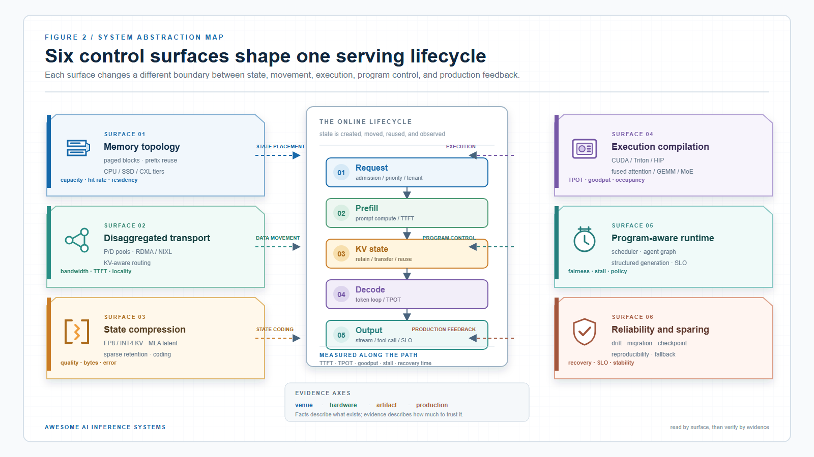

# AI Inference Papers

<!-- generated from data/papers.jsonl and data/industry.jsonl; do not edit directly -->

[Home](../README.md) · [System taxonomy](../ai-infra-system-abstractions.md) · [Industry systems](../industry/README.md)

A complete academic paper collection organized by serving-system abstraction. Formal venues, posters/workshops, preprints, and legacy imports are labeled separately.

> **How to read this page.** Start with the featured entry points, then read foundation and frontier work before supporting records. A bounded rolling exploration section keeps new workloads visible; the full adjacent/archive history remains in the [archive](../archive/README.md).

## At a Glance

| Records | Formal venue | With artifact | Tagged records |
|---:|---:|---:|---:|
| 329 | 134 | 26 | 313 |

## Collection Navigation

- [Attention / Kernel](#attention-kernel) (7)
- [KV Cache](#kv-cache) (69)
- [Prefill–Decode 与传输](#prefill-decode) (30)
- [Speculative Decoding](#speculative-decoding) (28)
- [MoE](#moe) (48)
- [Compiler / DSL](#compiler-dsl) (16)
- [Runtime / Scheduling](#runtime-scheduling) (89)
- [奠基与架构 / Foundation](#foundation) (42)
- [探索观察](#探索观察) (17)

## Evidence and Selection

Evidence labels describe the source material. Featured entries are editorial entry points, not a publication-quality ranking.

| Field | Reading rule |
|---|---|
| Venue / channel | What kind of source it is, not a quality score. |
| Technical tags | Searchable system surface; tags may be incomplete for legacy imports. |
| Artifact | A linked implementation, documentation page, or deployment entry point. |
| Curation priority | Foundation and frontier work appear first within each abstraction; supporting records follow. |
| Scope | `core` records form the main reading themes; a bounded `adjacent` window appears under exploration, with full adjacent/archive history on the archive page. |
| Featured | A small editorial starting set; all core records remain below. |

## Resource List

### Attention / Kernel (7)

#### Full Resource List

- **vAttention: Dynamic Memory Management for Serving LLMs without PagedAttention**
  `ASPLOS 2025` · `2025` · `Academic paper` · `Formal Conference · Legacy Import` · `Reading priority: foundation`
  Tags: `serving` `cuda` `kernel` `memory`
  vAttention 通过 CUDA virtual memory 保留连续虚拟 KV layout，同时按需分配物理页，避免重写 attention kernel。
- **[FlashAttention-2: Faster Attention with Better Parallelism and Work Partitioning](https://arxiv.org/abs/2307.08691)**
  `ICLR 2024` · `2024` · `Academic paper` · `Formal Conference` · `Reading priority: foundation`
  Tags: `gpu`
  在 FA1 的 IO 优化之上改进 thread-block 与 warp 级工作划分，进一步提升 GPU 利用率。
- **Efficient Memory Management for Large Language Model Serving with PagedAttention**
  `SOSP 2023` · `2023` · `Academic paper` · `Formal Conference · Legacy Import` · `Reading priority: foundation`
  Tags: `serving` `kv-cache` `memory` `vllm`
  vLLM/PagedAttention 用块式虚拟内存管理 KV cache，显著减少碎片并支持 beam search、parallel sampling 和前缀共享。
- **[FlashAttention: Fast and Memory-Efficient Exact Attention with IO-Awareness](https://arxiv.org/abs/2205.14135)**
  `NeurIPS 2022` · `2022` · `Research record` · `Unclassified` · `Reading priority: foundation`
  Tags: `kernel` `memory`
  提出 IO-aware 的精确 attention，用 tiling 把 HBM 与 SRAM 之间的数据搬移降到最低，attention kernel 的真正根节点。
- **FlashAttention-4: Algorithm and Kernel Pipelining Co-Design for Asymmetric Hardware Scaling**
  `MLSys 2026` · `2026` · `Academic paper` · `Formal Conference · Legacy Import` · `Reading priority: frontier`
  Tags: `kernel`
  FlashAttention-4 针对非对称硬件扩展重做 attention 算法和 kernel pipeline 协同设计，提高长上下文与大模型注意力吞吐。
- **I/O Analysis is All You Need: An I/O Analysis for Long-Sequence Attention**
  `ASPLOS 2026` · `2026` · `Academic paper` · `Formal Conference` · `Reading priority: frontier`
  该工作从 I/O 复杂度而非 FLOPs 分析长序列 attention，指导算法与硬件在数据搬运瓶颈下协同优化。
- **[HiFA4: Training-Free 4-bit FlashAttention on Ascend HIF4 NPUs for LLM Inference](https://arxiv.org/abs/2607.04302v1)**
  `arXiv AI infrastructure query` · `2026` · `Research record` · `Preprint` · `Reading priority: frontier`
  Tags: `training` `npu` `tpu` `compiler` `compression` `edge` `latency`
  HiFA4 在昇腾 HIF4 NPU 上把 FlashAttention 的 QK^T 与 PV 以 4-bit HIF4 Cube GEMM 执行（softmax 保持 FP16），借 Smooth-QK 逐通道重标定与 P-Reordering 降量化漂移；Qwen3-8B 上恢复 37.5% 精度差距、MMLU 损失从 1.12pp 收到 0.70pp、回归数减 57%，关键路径延迟预计降 35.4%。

### KV Cache (69)

#### Featured

- **Featured:** **[MorphServe: Efficient and Workload-Aware LLM Serving via Runtime Quantized Layer Swapping and KV Cache Resizing](https://openreview.net/forum?id=1JyePezdlF)**
  `MLSys 2026` · `2026` · `Academic paper` · `Formal Conference` · `Reading priority: frontier`
  Tags: `prefill` `decode` `gpu` `cuda` `compression` `kv-cache` `long-context` `vllm`
  Artifact: [source](https://arxiv.org/abs/2506.02006)
  MorphServe 以反馈控制方式在运行时联合调整量化层和 KV cache 容量：高压时异步换入低精度层并弹性扩缩 KVC，压力恢复后再切回；在 Vicuna/Llama 和真实 workload 上平均 SLO 违规降低 92.45%，P95 TTFT 相较全精度 serving 改善 2.2x–3.9x，并保持生成质量。
#### Full Resource List

- **InfiniGen: Efficient Generative Inference of Large Language Models with Dynamic KV Cache Management**
  `OSDI 2024` · `2024` · `Academic paper` · `Formal Conference · Legacy Import` · `Reading priority: foundation`
  Tags: `kv-cache` `memory`
  InfiniGen 用少量 rehearsal 预测下一层重要 KV，仅从 host memory 预取必要状态以加速 offloaded inference。
- **Infinite-LLM: Efficient LLM Service for Long Context with DistAttention and Distributed KVCache**
  `OSDI 2024` · `2024` · `Academic paper` · `Formal Conference · Legacy Import` · `Reading priority: foundation`
  Tags: `long-context`
  Infinite-LLM 将 attention layer 解耦并使用 pooled distributed KVCache，支撑最长约两百万 token 的弹性服务。
- **Mooncake: A KVCache-centric Disaggregated Architecture for LLM Serving**
  `FAST 2025` · `2025` · `Research record` · `Unclassified · Legacy Import` · `Reading priority: foundation`
  Tags: `serving`
  Mooncake 以 KVCache 为中心构建分离式 LLM serving 架构，利用 CPU/DRAM/SSD/NIC 资源扩展在线长上下文服务能力。
- **A Queueing-Theoretic Framework for Stability Analysis of LLM Inference with KV Cache Memory Constraints**
  `ICML 2026` · `2026` · `Academic paper` · `Formal Conference · Legacy Import` · `Reading priority: frontier`
  Tags: `kv-cache` `memory`
  该工作把计算和 KV cache 显存同时纳入排队稳定性分析，给出 LLM inference 系统何时会因内存约束失稳的理论条件。
- **[ArborKV: Structure-Aware KV Cache Management for Scaling Tree-based LLM Reasoning](https://icml.cc/virtual/2026/poster/63539)**
  `ICML 2026` · `2026` · `Academic paper` · `Formal Conference` · `Reading priority: frontier`
  Tags: `kv-cache` `memory`
  ArborKV（ICML 2026）利用推理任务本身的树状结构来组织 KV cache，对树中共享前缀做复用、对分支节点有选择地保留与回收，以在分支式（tree-based）LLM 推理中提升显存效率与吞吐。
- **Cache What Lasts: Token Retention for Memory-Bounded KV Cache in LLMs**
  `ICLR 2026` · `2026` · `Academic paper` · `Formal Conference · Legacy Import` · `Reading priority: frontier`
  Tags: `kv-cache` `memory`
  TRIM-KV 在 token 生成时预测长期保留价值，并随时间衰减以在固定内存预算下保留最有用的 KV。
- **[DroidSpeak: KV Cache Sharing Across Fine-tuned Model Variants](https://www.usenix.org/conference/nsdi26/presentation/liu-yuhan)**
  `NSDI 2026` · `2026` · `Academic paper` · `Formal Conference` · `Reading priority: frontier`
  Tags: `prefill` `serving` `npu` `kv-cache` `agent` `edge` `throughput`
  DroidSpeak 是首个跨不同 LLM（同架构）复用前缀 KV cache 的分布式推理系统：选择性重算另一模型产生的少数层、复用其余层，并以流水线叠加重算与加载；相较不允许跨模型共享的基线最高提升 4× 吞吐、prefill（TTFT）快约 3.1×，质量损失可忽略。
- **[ECHO: Efficient KV Cache Offloading with Lossless Prefetching for Serving Native Sparse Attention LLMs](https://www.usenix.org/conference/osdi26/presentation/liu-guangda)**
  `USENIX OSDI 2026 technical sessions` · `2026` · `Academic paper` · `Formal Conference` · `Reading priority: frontier`
  Tags: `serving` `kv-cache`
  ECHO 为原生稀疏注意力 LLM 设计 KV 卸载服务系统：图友好缓存管理器在 GPU graph 内动态淘汰/召回 KV，并以无损的查询内（decode）与查询间（prefill）预取配合融合 kernel 把召回开销与索引计算重叠；长上下文下生成吞吐比 SGLang/vLLM 高至多 2.1×、轻载延迟相当。
- **[FlexiCache: Leveraging Temporal Stability of Attention Heads for Efficient KV Cache Management](https://openreview.net/forum?id=GgX6dPJx9M)**
  `MLSys 2026` · `2026` · `Academic paper` · `Formal Conference` · `Reading priority: frontier`
  Tags: `compression` `kv-cache` `rag`
  FlexiCache 利用 attention head 重要性的时间稳定性动态管理 KV cache，减少长上下文生成中不必要的保留和加载。
- **KV Cache Transform Coding for Compact Storage in LLM Inference**
  `ICLR 2026` · `2026` · `Academic paper` · `Formal Conference · Legacy Import` · `Reading priority: frontier`
  Tags: `kv-cache` `rag`
  KVTC 借鉴媒体压缩，用 PCA 去相关、自适应量化和熵编码压缩可复用 KV cache。
- **KVServe: Service-Aware KV Cache Compression for Communication-Efficient Disaggregated LLM Serving**
  `SIGCOMM 2026` · `2026` · `Academic paper` · `Formal Conference` · `Reading priority: frontier`
  Tags: `serving` `compression` `kv-cache` `slo`
  KVServe 用 Bayesian profiling 建立压缩策略 Pareto 集，并由在线 controller 按 workload、网络、SLO 和质量约束选择 KV 传输压缩方案。
- **[KVSwap: Disk-aware KV Cache Offloading for Long-Context On-device Inference](https://www.sigmobile.org/mobisys/2026/program/#kvswap-disk-aware-kv-cache-offloading-for-long-context-on-device-inference)**
  `MobiSys 2026` · `2026` · `Academic paper` · `Formal Conference` · `Reading priority: frontier`
  Tags: `decode` `serving` `gpu` `edge` `kv-cache` `memory` `long-context` `throughput`
  Artifact: [source](https://eprints.whiterose.ac.uk/id/eprint/240121/1/kvswap.pdf)
  KVSwap 针对统一内存的移动/嵌入式设备，将完整 KV cache 放到磁盘，仅在 RAM 保留低秩 K 元数据预测下一层关键 token，并以连续磁盘访问和异步 I/O 与计算重叠；MobiSys 评审确认其在 NVIDIA Jetson 上相较既有 offloading 方案提升紧内存预算下吞吐。
- **Kitty: Accurate and Efficient 2-bit KV Cache Quantization with Dynamic Channel-wise Precision Boost**
  `MLSys 2026` · `2026` · `Academic paper` · `Formal Conference · Legacy Import` · `Reading priority: frontier`
  Tags: `kv-cache` `quantization`
  Kitty 用动态 channel-wise precision boost 和 page-centric layout 实现接近 2-bit 的 KV cache 压缩，同时保持规则访存和解量化效率。
- **LMCache: An Efficient KV Cache Layer for Enterprise-Scale LLM Inference**
  `MLSys 2026` · `2026` · `Academic paper` · `Formal Conference · Legacy Import` · `Reading priority: frontier`
  Tags: `kv-cache` `lmcache`
  LMCache 将 KV cache 抽象为独立可复用层，支持跨请求、跨 engine、跨存储层的 KV offload、传输和复用。
- **[No Buffer, No Bottleneck: Efficient Zero-Copy KV Cache Offloading for Long-Context LLMs](https://www.usenix.org/conference/osdi26/presentation/luo)**
  `USENIX OSDI 2026 technical sessions` · `2026` · `Academic paper` · `Formal Conference` · `Reading priority: frontier`
  Tags: `decode` `gpu` `cuda` `kernel` `kv-cache` `long-context` `latency`
  Artifact: [source](https://github.com/shutianluo/DirectKV)
  DirectKV 在 GH200/GB200 上用 NVLink-C2C 实现零拷贝 KV cache 卸载，GPU kernel 直接访问 CPU 内存 KV 省去 buffer 并把 KV 生成与 attention 融合，传输量降 50%、显存减 43%、端到端提升至多 1.2×。
- **[OBCache: Optimal Brain KV Cache Pruning for Efficient Long-Context LLM Inference](https://icml.cc/virtual/2026/poster/62607)**
  `ICML 2026 official virtual papers` · `2026` · `Academic paper` · `Formal Conference` · `Reading priority: frontier`
  Tags: `serving` `compression` `kv-cache` `long-context`
  OBCache（ICML 2026）把 optimal brain 的剪枝思想迁移到 KV cache，按其重要性评估并剪除低贡献的 KV 条目，在长上下文推理中同时削减 KV 显存与 attention 计算量，并尽量保持生成质量。
- **[OPKV: A High-Throughput Plugin-Driven Framework for Recallable Sparsity in Paged KV Cache Systems](https://openreview.net/forum?id=EB5bgzv4qA)**
  `MLSys 2026` · `2026` · `Academic paper` · `Formal Conference` · `Reading priority: frontier`
  Tags: `serving` `kv-cache` `throughput`
  OPKV 为 paged KV cache 提供可插拔稀疏召回框架，使不同稀疏策略能在高吞吐 serving runtime 中复用同一数据通路。
- **REPA: Reconfigurable PIM for the Joint Acceleration of KV Cache Offloading and Processing**
  `ASPLOS 2026` · `2026` · `Academic paper` · `Formal Conference` · `Reading priority: frontier`
  Tags: `kv-cache`
  REPA 用可重构 PIM 同时加速 KV cache 的卸载传输与就地处理，减少长上下文推理的数据移动。
- **[ThinKV: Thought-Adaptive KV Cache Compression for Efficient Reasoning Models](https://iclr.cc/virtual/2026/poster/10009980)**
  `ICLR 2026 Oral` · `2026` · `Academic paper` · `Formal Conference` · `Reading priority: frontier`
  Tags: `compiler` `compression` `throughput`
  ThinKV 结合思维感知低比特量化与渐进式 KV 淘汰并配 PagedAttention 扩展 kernel，官方评测仅保留不到 5% 原缓存却取得至多 5.8× 更高吞吐。
- **[UniCache: Unifying Prefix Cache Eviction for Heterogeneous LLM Serving Workloads](https://www.sigmetrics.org/sigmetrics2026/accepted.html#unicache-unifying-prefix-cache-eviction-for-heterogeneous-llm-serving-workloads)**
  `ACM SIGMETRICS 2026 official accepted papers` · `2026` · `Academic paper` · `Formal Conference` · `Reading priority: frontier`
  Tags: `prefill` `serving` `gpu` `kv-cache` `scheduler` `heterogeneous` `multi-turn` `vllm`
  Artifact: [source](https://jxing.me/pdf/unicache-sigmetrics26.pdf)
  针对异构多轮与单轮 workload 下 prefix reuse 模式不同的问题，设计统一的 task-aware eviction policy，并在 vLLM 中实现；公开评测报告 prefix-cache hit rate 最高提升 17.32%，推理延迟最高降低 3.63 倍。该条目为 SIGMETRICS 2026 formal abstract/proceedings 记录。
- **Which Heads Matter for Reasoning? RL-Guided KV Cache Compression**
  `ICML 2026` · `2026` · `Academic paper` · `Formal Conference · Legacy Import` · `Reading priority: frontier`
  Tags: `compression` `kv-cache`
  RLKV 用强化学习探针识别对推理链关键的注意力头，并优先保留这些头的 KV cache 来压缩长 CoT 推理开销。
- **[FreeKV: Boosting KV Cache Retrieval for Efficient LLM Inference](https://iclr.cc/virtual/2026/poster/10006722)**
  `ICLR 2026 Poster` · `2026` · `Academic paper` · `Poster / Workshop` · `Reading priority: frontier`
  Tags: `serving` `gpu` `compiler` `kernel`
  FreeKV 以推测式检索、CPU/GPU 混合布局与双缓冲流式传输把 KV 选择移出关键路径，报告最高 13× 加速且质量近无损。
- **[LookaheadKV: Fast and Accurate KV Cache Eviction by Glimpsing into the Future without Generation](https://iclr.cc/virtual/2026/poster/10009483)**
  `ICLR 2026 Poster` · `2026` · `Academic paper` · `Poster / Workshop` · `Reading priority: frontier`
  Tags: `compression` `kv-cache`
  LookaheadKV 用轻量参数高效模块预测未来 KV 重要性，无需草稿生成即可获得未来感知淘汰的精度收益，运行时开销可忽略。
- **[LouisKV: Efficient KV Cache Retrieval for Long Input-Output Sequences](https://iclr.cc/virtual/2026/poster/10011378)**
  `ICLR 2026 Poster` · `2026` · `Academic paper` · `Poster / Workshop` · `Reading priority: frontier`
  Tags: `decode` `serving` `npu` `tpu` `kv-cache`
  LouisKV 利用时间局部性与输入/输出 KV 分布差异，在语义边界触发检索并以解耦的细粒度缓存管理应对长输入-输出推理序列。
- **[A JoLT for the KV Cache: Near-Lossless KV Cache Compression via Joint Tucker and JL-Residual Allocation for LLMs](https://arxiv.org/abs/2607.12550v1)**
  `arXiv AI infrastructure query` · `2026` · `Research record` · `Preprint` · `Reading priority: frontier`
  Tags: `compiler` `compression` `long-context` `throughput`
  JoLT（Joint Lagrangian Tucker）对 KV cache 做部分 Tucker 分解只压 token 与 feature 轴、保留 head/layer 轴，再用旋转低比特残差补回被截断的能量，由单一拉格朗日对偶在字节预算下联合分配秩与位宽，实现近无损 2×–3× 压缩，其 FlashJoLT 变体压缩耗时再快 5×–13×。
- **[C$^2$KV: Compressed and Composable KV Cache Reuse for Efficient LLM Inference](https://arxiv.org/abs/2607.17715v1)**
  `arXiv AI infrastructure query` · `2026` · `Research record` · `Preprint` · `Reading priority: frontier`
  Tags: `prefill` `serving` `compiler` `compression` `agent` `long-context`
  C²KV 为非前缀 KV 复用提出统一框架，以位置无关的可学习压缩 token 与结构化注意力流联合优化 KV 抽取与推理时拼接，在长上下文下最高加速推理 17× 且保持生成质量。
- **[D-Quant: Driftable Entropy Coding for KV Cache Quantization](https://arxiv.org/abs/2609.19880v1)**
  `arXiv AI infrastructure query` · `2026` · `Research record` · `Preprint` · `Reading priority: frontier`
  Tags: `tpu` `compiler` `compression` `agent` `rag`
  D-Quant 针对固定位宽 KV 量化在低位宽下信息损失严重的问题，引入 drift 机制把熵编码后的变长表示转为定长比特流，在旋转归一化后 KV 近似正态的分布下兼顾熵编码的压缩收益与注意力 kernel 所需的规则内存访问和并行反量化。
- **[DeepSeek-V4.1-Flash: Pushing the Limits of KV Cache Compression](https://arxiv.org/abs/2609.19969v1)**
  `arXiv AI infrastructure query` · `2026` · `Research record` · `Preprint` · `Reading priority: frontier`
  Tags: `decode` `prefill` `npu` `compiler` `compression` `agent` `edge`
  DeepSeek-V4.1-Flash 是支持百万 token 上下文的多模态 MoE（552B 主干），其 CED 架构 decode 每 token 激活 16B、prefill 仅 8B，并以 CSA2 跨层 KV 复用加 FP4 KV 缓存把全局 KV 压到 890 字节/token（约 V4-Flash 的 1/4），SWA Bounded Replay 再把持久 KV 降到约 1/8。
- **[Elastic KV Cache for LLM Serving:A Working Reclamation Mechanism, and Why Chunked Prefill Already Closes the Gap](https://arxiv.org/abs/2608.23658v1)**
  `arXiv AI infrastructure query` · `2026` · `Research record` · `Preprint` · `Reading priority: frontier`
  Tags: `decode` `prefill` `cuda` `compiler` `kernel` `latency`
  弹性 KV cache 在 decode 阶段把启动时为最坏 prefill 预留的 reserve 借给 KV 池、prefill 前归还，纯用户态 CUDA 虚拟内存路径、与 CUDA graph 和前缀缓存兼容；但作者诚实指出其收益有限——分块 prefill 已几乎抹平差距，且 reserve 在张量并行下被稀释（TP1 占 16%、TP4 仅 2.7%）。
- **[Every Cache Entry Earns Its Place: Global Allocation of Resolution and Coverage for KV Cache Compression](https://arxiv.org/abs/2608.07001v1)**
  `arXiv AI infrastructure query` · `2026` · `Research record` · `Preprint` · `Reading priority: frontier`
  Tags: `training` `gpu` `compression` `kv-cache` `agent` `long-context` `slo`
  GraceKV 把 KV 压缩建模为固定预算下的全局资源分配，以层-KV 头-slot 为原子单元构建原型树，让所有候选动作（扩展覆盖/分裂提分辨率）在全球范围竞争共享预算；无需训练、全程在 GPU 上进行，在 32 个设置中的 24 个居首、最高 128 倍压缩仍稳健。
- **[MemDecay: Region-Aware KV Cache Eviction for Efficient LLM Agent Inference](https://arxiv.org/abs/2607.10582v1)**
  `arXiv AI infrastructure query` · `2026` · `Research record` · `Preprint` · `Reading priority: frontier`
  Tags: `training` `tpu` `compiler` `kernel` `agent`
  MemDecay 是免训练的区域感知 KV 淘汰策略：给各区域分配不同基础优先级与衰减率、在受注意时刷新分数、淘汰最低分页并允许钉住关键区域；实测系统 token 半衰期 148–189 解码步、草稿 token 仅 14–16 步，钉住可在全缓存精度下保留系统事实。
- **[More GPUs or a Smaller Cache? Tensor Parallelism versus KV Compression for Memory-Bound LLM Serving](https://arxiv.org/abs/2608.23962v1)**
  `arXiv AI infrastructure query` · `2026` · `Research record` · `Preprint` · `Reading priority: frontier`
  Tags: `serving` `gpu` `compression` `kv-cache` `latency` `throughput`
  把张量并行（1–8 度）与 KV 压缩（16/8/4-bit、保留比低至 0.25）放到同一成本归一化轴比较，发现压缩便宜 1.20×–2.00×，分界约在 80GB 卡上 36B 参数：以下压缩主导、以上 TP 成入场券；TP 是唯一降延迟的杠杆（压缩使每 token 延迟升 8%–93%），而压缩把每美元容量放大约 16.5×（TP 仅 1.21×）。
- **[OasisKV: Scaling In-Decode KV Cache Beyond HBM with Lookahead Sparse Prefetching](https://arxiv.org/abs/2608.08097v1)**
  `arXiv AI infrastructure query` · `2026` · `Research record` · `Preprint` · `Reading priority: frontier`
  Tags: `decode` `prefill` `gpu` `compiler` `compression` `agent` `long-context` `vllm`
  OasisKV 把完整 KV cache 从 HBM 解耦到远端内存，用 SD lookahead token 预测重要 KV 并预取，在 2048-token 预算下精度差 ≤0.7 点，相比 dense vLLM 吞吐提升 1.69×（多 GPU 达 2.1×）。
- **[Pallas: A Proactive KV Cache Migration Framework for LLM Inference in AI-RAN](https://arxiv.org/abs/2608.16477v1)**
  `arXiv AI infrastructure query` · `2026` · `Research record` · `Preprint` · `Reading priority: frontier`
  Tags: `prefill` `serving` `kv-cache` `scheduler` `agent` `rag` `vllm` `latency`
  Pallas 在 AI-RAN 切换前于目标基站主动准备 KV cache：源侧流式传后缀 KV、目标侧本地 prefill 重建前缀，切换时组装恢复 decode，相比目标侧恢复把 SIT 降低 2.28–89.68×、ITL 降低 16–50%。
- **[Physically Partitioned KVCache Format for CPU--GPU Load Balancing in MoE Inference](https://arxiv.org/abs/2609.14507v1)**
  `arXiv systems and accelerator query` · `2026` · `Research record` · `Preprint` · `Reading priority: frontier`
  Tags: `gpu` `compiler` `compression` `agent` `long-context` `sglang` `vllm`
  InplaceKVCache 在写入时固定字节物理驻留位置使 CPU-GPU 负载均衡无需事后搬数据，WriteScope 沿序列切分 CPU-GPU 份额并用 roofline 模型定最优 CPU 份额，长上下文下 A100 上取得 1.5–2.5× 加速。
- **[PuzzleKV: Page-Wise Low-Rank Decomposition for KV Cache Compression](https://arxiv.org/abs/2608.23843v1)**
  `arXiv AI infrastructure query` · `2026` · `Research record` · `Preprint` · `Reading priority: frontier`
  Tags: `training` `compiler` `compression` `agent` `long-context`
  PuzzleKV 把每头 KV cache 分固定长度逻辑页并利用页内低秩结构做免训练、免校准的页级低秩压缩，约 60% 存储下保留全 KV 性能 96% 以上，结合量化仅 18.7% 存储仍保留 93% 以上。
- **[Robust KV Cache Management for LLM Serving under Output Token Length Uncertainty](https://arxiv.org/abs/2607.16892v1)**
  `arXiv AI infrastructure query` · `2026` · `Research record` · `Preprint` · `Reading priority: frontier`
  Tags: `routing` `serving` `gpu` `tpu` `compiler` `kernel` `goodput` `latency`
  该框架联合优化 GPU 并行配置、按请求类的 KV 预留、跨异构组路由与前缀缓存以管理输出长度未知下的 KV 预留，用 Wasserstein 鲁棒优化降本至多 56% 同时保持 P99 与 SLO。
- **[SPECTRA: Pushing the KV Cache Beyond the 2-Bit Cliff via Spectral Transform Coding](https://arxiv.org/abs/2608.07915v1)**
  `arXiv AI infrastructure query` · `2026` · `Research record` · `Preprint` · `Reading priority: frontier`
  Tags: `training` `gpu` `npu` `compiler` `compression` `agent` `edge`
  SPECTRA 把 KV cache 旋转到由自身统计得到的坐标系以消除通道相关，把比特预算集中到少数信息通道，在 Llama-3.1-8B/Qwen2.5-7B 上 4× 近无损、最高 12×，推过 2-bit 悬崖。
- **[TwinKV: A Composable Repair Pass for KV Cache Eviction via Pairwise Key Redundancy](https://arxiv.org/abs/2608.27128v1)**
  `arXiv AI infrastructure query` · `2026` · `Research record` · `Preprint` · `Reading priority: frontier`
  Tags: `serving` `training` `compiler` `compression` `agent` `long-context`
  TwinKV 经留一法探针发现 attention 大小与 token 因果贡献无关，遂以免训练、免 attention 的近重复 key 信号做可组合修复层，与既有淘汰策略组合后在多数配置上改善。
- **[Where Should the KV Cache Live? Placement Policies Across GPU, CPU, and SSD for Long-Lived Sessions](https://arxiv.org/abs/2609.16215v1)**
  `arXiv AI infrastructure query` · `2026` · `Research record` · `Preprint` · `Reading priority: frontier`
  Tags: `decode` `serving` `gpu` `compiler` `kernel` `agent` `edge` `lmcache`
  该仿真研究 GPU/CPU/SSD 三层中 KV cache 放置策略，发现分层本身（容量 1+8+64）支撑每 GPU 多 73.02× 并发会话、单会话成本降 62.04×，增益主要来自容量而非策略，预取并不划算。
- **[Omni-LUT: Energy-Efficient LUT-based Accelerator with Hardware-Aware KV Cache Quantization](https://www.iscaconf.org/isca2026/program/#omni-lut-energy-efficient-lut-based-accelerator-with-hardware-aware-kv-cache-quantization)**
  `ISCA 2026 official conference program` · `2026` · `Research record` · `Unclassified` · `Reading priority: frontier`
  Tags: `serving` `compiler` `compression` `edge` `moe`
  Omni-LUT（ISCA 2026，阳明交通大学）提出基于查找表（LUT）的高能效 LLM 推理加速器，并配合硬件感知的 KV cache 量化，把查表计算与低比特 KV 结合以降低推理能耗；具体方法与结果未在摘要中给出。
- **[Probe-and-Fetch: Dynamic KV Cache Pruning for Accelerated Long-Context Inference in Web-Scale AI Search](https://www2026.thewebconf.org/accepted/industry.html#probe-and-fetch-dynamic-kv-cache-pruning-for-accelerated-long-context-inference-in-web-scale-ai-)**
  `The Web Conference 2026 official industry accepted papers` · `2026` · `Research record` · `Unclassified` · `Reading priority: frontier`
  Tags: `serving` `kv-cache` `agent` `long-context`
  Probe-and-Fetch（The Web Conference 2026 industry，百度等）提出动态 KV cache 剪枝方法，用于网页级 AI 搜索中的长上下文推理加速，以「先探测再取回」的方式在剪枝后保住关键上下文；具体方法与结果未在摘要中给出。
- **Attention Is All You Need for KV Cache in Diffusion LLMs**
  `ICLR 2026 Poster` · `2026` · `Academic paper` · `Poster / Workshop · Legacy Import` · `Reading priority: supporting`
  Tags: `kv-cache`
  Elastic-Cache 基于 attention-aware drift test 和 layer-aware schedule 选择何时、何处刷新 DLM KV cache，减少 denoising step 间重复计算。
- **Beyond Speedup - Utilizing KV Cache for Sampling and Reasoning**
  `ICLR 2026 Poster` · `2026` · `Academic paper` · `Poster / Workshop · Legacy Import` · `Reading priority: supporting`
  Tags: `kv-cache`
  该工作把 KV cache 从单纯加速结构扩展为采样和 reasoning-time reuse 的状态载体，探索更高层次的推理复用。
- **Bottlenecked Transformers: Periodic KV Cache Consolidation for Generalised Reasoning**
  `ICLR 2026 Poster` · `2026` · `Academic paper` · `Poster / Workshop · Legacy Import` · `Reading priority: supporting`
  Tags: `kv-cache` `memory`
  Bottlenecked Transformer 用轻量 cache processor 周期性重写和整合 KV segments，把推理链中的 latent memory 作为可优化状态。
- **DefensiveKV: Taming the Fragility of KV Cache Eviction in LLM Inference**
  `ICLR 2026 Poster` · `2026` · `Academic paper` · `Poster / Workshop · Legacy Import` · `Reading priority: supporting`
  Tags: `kv-cache` `rag`
  DefensiveKV 分析基于注意力稳定性的 KV 淘汰脆弱性，并引入更稳健的保留策略降低长上下文质量崩溃风险。
- **Fast-dLLM: Training-free Acceleration of Diffusion LLM by Enabling KV Cache and Parallel Decoding**
  `ICLR 2026 Poster` · `2026` · `Academic paper` · `Poster / Workshop · Legacy Import` · `Reading priority: supporting`
  Tags: `training` `kv-cache`
  Fast-dLLM 为 diffusion LLM 引入 KV cache 和并行解码路径，在无需训练的情况下缩小其与自回归模型的推理速度差距。
- **PM-KVQ: Progressive Mixed-precision KV Cache Quantization for Long-CoT LLMs**
  `ICLR 2026 Poster` · `2026` · `Academic paper` · `Poster / Workshop · Legacy Import` · `Reading priority: supporting`
  Tags: `kv-cache` `quantization` `long-cot`
  PM-KVQ 采用渐进式混合精度量化和长位置分布校准，降低长 CoT 推理中 KV cache 量化的累积误差。
- **ReST-KV: Robust KV Cache Eviction with Layer-wise Output Reconstruction and Spatial-Temporal Smoothing**
  `ICLR 2026 Poster` · `2026` · `Academic paper` · `Poster / Workshop · Legacy Import` · `Reading priority: supporting`
  Tags: `tpu` `kv-cache`
  ReST-KV 通过逐层输出重构和时空平滑修正 token 删除后的注意力重分布，使 KV eviction 更适合长序列生成。
- **AnchorKV: Safety-Aware KV Cache Compression via Soft Penalty with a Refusal Anchor**
  `arXiv 预印本, 2026` · `2026` · `Research record` · `Preprint · Legacy Import` · `Reading priority: supporting`
  Tags: `compression` `kv-cache`
  AnchorKV 在 KV 压缩保留分数中引入 refusal anchor 的软惩罚，使压缩后的长上下文推理兼顾内存节省与安全对齐。
- **CacheFlow: Efficient LLM Serving with 3D-Parallel KV Cache Restoration**
  `arXiv 预印本, 2026` · `2026` · `Research record` · `Preprint · Legacy Import` · `Reading priority: supporting`
  Tags: `serving` `gpu` `kv-cache` `scheduler`
  CacheFlow 将 KV 恢复重构为 token、layer、GPU 三维并行，并以 batch-aware scheduler 联合分配重算和 I/O。
- **CacheWise: Understanding Workloads and Optimizing KVCache Management for Efficiently Serving LLM Coding Agents**
  `arXiv 预印本, 2026` · `2026` · `Research record` · `Preprint · Legacy Import` · `Reading priority: supporting`
  Tags: `serving` `kv-cache` `agent`
  CacheWise 将 coding agent 的前缀复用与 tool-call 元数据结合做复用感知驱逐和前缀感知调度，显著降低 KV eviction 并缩短会话完成时间。
- **Can I Buy Your KV Cache?**
  `arXiv 预印本, 2026` · `2026` · `Research record` · `Preprint · Legacy Import` · `Reading priority: supporting`
  Tags: `prefill` `kv-cache`
  该工作把热门文档的预填充 KV 视作可交易的 provider-side 资产，用服务端复用替代重复 prefill。
- **Forget Without Compromise: Nexus Sampling for Streaming KV-Cache Eviction Under Fixed Budgets**
  `arXiv 预印本, 2026` · `2026` · `Research record` · `Preprint · Legacy Import` · `Reading priority: supporting`
  Tags: `kv-cache`
  Nexus Sampling 面向固定预算下的流式 KV eviction，用采样式保留机制维持长上下文质量并控制 cache 增长。
- **HERALD: High-Throughput Block Diffusion LLM Serving via CPU-GPU Cooperative KV Cache Retrieval**
  `arXiv 预印本, 2026` · `2026` · `Research record` · `Preprint · Legacy Import` · `Reading priority: supporting`
  Tags: `serving` `gpu` `kv-cache` `throughput`
  HERALD 利用 block diffusion 每个 block 内 top-k KV 选择可复用的性质，只选一次并与 denoising 重叠，以 CPU-GPU 协同稀疏召回 host DRAM 中的 KV。
- **Information-Aware KV Cache Compression for Long Reasoning**
  `arXiv 预印本, 2026` · `2026` · `Research record` · `Preprint · Legacy Import` · `Reading priority: supporting`
  Tags: `compression` `kv-cache`
  InfoKV 将预测不确定性和层间表示演化构成的 entropy signal 与 attention 分数结合，用 Forward Influence 感知的 token 选择改进长推理 KV 压缩。
- **KV Cache Optimization Strategies for Scalable and Efficient LLM Inference**
  `arXiv 综述, 2026` · `2026` · `Research record` · `Preprint · Legacy Import` · `Reading priority: supporting`
  Tags: `kv-cache`
  该综述从淘汰、压缩、混合内存、新注意力和组合策略五条路线比较 KV 优化，并映射到七类部署场景。
- **KVEraser: Learning to Steer KV Cache for Efficient Localized Context Erasing**
  `arXiv 预印本, 2026` · `2026` · `Research record` · `Preprint · Legacy Import` · `Reading priority: supporting`
  Tags: `kv-cache`
  KVEraser 用学习式 steering state 只改被删除跨度的 KV 区间，在不重算整段 suffix 的前提下做局部上下文擦除。
- **Models Take Notes at Prefill: KV Cache Can Be Editable and Composable**
  `arXiv 预印本, 2026` · `2026` · `Research record` · `Preprint · Legacy Import` · `Reading priority: supporting`
  Tags: `prefill` `kv-cache`
  该工作把 KV cache 视作可编辑、可组合的“笔记本”，支持附加勘误与 RoPE 重定位拼接来复用预填充结果。
- **ORBITFLOW: SLO-Aware Long-Context LLM Serving with Fine-Grained KV Cache Reconfiguration**
  `arXiv 预印本, 2026` · `2026` · `Research record` · `Preprint · Legacy Import` · `Reading priority: supporting`
  Tags: `serving` `gpu` `kv-cache` `long-context` `slo`
  ORBITFLOW 以轻量 ILP 按请求和层动态决定 GPU/CPU KV 放置，并根据运行反馈重配置以控制尾延迟。
- **PolyKV: Heterogeneous Retention and Allocation for KV Cache Compression**
  `arXiv 预印本, 2026` · `2026` · `Research record` · `Preprint · Legacy Import` · `Reading priority: supporting`
  Tags: `compression` `kv-cache`
  PolyKV 在层级粒度上联合选择 KV 压缩策略和预算分配，用异构保留方案替代统一 cache budget。
- **SAC: Disaggregated KV Cache System for Sparse Attention LLMs with CXL**
  `arXiv 预印本, 2026` · `2026` · `Research record` · `Preprint · Legacy Import` · `Reading priority: supporting`
  Tags: `cxl` `gpu` `kv-cache`
  SAC 将稀疏注意力 LLM 的冷 KV cache 下沉到 CXL 内存池，并用访问预测和批量迁移降低 GPU 显存压力。
- **SwiftCache: Efficient LLM Serving for Multi-turn Conversations with Heterogeneous KV Cache Sharing**
  `arXiv 预印本, 2026` · `2026` · `Research record` · `Preprint · Legacy Import` · `Reading priority: supporting`
  Tags: `prefill` `serving` `kv-cache`
  SwiftCache 在异构会话间共享 KV cache 并协调多轮对话的缓存放置与复用，降低重复 prefill 和内存占用。
- **Tangram: Unlocking Non-Uniform KV Cache for Efficient Multi-turn LLM Serving**
  `arXiv 预印本, 2026` · `2026` · `Research record` · `Preprint · Legacy Import` · `Reading priority: supporting`
  Tags: `serving` `kv-cache` `agent` `rag`
  Tangram 以确定性 head 预算、Head Group Page 和 AOT 负载均衡，把非均匀 KV 压缩转化为可高效执行的 serving layout。
- **TokenDance: Scaling Multi-Agent LLM Serving via Collective KV Cache Sharing**
  `arXiv 预印本, 2026` · `2026` · `Research record` · `Preprint · Legacy Import` · `Reading priority: supporting`
  Tags: `serving` `kv-cache` `agent`
  TokenDance 利用多 agent round 的 All-Gather 结构集中复用共享 KV，并用 block-sparse diff 压缩 sibling cache。
- **Tutti: Making SSD-Backed KV Cache Practical for Long-Context LLM Serving**
  `arXiv 预印本, 2026` · `2026` · `Research record` · `Preprint · Legacy Import` · `Reading priority: supporting`
  Tags: `serving` `gpu` `kv-cache` `long-context`
  Tutti 构建 GPU-centric KV object store、GPU io uring 和 slack-aware I/O 调度，使 SSD-backed KV 恢复绕开 CPU 控制瓶颈。
- **VeriCache: Turning Lossy KV Cache into Lossless LLM Inference**
  `arXiv 预印本, 2026` · `2026` · `Research record` · `Preprint · Legacy Import` · `Reading priority: supporting`
  Tags: `kv-cache`
  VeriCache 用压缩 KV 起草、完整 KV 验证，并重叠 HBM 解码与 PCIe/网络换入，保证输出与 full-KV 完全一致。
- **CacheSlide: Unlocking Cross Position-Aware KV Cache Reuse for Accelerating LLM Serving**
  `FAST 2026` · `2026` · `Research record` · `Unclassified · Legacy Import` · `Reading priority: supporting`
  Tags: `serving` `kv-cache` `agent`
  CacheSlide 针对 agent prompt 中相对位置稳定的片段设计 RPDC、位置校正和 layer-wise spill-aware KV 复用。

### Prefill–Decode 与传输 (30)

#### Featured

- **Featured:** **CacheBlend: Fast Large Language Model Serving for RAG with Cached Knowledge Fusion**
  `EuroSys 2025` · `2025` · `Academic paper` · `Formal Conference · Legacy Import` · `Reading priority: foundation`
  Tags: `prefill` `serving` `edge` `rag`
  CacheBlend 复用非前缀知识片段的预计算 KV，并用知识融合机制降低 RAG prefill 延迟。
- **Featured:** **Context Parallelism for Scalable Million-Token Inference**
  `MLSys 2025` · `2025` · `Academic paper` · `Formal Conference · Legacy Import` · `Reading priority: foundation`
  Tags: `decode` `prefill`
  该工作用 pass-KV/pass-Q 两种精确 ring attention 在 128 张 H100 上扩展百万 token prefill 和 persistent-KV decode。
- **Featured:** **[PLA-Serve: A Prefill-Length-Aware LLM Serving System](https://openreview.net/forum?id=dzjCkSEDyG)**
  `MLSys 2026` · `2026` · `Academic paper` · `Formal Conference` · `Reading priority: frontier`
  Tags: `prefill` `serving` `gpu` `scheduler` `scheduling` `multi-turn` `long-context` `sglang`
  Artifact: [source](https://arxiv.org/abs/2601.11589)
  PLA-Serve（预印本标题 LAPS）在 prefill 阶段按 prompt 长度做双队列与时空分离：长 prefill 与短 prefill 隔离，并对短请求采用 length-aware batching 与 CUDA Graph clustering；在真实多轮 workload 上，相较 vanilla SGLang prefill 延迟降低超过 30%，SLO 违规降低 28%，多 GPU 下进一步降低 12%，Qwen2.5-32B prefill 吞吐提…
- **Featured:** **TPLA: Tensor Parallel Latent Attention for Efficient Disaggregated Prefill & Decode Inference**
  `ASPLOS 2026` · `2026` · `Academic paper` · `Formal Conference` · `Reading priority: frontier`
  Tags: `decode` `prefill`
  TPLA 将 latent attention 与 tensor parallel 结合，降低 PD 分离推理中的 KV 和跨卡通信压力。
#### Full Resource List

- **DistServe: Disaggregating Prefill and Decoding for Goodput-optimized Large Language Model Serving**
  `OSDI 2024` · `2024` · `Academic paper` · `Formal Conference · Legacy Import` · `Reading priority: foundation`
  Tags: `decode` `prefill` `gpu` `goodput` `tpot`
  DistServe 将 prefill 和 decode 放到不同 GPU 上，并按 TTFT/TPOT 约束联合优化资源与并行策略。
- **Taming Throughput-Latency Tradeoff in LLM Inference with Sarathi-Serve**
  `OSDI 2024` · `2024` · `Academic paper` · `Formal Conference · Legacy Import` · `Reading priority: foundation`
  Tags: `decode` `prefill` `latency` `stall`
  Sarathi-Serve 用 chunked prefill 和 stall-free scheduling 缓解 prefill/decode 混批中的吞吐-延迟冲突。
- **[Fast Transformer Decoding: One Write-Head is All You Need](https://arxiv.org/abs/1911.02150)**
  `arXiv 2019` · `2019` · `Research record` · `Preprint` · `Reading priority: foundation`
  Tags: `decode`
  提出 Multi-Query Attention，只保留单个 KV head，直接从 decode 阶段的 KV 读取带宽瓶颈出发做优化。
- **[ADAngel: Accelerating Arbitrary-Precision Quantized LLMs with Adaptive Computing Mapping](https://www.usenix.org/conference/osdi26/presentation/liu-yao)**
  `USENIX OSDI 2026 technical sessions` · `2026` · `Academic paper` · `Formal Conference` · `Reading priority: frontier`
  Tags: `prefill` `decode` `gpu` `compiler` `compression` `tensorrt-llm` `throughput` `ttft`
  Artifact: [source](https://www.usenix.org/system/files/osdi26-liu-yao.pdf)
  ADAngel 基于 DPR（分解-部分积-重构）计算模型为任意精度量化（如 W4A8）的 mpGEMM 生成多样化 kernel，并用 Oracle 策略图让轻量分发器按负载选最优 kernel，decode 吞吐比 llama.cpp 最高快 5.10×、prefill 的 TTFT 比 TensorRT-LLM 快 1.17×–2.38×。
- **[FlashAgents: Accelerating Multi-Agent LLM Systems via Streaming Prefill Overlap](https://openreview.net/pdf?id=m14PPUfgEc)**
  `MLSys 2026` · `2026` · `Academic paper` · `Formal Conference` · `Reading priority: frontier`
  Tags: `prefill` `serving` `agent` `rag`
  FlashAgents 用 agent 间 token streaming、增量 prefill 和 prefix-aware coordination 重叠多智能体调用链中的等待与计算。
- **From Tokens to Layers: Redefining Stall-Free Scheduling for LLM Serving with Layered Prefill**
  `MLSys 2026` · `2026` · `Academic paper` · `Formal Conference · Legacy Import` · `Reading priority: frontier`
  Tags: `decode` `prefill` `moe` `stall`
  该工作把 prefill 调度单位从 token chunk 改为 layer group，在 MoE serving 中减少重复 expert 权重加载并维持 stall-free decode。
- **RDMA Point-to-Point Communication for LLM Systems**
  `MLSys 2026` · `2026` · `Academic paper` · `Formal Conference · Legacy Import` · `Reading priority: frontier`
  Tags: `routing` `serving` `rdma` `moe`
  TransferEngine 为分离式推理、MoE routing 和 RL 权重更新提供可移植 RDMA 点到点通信接口，避免 serving runtime 绑定单一 NIC 栈。
- **[Strata: Hierarchical Context Caching for Long Context Language Model Serving](https://www.usenix.org/conference/osdi26/presentation/xie-zhiqiang)**
  `USENIX OSDI 2026 technical sessions` · `2026` · `Academic paper` · `Formal Conference` · `Reading priority: frontier`
  Tags: `prefill` `serving` `long-context`
  Strata 是长上下文 LLM serving 的分层上下文缓存框架：用 GPU 辅助 I/O 解耦 GPU 与主机布局以支持大块传输，并以缓存感知调度器缓解延迟命中、均衡 batch、重叠互补工作；作为 SGLang 一部分部署后吞吐比 vLLM-LMCache 高 5×、比 TensorRT-LLM 高 3.75×。
- **[Stream2LLM: Overlap Context Streaming and Prefill for Reduced Time-to-First-Token](https://openreview.net/forum?id=FuRo7Ur5Ib)**
  `MLSys 2026` · `2026` · `Academic paper` · `Formal Conference` · `Reading priority: frontier`
  Tags: `prefill` `serving`
  Stream2LLM 将上下文流式加载与 prefill 计算重叠，把长 prompt 的数据到达时间隐藏到首 token 前的执行流水中。
- **Towards High-Goodput LLM Serving with Prefill-decode Multiplexing**
  `ASPLOS 2026` · `2026` · `Academic paper` · `Formal Conference` · `Reading priority: frontier`
  Tags: `decode` `prefill` `gpu` `goodput` `slo`
  MuxWise 在单 GPU 内对 prefill/decode 进行多路复用，并结合估计器和 SLO 调度提升 goodput。
- **[UEP: Portable Expert-Parallel Communication](https://www.usenix.org/conference/osdi26/presentation/mao-ziming-uep)**
  `USENIX OSDI 2026 technical sessions` · `2026` · `Academic paper` · `Formal Conference` · `Reading priority: frontier`
  Tags: `serving` `training` `gpu` `amd` `moe` `routing` `sglang` `throughput`
  Artifact: [source](https://www.usenix.org/system/files/osdi26-mao-ziming-uep.pdf)
  UEP 用 GPU-CPU 控制通道取代 GPU 发起的 RDMA，由 CPU 代理发 GPUDirect RDMA 以 immediate data 模拟保序，在 EFA 上 dispatch/combine 吞吐提升 2.1×、SGLang token 吞吐提升至多 40%。
- **[QuoKA: Query-Oriented KV Selection for Efficient LLM Prefill](https://iclr.cc/virtual/2026/poster/10008892)**
  `ICLR 2026 Poster` · `2026` · `Academic paper` · `Poster / Workshop` · `Reading priority: frontier`
  Tags: `prefill` `serving` `gpu` `compiler` `kernel` `ttft`
  QuoKA 在分块 prefill 中用面向 query 的稀疏 attention，只评估 88% 更少的 KV 对即把 TTFT 降低 3×、GPU attention 快 5×、CPU attention 快近 7×。
- **[AgentKV: Phase-Aware KV Eviction for Agentic LLMs](https://arxiv.org/abs/2609.14872v1)**
  `arXiv AI infrastructure query` · `2026` · `Research record` · `Preprint` · `Reading priority: frontier`
  Tags: `decode` `serving` `tpu` `compiler` `kernel` `agent` `rag` `sglang`
  AgentKV 针对智能体生成跨 think/act/tool 等多相、未来查询不似近邻的问题，为每个相位维护小型查询缓冲并按其并集给缓存 key 打分，在多轮持久路径中跨轮携带压缩 KV；相较完整 KV 的 SGLang 输出 token 吞吐最高提升 1.80×，任务分比 R-KV 高 5.5 点。
- **[Beyond Prefill-Decode Disaggregation: Dissecting LLM Inference for Heterogeneous Platforms via Dynamic Operator Scheduling](https://arxiv.org/abs/2607.25498v1)**
  `arXiv AI infrastructure query` · `2026` · `Research record` · `Preprint` · `Reading priority: frontier`
  Tags: `decode` `prefill` `npu` `memory` `scheduler` `edge` `latency`
  DOPS 是硬件感知的闭环框架，用阶段感知 DAG 联合优化算子调度与分块权重布局：Bifocal 调度器做算子到设备的动态放置，Weight Layout Arbiter 在严格内存约束下选高效权重布局；在 NPU+PIM 异构系统上 Bifocal 比 PD 基线几何均值快 1.20×–2.23×，WLA 再叠加 1.28×–1.33×。
- **[Efficient Multi-round LLM Inference over Disaggregated Serving](https://icml.cc/virtual/2026/poster/64461)**
  `arXiv 预印本, 2026` · `2026` · `Research record` · `Preprint` · `Reading priority: frontier`
  Tags: `prefill` `serving` `agent` `rag`
  AMPD 面向多轮 agent/RAG 工作流，在 PD 分离式服务中自适应协调增量 prefill 和阶段部署。
- **[FlashPrefill V2: Block-Sparse Prefill Attention for Long-Context LLM Serving](https://arxiv.org/abs/2608.19758v1)**
  `arXiv AI infrastructure query` · `2026` · `Research record` · `Preprint` · `Reading priority: frontier`
  Tags: `prefill` `serving` `gpu` `compiler` `compression` `edge` `long-context` `sglang`
  FlashPrefill V2 以均值校正项抑制近似误差，并重写支持 FP8 的稀疏注意力算子（PackGQA、warp 专用化、乒乓流水线），原生支持 paged KV 与 continuous batching 作 SGLang 后端；H20 上 128K 上下文相对 FlashAttention-2 加速 47.26×（FP8）/27.19×（BF16），FP8 下比 FA3/4 稠密基线快 30.49×。
- **[LOCKS: Page-Local Compact Key Summaries for Efficient Long-Context Decoding](https://arxiv.org/abs/2607.24555v1)**
  `arXiv AI infrastructure query` · `2026` · `Research record` · `Preprint` · `Reading priority: frontier`
  Tags: `decode` `serving` `cuda` `compiler` `kernel` `long-context` `vllm` `latency`
  LOCKS 给每个 KV 页配独有的谱摘要（约缓存 1/10 大小），以 log-sum-exp 估计各页注意力质量、只注意 top 页而无需读取候选 key/value；在 2048 token 预算下 100K+ 上下文仅注意约 2% token 即匹配全缓存质量，并将每 token decode 延迟减半（1M 时 2.0×），可作 vLLM 即插即用插件。
- **[P-PAS: Prefill-Pressure Adaptive Scheduling for Long-Context LLM Serving](https://arxiv.org/abs/2608.15171v1)**
  `arXiv AI infrastructure query` · `2026` · `Research record` · `Preprint` · `Reading priority: frontier`
  Tags: `decode` `prefill` `gpu` `npu` `compiler` `kernel` `agent` `edge`
  P-PAS 依据并发 prefill 与 decode 状态动态调节 vLLM 的调度 token 预算（MBT）：低压保留大预算、高压限制 prefill，从而在不同负载下都维持较低端到端延迟。
- **[Shared KV Caching for Replicated 27B Inference: Correctness Failures and Performance Boundaries](https://arxiv.org/abs/2609.15021v1)**
  `arXiv AI infrastructure query` · `2026` · `Research record` · `Preprint` · `Reading priority: frontier`
  Tags: `prefill` `serving` `cuda` `gpu` `compiler` `kernel` `edge` `lmcache`
  该工程案例研究两个共享 LMCache 的 27B vLLM 副本间共享主机内存缓存以避免重复 prefill 的正确性边界，定位忽略 CUDA 流依赖的缺陷，128k 输入下跨副本首内容 token 时间从 31.7s 降到 0.6s。
- **[VPP: Virtual Pipeline Parallelism for Efficient Chunked Prefill in Long-Context LLM Inference](https://arxiv.org/abs/2608.26523v1)**
  `arXiv AI infrastructure query` · `2026` · `Research record` · `Preprint` · `Reading priority: frontier`
  Tags: `prefill` `serving` `npu` `compiler` `kernel` `edge` `long-context` `vllm`
  VPP 保持 chunk 大小固定、用 V 形虚拟阶段遍历把昂贵中间阶段与相邻轻阶段重叠以减少气泡，在 vLLM-Ascend 上长序列吞吐比 DCPP 高 13.1%，512K prefill 气泡率从 6.4% 降到 0.1%。
- **[When Does Disaggregation Pay? Simulating Prefill--Decode--Attention--FFN Specialization for Agentic LLM Inference](https://arxiv.org/abs/2608.03741v1)**
  `arXiv systems and accelerator query` · `2026` · `Research record` · `Preprint` · `Reading priority: frontier`
  Tags: `decode` `prefill` `gpu` `npu` `compiler` `compression` `agent` `edge`
  HeteroPanacea 跨分离式量化、自动并行调度与 PDAF（prefill-decode-attention-FFN）NPU 异构三维仿真 agentic 推理，确认 PD 分离价值（吞吐提升至多 75%）并发现四路 PDAF 提升最稳定。
- **[Windowed-MTP: Removing the Full-Context Draft-KV Tax at Million-Token Context](https://arxiv.org/abs/2607.21535v1)**
  `arXiv AI infrastructure query` · `2026` · `Research record` · `Preprint` · `Reading priority: frontier`
  Tags: `decode` `serving` `gpu` `npu` `compiler` `kernel` `edge` `moe`
  Windowed-MTP 仅对草稿 attention 施加 StreamingLLM 式滑动窗口加 sink，保留全 attention 验证，免训练把草稿 KV 工作集限制为常数（1M 时丢约 99% 条目），每 decode 步成本降 28–44%。
- **ELDR: Expert-Locality-Aware Decode Routing for PD-Disaggregated MoE Serving**
  `arXiv 预印本, 2026` · `2026` · `Research record` · `Preprint · Legacy Import` · `Reading priority: supporting`
  Tags: `decode` `prefill` `moe` `routing`
  ELDR 根据 prefill expert activation 构建 expert signature，并用 locality-band routing 把请求发往 expert locality 更好的 decode worker，降低 PD 分离式 MoE serving 的 decode 延迟。
- **Prefill/Decode-Aware Evaluation of LLM Inference on Emerging AI Accelerators**
  `arXiv 预印本, 2026` · `2026` · `Research record` · `Preprint · Legacy Import` · `Reading priority: supporting`
  Tags: `decode` `prefill` `gpu` `tpot` `ttft`
  该工作按 Prefill/Decode 两阶段分别测 TTFT、TPOT 和批量吞吐，比较 GPU 与新型 AI 加速器的相位优势。
- **The Price of Anarchy in Disaggregated Inference**
  `arXiv 预印本, 2026` · `2026` · `Research record` · `Preprint · Legacy Import` · `Reading priority: supporting`
  该工作从博弈角度分析分离式推理中的自利资源选择如何恶化全局效率，并给出调度设计的效率边界。
- **vLLM-Omni: Fully Disaggregated Serving for Any-to-Any Multimodal Models**
  `arXiv 预印本, 2026` · `2026` · `Research record` · `Preprint · Legacy Import` · `Reading priority: supporting`
  Tags: `serving` `gpu` `multimodal` `vllm`
  vLLM-Omni 把任意到任意多模态模型分解为独立 stage graph，为 LLM、扩散模型和编码器分别批处理和分配 GPU。

### Speculative Decoding (28)

#### Full Resource List

- **Medusa: Simple LLM Inference Acceleration Framework with Multiple Decoding Heads**
  `ICML 2024` · `2024` · `Academic paper` · `Formal Conference · Legacy Import` · `Reading priority: foundation`
  Tags: `kv-cache`
  Medusa 在目标模型上添加多个 decoding heads，无需独立 draft model 即可并行预测和验证多个未来 token。
- **[Fast Inference from Transformers via Speculative Decoding](https://arxiv.org/abs/2211.17192)**
  `ICML 2023` · `2023` · `Academic paper` · `Formal Conference` · `Reading priority: foundation`
  提出 draft 模型 + 并行验证的投机解码，在不改变目标分布的前提下加速生成。
- **Accelerating Large-Scale Reasoning Model Inference with Sparse Self-Speculative Decoding**
  `MLSys 2026` · `2026` · `Academic paper` · `Formal Conference · Legacy Import` · `Reading priority: frontier`
  Tags: `kv-cache`
  SparseSpec 以稀疏注意力版本的同一模型充当 draft，并联合调度 drafting、verification 和动态 KV 管理以加速长 CoT。
- **Beat the long tail: Distribution-Aware Speculative Decoding for RL Training**
  `MLSys 2026` · `2026` · `Academic paper` · `Formal Conference · Legacy Import` · `Reading priority: frontier`
  Tags: `training`
  DAS 利用历史 rollout 维护非参数 drafter，并按轨迹长度分配 speculative budget，缩短 RL post-training 中长尾生成阶段。
- **DFVG: A Heterogeneous Architecture for Speculative Decoding with Draft-on-FPGA and Verify-on-GPU**
  `ASPLOS 2026` · `2026` · `Academic paper` · `Formal Conference` · `Reading priority: frontier`
  Tags: `gpu` `kv-cache`
  DFVG 将 draft 放在 FPGA、verify 放在 GPU，以异构流水降低推测解码的草稿成本并提高验证硬件利用率。
- **NexSpec: Towards Optimizing Speculative Decoding in Reinforcement Learning Systems**
  `MLSys 2026` · `2026` · `Academic paper` · `Formal Conference · Legacy Import` · `Reading priority: frontier`
  NexSpec 针对 RL 系统中的 speculative decoding 动态调参、更新 drafter 并按 rollout reward 加权，缓解大 batch 和 actor 漂移下的加速失效。
- **[PRISM: Parametrically Refactor Inference for Speculative Decoding Draft Models](https://openreview.net/forum?id=cvU2HuuxEf)**
  `MLSys 2026` · `2026` · `Academic paper` · `Formal Conference` · `Reading priority: frontier`
  Tags: `serving` `throughput`
  PRISM（MLSys 2026）对 speculative decoding 中的 draft 模型推理做参数化重构，在保持验证阶段正确性的前提下降低草稿生成的算力与延迟开销，从而提升草稿生成效率与验证吞吐量。
- **SpecDiff-2: Scaling Diffusion Drafter Alignment For Faster Speculative Decoding**
  `MLSys 2026` · `2026` · `Academic paper` · `Formal Conference · Legacy Import` · `Reading priority: frontier`
  SpecDiff-2 用离散扩散模型作为非自回归 drafter，并校准 diffusion drafter 与自回归 verifier 的分布差异，以提升 speculative decoding 接受率和并行度。
- **Speculative Decoding: Performance or Illusion?**
  `MLSys 2026` · `2026` · `Academic paper` · `Formal Conference · Legacy Import` · `Reading priority: frontier`
  Tags: `serving`
  该工作用真实 serving 条件重新评估 speculative decoding，区分离线 speedup 与在线负载下的端到端收益。
- **[SwiftSpec: Disaggregated Speculative Decoding and Fused Kernels for Low-Latency LLM Inference](https://www.asplos-conference.org/asplos2026/program/index.html#swiftspec-disaggregated-speculative-decoding-and-fused-kernels-for-low-latency-llm-inference)**
  `ASPLOS 2026 official detailed program` · `2026` · `Academic paper` · `Formal Conference` · `Reading priority: frontier`
  Tags: `serving` `compiler` `compression` `moe` `latency`
  SwiftSpec（ASPLOS 2026，字节 Seed / 芝加哥大学）把 draft 与 target 的 speculative decoding 做分离式（disaggregated）部署，并用融合 kernel 进一步压低单请求延迟，面向低延迟 LLM 推理场景。
- **[AdaFlash: Adaptive Speculative Decoding via On-Policy Distilled Diffusion Drafters](https://arxiv.org/abs/2607.19223v1)**
  `arXiv AI infrastructure query` · `2026` · `Research record` · `Preprint` · `Reading priority: frontier`
  Tags: `compiler` `kernel` `agent` `edge` `throughput`
  AdaFlash 针对 diffusion drafter 的双向注意力方差问题，用 reverse-KL 的在线策略蒸馏（OPD）稳定域级方差，并以自适应长度头动态调节候选序列长度来压低目标模型验证开销，高并发下吞吐比此前最佳高约 66%。
- **[Alignment Drift in Single-Model Speculative Decoding for ASR: Mechanism, Correction, and Cost](https://arxiv.org/abs/2608.12703v1)**
  `arXiv AI infrastructure query` · `2026` · `Research record` · `Preprint` · `Reading priority: frontier`
  Tags: `training` `compiler` `kernel`
  ASR 单模型自推测中草稿每步都能读全部音频却随自回归变差，关键在音频位置跟踪；AnchorDraft 在不改动推理图的前提下于训练时教会草稿跟踪音频位置，在两个目标模型规模上都提升了端到端速度。
- **[AngelSpec: Towards Real-World High Performance Inference with Speculative Decoding](https://arxiv.org/abs/2607.25852v1)**
  `arXiv AI infrastructure query` · `2026` · `Research record` · `Preprint` · `Reading priority: frontier`
  Tags: `training` `tpu` `compiler` `kernel` `agent` `rag` `latency` `throughput`
  AngelSpec 统一训练 MTP 与块并行 speculative decoding：MTP 专攻对话、block-diffusion drafter 专攻代码/数学，DFly 把验证当跨请求批级共享资源并自适应调深度；Hy3-A21B 平均接受长度提升约 30%，比自回归解码快 1.98–2.40×、比 DFlash 吞吐高 10.5–11.8%。
- **[Beyond KV Reconstruction: Functional Reconstruction for MLA Draft Models in Speculative Decoding](https://arxiv.org/abs/2607.27269v1)**
  `arXiv AI infrastructure query` · `2026` · `Research record` · `Preprint` · `Reading priority: frontier`
  Tags: `training` `tpu` `compiler` `compression` `long-context` `vllm`
  将 MHA/GQA 转 MLA 的草稿构建视为「功能重构」而非缓存压缩：端到端方法优化每个转换后的 MLA 注意力模块以复现原 MHA/GQA 的输出投影响应，无需验证器 logits 或监督，在 64 个匹配任务单元中的 37 个显著提升草稿 token 接受率。
- **[Carryover Drafting: Recycling Rejected States for Speculative Decoding](https://arxiv.org/abs/2609.14717v1)**
  `arXiv AI infrastructure query` · `2026` · `Research record` · `Preprint` · `Reading priority: frontier`
  Tags: `serving` `training` `agent` `rag` `vllm` `latency`
  Carryover Drafting 把验证中被拒的目标隐藏状态回收为临时 KV context 供草稿选择性注意，仅加一个可学习嵌入并配并行 draft-verify-draft 训练；相较基线草稿接受长度提升 6.5%–14.7%、端到端 vLLM 加速 7.9%–14.4%（翻译上达 28.8%）。
- **[FOVEA: Focused On-Demand Visual Evidence Adaptation for Cache-Friendly Multimodal Speculative Decoding](https://arxiv.org/abs/2608.22883v1)**
  `arXiv AI infrastructure query` · `2026` · `Research record` · `Preprint` · `Reading priority: frontier`
  Tags: `npu` `memory` `edge` `multimodal`
  FOVEA 面向多模态 speculative decoding 构建可复用视觉记忆并按累积质量规则动态检索有界子集，以门控残差校正把视觉读出融入草稿隐藏态（不插入视觉 token 到自回归上下文），提升草稿接受率与端到端解码速度，最高比自回归解码快 2.13×。
- **[From Positionwise Confidence to Prefix Scheduling: Verifier Skipping in Speculative Decoding](https://arxiv.org/abs/2608.14787v1)**
  `arXiv AI infrastructure query` · `2026` · `Research record` · `Preprint` · `Reading priority: frontier`
  Tags: `serving` `scheduler`
  该工作研究 speculative decoding 中的验证器跳过（直接提交草稿前缀的有损策略），比较原始置信度与边际/条件生存分数三种信号在 HumanEval（DiffuCoder-7B-Instruct、Qwen3-32B）上的调度效果，三者都在与 Strict SDD 相同 pass@1 下省下 9.6%–13.5% 的验证调用，且原始置信度省得最多。
- **[Is Multimodal Speculative Decoding Ready for Diffusion-Based Parallel Drafting? A Survey and Empirical Diagnosis](https://arxiv.org/abs/2608.20743v1)**
  `arXiv AI infrastructure query` · `2026` · `Research record` · `Preprint` · `Reading priority: frontier`
  Tags: `npu` `compression` `agent` `edge`
  该工作以「模态为中心的综述 + 跨架构实证」回答多模态 speculative decoding 是否就绪于 diffusion 式并行起草，统一把草稿侧并行与树构造/验证等正交设计分离出分类法，并在 OCR/VQA 等标准基准上比较不同并行度下的现有方法、总结局限与开放挑战。
- **[LiLiCorr: Lightweight Likelihood Correlation of Parallel Drafts for Speculative Decoding](https://arxiv.org/abs/2608.20530v1)**
  `arXiv AI infrastructure query` · `2026` · `Research record` · `Preprint` · `Reading priority: frontier`
  Tags: `serving` `npu` `edge` `latency` `throughput`
  LiLiCorr 轻量建模 diffusion 式块草稿各位置边缘分布间的相关性：保留每位置 top-k 候选并联合处理，用 in/out 向量的余弦相似度匹配相邻候选，单次轻量网络前向即得分数；与草稿联合训练后接受长度比 DFlash 提升 9%–19%，在 72 个设置中的 70 个吞吐最高。
- **[HybridSpec: Exploiting Hybrid-bonding Memory to Accelerate LLM Serving through Heterogeneous Architecture and Speculative Decoding](https://www.iscaconf.org/isca2026/program/#hybridspec-exploiting-hybrid-bonding-memory-to-accelerate-llm-serving-through-heterogeneous-arch)**
  `ISCA 2026 official conference program` · `2026` · `Research record` · `Unclassified` · `Reading priority: frontier`
  Tags: `serving` `compiler` `compression` `edge` `moe`
  HybridSpec（ISCA 2026）利用混合键合（hybrid-bonding）内存结合 speculative decoding 加速 LLM serving，具体方法与结果未在摘要中给出。
- **Learning To Draft: Adaptive Speculative Decoding with Reinforcement Learning**
  `ICLR 2026 Poster` · `2026` · `Academic paper` · `Poster / Workshop · Legacy Import` · `Reading priority: supporting`
  LTD 将 draft/verify 时间分配建模为 RL 环境，联合学习两个策略以直接优化每轮 speculative decoding 的吞吐。
- **Not-a-Bandit: Provably No-Regret Drafter Selection in Speculative Decoding for LLMs**
  `ICLR 2026 Poster` · `2026` · `Academic paper` · `Poster / Workshop · Legacy Import` · `Reading priority: supporting`
  Not-a-Bandit 把 drafter 选择建模为带理论保证的在线决策问题，在不同请求和模型下自适应选择推测解码草稿器。
- **Self-Speculative Decoding Accelerates Lossless Inference in Any-Order and Any-Subset Autoregressive Models**
  `ICLR 2026 Poster` · `2026` · `Academic paper` · `Poster / Workshop · Legacy Import` · `Reading priority: supporting`
  ASSD 让 any-subset autoregressive model 并行生成并自校正 token 分布，在保持无损采样的同时减少生成调用。
- **Training-Free Loosely Speculative Decoding: Accepting Semantically Correct Drafts Beyond Exact Match**
  `ICLR 2026 Poster` · `2026` · `Academic paper` · `Poster / Workshop · Legacy Import` · `Reading priority: supporting`
  Tags: `training`
  Loosely Speculative Decoding 放宽 exact-match 验证，只接受语义等价草稿，提升推测解码在开放生成中的可用接受率。
- **CATS: Cascaded Adaptive Tree Speculation for Memory-Limited LLM Inference Acceleration**
  `arXiv 预印本, 2026` · `2026` · `Research record` · `Preprint · Legacy Import` · `Reading priority: supporting`
  Tags: `memory`
  CATS 在显存受限场景下自适应选择 tree speculation 结构和草稿深度，减少推测解码额外 KV 与验证开销。
- **EfficientRollout: System-Aware Self-Speculative Decoding for RL Rollouts**
  `arXiv 预印本, 2026` · `2026` · `Research record` · `Preprint · Legacy Import` · `Reading priority: supporting`
  Tags: `kv-cache`
  EfficientRollout 为 RL rollout 设计自推测解码和系统感知开关策略，在活跃 batch 缩小时继续利用并行验证加速。
- **JetFlow: Breaking the Scaling Ceiling of Speculative Decoding with Parallel Tree Drafting**
  `arXiv 预印本, 2026` · `2026` · `Research record` · `Preprint · Legacy Import` · `Reading priority: supporting`
  Tags: `kv-cache`
  JetFlow 用单次前向的并行 draft head 生成具因果一致性的候选树，突破 speculative decoding 在更大 draft budget 下的扩展瓶颈。
- **Speculative Speculative Decoding**
  `arXiv 预印本, 2026` · `2026` · `Research record` · `Preprint · Legacy Import` · `Reading priority: supporting`
  Tags: `kv-cache`
  Saguaro 在目标模型验证当前草稿时预先推测验证结果并并行准备下一批草稿，从而进一步隐藏 drafting 串行开销。

### MoE (48)

#### Featured

- **Featured:** **[SwiftEP: Accelerating MoE Inference with Buffer Fusion and TMA Offloading](https://www.usenix.org/conference/nsdi26/presentation/li-xingyi)**
  `NSDI 2026` · `2026` · `Academic paper` · `Formal Conference` · `Reading priority: frontier`
  Tags: `prefill` `serving` `gpu` `cuda` `kernel` `moe` `throughput`
  Artifact: [source](https://www.usenix.org/system/files/nsdi26-li-xingyi.pdf)
  SwiftEP 面向 MoE prefill 的 all-to-all 通信，以 buffer fusion 消除 staging copy，并结合 TMA offloading、RDMA scatter-gather、QP 并行和 CUDA IPC 提升 NVLink/网络利用率；在 16/32 GPU 集群上相较 DeepEP，算法带宽最高提升 119.7%，SM 占用最高下降 66.7%，服务容量提升 21.2%。
#### Full Resource List

- **KTransformers: Unleashing the Full Potential of CPU/GPU Hybrid Inference for MoE Models**
  `SOSP 2025` · `2025` · `Academic paper` · `Formal Conference · Legacy Import` · `Reading priority: foundation`
  Tags: `gpu` `kernel` `moe`
  KTransformers 把活跃 expert、attention 与其他算子分配到 CPU/GPU，并用定制 kernel 提升本地 MoE 推理。
- **MegaBlocks: Efficient Sparse Training with Mixture-of-Experts**
  `MLSys 2023` · `2023` · `Academic paper` · `Formal Conference · Legacy Import` · `Reading priority: foundation`
  Tags: `routing` `training` `kernel` `moe`
  MegaBlocks 把动态 token routing 转化为 block-sparse operation，避免 expert capacity padding；其 kernel 思路影响 MoE inference。
- **Tutel: Adaptive Mixture-of-Experts at Scale**
  `MLSys 2023` · `2023` · `Academic paper` · `Formal Conference · Legacy Import` · `Reading priority: foundation`
  Tags: `kernel` `moe`
  Tutel 以自适应并行、all-to-all 和 fused kernel 构建通用 MoE runtime。
- **DeepSpeed-MoE: Advancing Mixture-of-Experts Inference and Training to Power Next-Generation AI Scale**
  `ICML 2022` · `2022` · `Academic paper` · `Formal Conference · Legacy Import` · `Reading priority: foundation`
  Tags: `training` `moe`
  DeepSpeed-MoE 联合优化 expert parallel、通信和模型压缩，使大规模 MoE 同时具备训练和推理可行性。
- **[GShard: Scaling Giant Models with Conditional Computation and Automatic Sharding](https://arxiv.org/abs/2006.16668)**
  `ICLR 2020/2021` · `2021` · `Academic paper` · `Formal Conference` · `Reading priority: foundation`
  Tags: `moe`
  把 MoE 条件计算与自动分片结合，给出稀疏专家模型在分布式集群上的执行方案。
- **[Outrageously Large Neural Networks: The Sparsely-Gated Mixture-of-Experts Layer](https://arxiv.org/abs/1701.06538)**
  `ICLR 2017` · `2017` · `Academic paper` · `Formal Conference` · `Reading priority: foundation`
  Tags: `moe` `rag`
  提出稀疏门控 MoE 层，用条件计算让参数量扩到极大规模而单样本计算量近似不变。
- **[Switch Transformers: Scaling to Trillion Parameter Models with Simple and Efficient Sparsity](https://arxiv.org/abs/2101.03961)**
  `JMLR 2021/2022` · `2022` · `Research record` · `Unclassified` · `Reading priority: foundation`
  Tags: `moe`
  用 top-1 路由大幅简化 MoE，把稀疏模型规模推到万亿参数级别。
- **[Achieving Cloud-Grade SLOs for Local Mixture-of-Experts Inference through CPU-GPU Hybrid Design](https://www.usenix.org/conference/osdi26/presentation/wang-wenxin)**
  `USENIX OSDI 2026 technical sessions` · `2026` · `Academic paper` · `Formal Conference` · `Reading priority: frontier`
  Tags: `decode` `prefill` `gpu` `kernel` `kv-cache` `moe` `slo`
  该 CPU-GPU 混合方案以流式/分布式加载 prefill（1200、1800 tokens/s）、节点内 P/D 分离与双批 overlap（延迟增 <15%、吞吐 +50%）、AVX-512 FP8 GEMV（CPU 延迟降 4–5×）和细粒度 CPU 并行（INT4 DeepSeek-V3 达 28 tokens/s）在消费级平台达成云级 SLO。
- **[BatchGen: An Architecture for Scalable and Efficient Batch Inference](https://www.usenix.org/conference/osdi26/presentation/xu-tairan)**
  `USENIX OSDI 2026 technical sessions` · `2026` · `Academic paper` · `Formal Conference` · `Reading priority: frontier`
  Tags: `serving` `gpu` `scheduler` `memory` `moe` `heterogeneous` `throughput`
  Artifact: [source](https://www.usenix.org/system/files/osdi26-xu-tairan.pdf)
  BatchGen 以「序列协程」计算模型把每条序列表示为细粒度事件驱动协程，让运行时动态重组工作（更大专家级 batch、缓解掉队、跨设备重分配），在 128-GPU 集群上把批完成时间最多缩短 2.3×，在内存受限加速器上比最强卸载基线快至多 9.6×。
- **[CRAFT: Fine-Grained Cost-Aware Expert Replication For Efficient Mixture-of-Experts Serving](https://mlsys.org/virtual/2026/poster/3508)**
  `MLSys 2026 official virtual papers` · `2026` · `Academic paper` · `Formal Conference` · `Reading priority: frontier`
  Tags: `serving` `memory` `moe` `goodput`
  CRAFT（MLSys 2026）在给定内存预算下对大规模 MoE 模型做细粒度的逐层专家复制（expert replication），把热门专家复制到多个设备以缓解专家负载不均，从而在不超预算的前提下提升 serving goodput。
- **[CoPilotIO: CPU as a Co-Pilot for GPU I/O to Free GPU Compute](https://www.usenix.org/conference/osdi26/presentation/chen-guanyi)**
  `USENIX OSDI 2026 technical sessions` · `2026` · `Academic paper` · `Formal Conference` · `Reading priority: frontier`
  Tags: `gpu` `kernel` `memory` `moe` `rag` `stall` `throughput`
  CoPilotIO 是异步 GPU I/O 引擎：GPU 发起 I/O、CPU 核作为完成轮询的「副驾」，借拆分 SQ/CQ、硬件屏障同步与自适应协同轮询，把 I/O 诱导的停顿最多降 55.5%、饱和 PCIe 带宽所需 SM 减半，应用性能最高提升 85%。
- **EARTH: An Efficient MoE Accelerator with Entropy-Aware Speculative Prefetch and Result Reuse**
  `ASPLOS 2026` · `2026` · `Academic paper` · `Formal Conference` · `Reading priority: frontier`
  Tags: `moe`
  EARTH 根据 gating entropy 推测预取 expert 并复用结果，以降低 MoE expert 加载等待与误预取代价。
- **FP8-Flow-MoE: A Casting-Free FP8 Recipe without Double Quantization Error**
  `MLSys 2026` · `2026` · `Academic paper` · `Formal Conference · Legacy Import` · `Reading priority: frontier`
  Tags: `moe` `quantization`
  FP8-Flow-MoE 为 MoE 设计避免重复量化误差的 FP8 执行配方，减少 expert 路径中的 cast 和量化开销。
- **LAER-MoE: Load-Adaptive Expert Re-layout for Efficient Mixture-of-Experts Training**
  `ASPLOS 2026` · `2026` · `Academic paper` · `Formal Conference` · `Reading priority: frontier`
  Tags: `training` `moe`
  LAER-MoE 根据 expert 负载动态重排布局，属于与推理基础设施相邻的 MoE 训练系统工作。
- **MoE-APEX: An Efficient MoE Inference System with Adaptive Precision Expert Offloading**
  `ASPLOS 2026` · `2026` · `Academic paper` · `Formal Conference` · `Reading priority: frontier`
  Tags: `moe`
  MoE-APEX 根据 expert 热度和执行需求自适应选择精度与卸载方式，缓解 MoE 权重容量和传输瓶颈。
- **MoEBlaze: Breaking the Memory Wall for Efficient MoE Training on Modern GPUs**
  `MLSys 2026` · `2026` · `Academic paper` · `Formal Conference · Legacy Import` · `Reading priority: frontier`
  Tags: `training` `gpu` `memory` `moe`
  MoEBlaze 针对现代 GPU 上 MoE 训练的显存墙优化 expert 参数、激活和通信组织，为大规模 MoE 系统提供训练侧基础设施。
- **[Stratum: System-Hardware Co-design with Tiered Monolithic 3D-DRAM for Efficient MoE Serving](https://microarch.org/micro59/program/#stratum-system-hardware-co-design-with-tiered-monolithic-3d-dram-for-efficient-moe-serving)**
  `MICRO 2026 official program` · `2026` · `Academic paper` · `Formal Conference` · `Reading priority: frontier`
  Tags: `serving` `compiler` `compression` `edge` `moe`
  Stratum（MICRO 2026，UCSD / Georgia Tech / UIUC 等）提出以分层单片 3D-DRAM 为核心的系统-硬件协同设计，用三维堆叠的高带宽近存内存承载 MoE 权重，面向高效 MoE serving；具体方法与结果未在摘要中给出。
- **[AirMoE: Realizing Over-the-Air Distributed Mixture-of-Experts Inference at the Wireless Edge](https://arxiv.org/abs/2608.22932v2)**
  `arXiv AI infrastructure query` · `2026` · `Research record` · `Preprint` · `Reading priority: frontier`
  Tags: `tpu` `compiler` `compression` `edge` `moe` `slo`
  AirMoE 在无线边缘用 over-the-air computing（AirComp）借波形叠加同步聚合分布式 MoE 的专家输出，以扰动式层敏感度标定推理误差度量，并用两时间尺度框架（阈值功率控制 + 激活/信道感知的专家放置）在强设备异质下优于基线端到端精度。
- **[Analytical Resource Management for Fine-grained MoE Computation-Communication Overlap](https://arxiv.org/abs/2609.07536v1)**
  `arXiv systems and accelerator query` · `2026` · `Research record` · `Preprint` · `Reading priority: frontier`
  Tags: `prefill` `serving` `gpu` `npu` `compiler` `kernel` `edge` `moe`
  针对细粒度 MoE 中计算-通信 CTA 争用 SM 驻留导致的波浪式执行，该方法用波量化解析模型与发射前资源管理器选择通信 CTA 数与资源划分，无需 profiling 或重编译；在 FLUX 的 COMET A100 上 GEMM2+GatherRS 几何均值加速 2.528×、后路由 MoE 层 1.771×、整模型 prefill 1.185×，相对 oracle 仅 3.22% 后悔。
- **[Benchmarking Composable Compression Techniques in Mixture-of-Experts LLMs](https://arxiv.org/abs/2608.21693v1)**
  `arXiv AI infrastructure query` · `2026` · `Research record` · `Preprint` · `Reading priority: frontier`
  Tags: `routing` `compiler` `compression` `agent` `long-context` `latency`
  MoEXBench 是评估 MoE 可组合压缩的系统性基准，覆盖 10 个 30B–235B 模型、20%–50% 专家剪枝、1–16 bit 权重量化与多种 KV cache 精度及其组合，以八模块套件揭示组合压缩不可由单技术外推、专家剪枝是主要质量退化源等交互规律。
- **[Beyond Capacity: Scalable MoE LLM Inference via High-Bandwidth Flash with Direct GPU and HBM Paths](https://arxiv.org/abs/2608.14333v1)**
  `arXiv AI infrastructure query` · `2026` · `Research record` · `Preprint` · `Reading priority: frontier`
  Tags: `serving` `gpu` `kv-cache` `memory` `moe` `latency` `throughput`
  该方法为 MoE 设计同时走「HBF 直连 GPU」与「HBF 经 HBM 中转 GPU」两条专家传输路径并并发传输，配合提前专家判定与权重/KV cache 分治，相对仅经 HBM 中转的设计在代表负载上吞吐高 1.94×、端到端加速 1.90×。
- **[From Expert Reduction to Behavioral Divergence: Tracing Numerical State through Sparse MoE Inference](https://arxiv.org/abs/2607.28097v1)**
  `arXiv systems and accelerator query` · `2026` · `Research record` · `Preprint` · `Reading priority: frontier`
  Tags: `decode` `serving` `npu` `compression` `moe` `edge`
  在原生 DeepSeek-V4-Flash 中冻结局部 MoE 状态、仅改变聚合语义，揭示数学等价的专家归约顺序会产生可观测不同的稀疏 MoE 执行，将操作数表示与累加器精度分离为四方案并做受控因果追踪，把归约顺序、累加精度纳入稀疏 MoE 运行时的数值兼容契约。
- **[HDA-MoE: Hybrid Parallelism and Dynamic, Adaptive Scheduling for Mixture-of-Experts with 3D Near-Memory Processing](https://arxiv.org/abs/2609.08682v1)**
  `arXiv systems and accelerator query` · `2026` · `Research record` · `Preprint` · `Reading priority: frontier`
  Tags: `routing` `memory` `moe` `edge`
  HDA-MoE 面向 3D 近内存处理（NMP）架构优化 MoE 执行，用离线混合并行映射加在线动态自适应调度降低通信开销、提升计算利用率，相对 TP/EP/混合 TP-EP/HD-MoE 分别加速 1.1×–3.4×/1.1×–1.5×/1.1×–3.7×/1.1×–1.3×。
- **[HetRoute Heterogeneous and Cost-aware Collaborative Routing Framework for Distributed Edge MoE Inference](https://arxiv.org/abs/2608.00577v2)**
  `arXiv systems and accelerator query` · `2026` · `Research record` · `Preprint` · `Reading priority: frontier`
  Tags: `routing` `serving` `gpu` `compression` `moe` `agent` `edge` `latency`
  HetRoute 为分布式边缘 MoE 建统一按分配成本模型（跨服务器传输、GPU-CPU 卸载、带排队 GPU 计算、量化质量损失），离线做专家放置与副本精度、在线以枚举/beam search 最小化瓶颈层成本地路由 Top-k 专家集，在 10 服务器测试床上平均延迟最多降 59.0%、P99 降 58.0%、跨服务器流量降 72.1%、吞吐提升 2.13×。
- **[How Far Can Disaggregation Go? A Design-Space Exploration of Attention-FFN Disaggregation for Efficient MoE LLM Serving](https://arxiv.org/abs/2605.28302v1)**
  `arXiv systems and accelerator query` · `2026` · `Research record` · `Preprint` · `Reading priority: frontier`
  Tags: `decode` `prefill` `gpu` `npu` `compiler` `kernel` `agent` `edge`
  该工作系统探索 MoE 的 Attention-FFN 分离（AFD，把 attention 与 MoE-FFN 置于不同 GPU 组）设计空间，在严格 TTFT/TPOT SLO 下 DeepSeek-V3.2 的聊天/编码/智能体编码负载上维持约 4k tokens/s 系统吞吐（非 AFD 不可行），并提炼出按负载与架构划分 attention/FFN 的设计原则。
- **[NOVA: Technology-Architecture Co-Design of Near-Memory Processing for Attention-SSM-MoE Hybrid LLM Inference](https://arxiv.org/abs/2608.22613v1)**
  `arXiv AI infrastructure query` · `2026` · `Research record` · `Preprint` · `Reading priority: frontier`
  Tags: `gpu` `compiler` `kernel` `agent` `edge` `latency` `throughput`
  NOVA 对注意力-SSM-MoE 混合推理做协同设计，用 4F² VCT DRAM 实现约 2× 内存密度、以两级 NMP 支撑不同计算强度，相比 GPU 基线取得 4.5× throughput、69.8% 更低 latency、5× 能效。
- **[OrderMoE: An expert similarity driven distributed edge MoE inference](https://arxiv.org/abs/2607.17154v1)**
  `arXiv systems and accelerator query` · `2026` · `Research record` · `Preprint` · `Reading priority: frontier`
  Tags: `serving` `moe` `agent` `edge` `latency`
  OrderMoE 按 router logits 构建专家相似度模型并把每层专家分相似组，用质量/轨迹感知的服务器-专家选择决定调用远端专家还是本地替代，在可控质量损失下降低延迟、跨服务器流量与远端调用。
- **[SpecPrefetch: Parameter-Efficient Expert Prefetching for Sparse MoE Foundation Models](https://arxiv.org/abs/2607.24787v1)**
  `arXiv systems and accelerator query` · `2026` · `Research record` · `Preprint` · `Reading priority: frontier`
  Tags: `routing` `serving` `tpu` `compiler` `compression` `agent` `moe` `latency`
  SpecPrefetch 用共享轻量适配器预测下一层专家候选以异步传输，冻结原生 router 决定最终专家，把传输预测与执行路由解耦；在骁龙 8 Elite 上把解码吞吐提升至多 20%，10 项设定中 9 项最佳召回。
- **[ViBE: Co-Optimizing Workload Skew and Hardware Variability for MoE Serving](https://arxiv.org/abs/2606.00735v1)**
  `arXiv systems and accelerator query` · `2026` · `Research record` · `Preprint` · `Reading priority: frontier`
  Tags: `routing` `serving` `gpu` `npu` `moe` `agent` `edge` `latency`
  ViBE 结合每 GPU 性能建模与专家激活画像做硬件感知专家放置，把高负载专家给更快设备、低负载给更慢设备，把 SLO 达成率提升 14%、P90 TTFT 降低至多 45%。
- **[Who Should Own the Expert Cache? Kernel-Managed Tiering for Trillion-Parameter MoE Inference](https://arxiv.org/abs/2608.12103v1)**
  `arXiv systems and accelerator query` · `2026` · `Research record` · `Preprint` · `Reading priority: frontier`
  Tags: `decode` `serving` `cuda` `tpu` `compiler` `kernel` `edge` `moe`
  该文探讨超大 MoE 的权重驻留层是否可由 OS 页缓存充当，在 GH200 上以 1.45TB 专家池重放生产轨迹，发现内核近因策略与静态频率 oracle 服务几乎相同需求，开启页缓存准入把 decode 提速 1.09–1.10×。
- **[DIAMoND: Dynamic Inference for Adaptive Edge MoE with Heterogeneous In-NAND and Near-DRAM Compute Architecture](https://www.iscaconf.org/isca2026/program/#diamond-dynamic-inference-for-adaptive-edge-moe-with-heterogeneous-in-nand-and-near-dram-compute)**
  `ISCA 2026 official conference program` · `2026` · `Research record` · `Unclassified` · `Reading priority: frontier`
  Tags: `serving` `compiler` `compression` `edge` `moe`
  DIAMoND（ISCA 2026）提出面向边缘 MoE 的动态推理架构，结合异构的 In-NAND 与 Near-DRAM 计算以适配边缘设备上的 MoE 推理，具体方法与结果未在摘要中给出。
- **[Patterns Behind Chaos: Forecasting Data Movement for Efficient Large-Scale MoE LLM Inference](https://www.iscaconf.org/isca2026/program/#patterns-behind-chaos-forecasting-data-movement-for-efficient-large-scale-moe-llm-inference)**
  `ISCA 2026 official conference program` · `2026` · `Research record` · `Unclassified` · `Reading priority: frontier`
  Tags: `serving` `compiler` `compression` `edge` `moe`
  Patterns Behind Chaos（ISCA 2026，UCSD / Samsung / NVIDIA 等）刻画并预测大规模 MoE LLM 推理中的数据搬运（data movement）模式，利用其可预测性指导专家调度与预取以提升系统效率；具体方法与结果未在摘要中给出。
- **[STEP: Adaptive Spatio-Temporal Expert Prefetching for Low-Latency and Memory-Efficient MoE Inference](https://www.iscaconf.org/isca2026/program/#step-adaptive-spatio-temporal-expert-prefetching-for-low-latency-and-memory-efficient-moe-infere)**
  `ISCA 2026 official conference program` · `2026` · `Research record` · `Unclassified` · `Reading priority: frontier`
  Tags: `serving` `compiler` `compression` `edge` `moe` `latency`
  STEP（ISCA 2026，上海交大 / 阿里等）提出自适应的时空（spatio-temporal）专家预取方法，依据专家在时间与空间上的访问规律提前搬运专家权重，以降低 MoE 推理延迟并提升内存效率；具体方法与结果未在摘要中给出。
- **Libra: Effective yet Efficient Load Balancing for Large-scale MoE Inference**
  `ICLR 2026 Poster` · `2026` · `Academic paper` · `Poster / Workshop · Legacy Import` · `Reading priority: supporting`
  Tags: `moe`
  Libra 为大规模 MoE inference 设计低开销负载均衡机制，在避免 expert 热点的同时不引入新的通信瓶颈。
- **SERE: Similarity-based Expert Re-routing for Efficient Batch Decoding in MoE Models**
  `ICLR 2026 Poster` · `2026` · `Academic paper` · `Poster / Workshop · Legacy Import` · `Reading priority: supporting`
  Tags: `routing` `moe`
  SERE 在 batch decoding 中按相似性重路由 expert，降低 MoE 批处理时的专家激活发散和内存带宽压力。
- **Semantic Parallelism: Redefining Efficient MoE Inference via Model-Data Co-Scheduling**
  `ICLR 2026 Poster` · `2026` · `Academic paper` · `Poster / Workshop · Legacy Import` · `Reading priority: supporting`
  Tags: `moe`
  Semantic Parallelism 将 token 语义聚类和 expert 放置协同调度，减少 MoE expert parallel 中昂贵的跨设备 all-to-all。
- **A Spatio-Temporal Expert Prefetching Framework for Efficient MoE-based LLM Inference**
  `arXiv 预印本, 2026` · `2026` · `Research record` · `Preprint · Legacy Import` · `Reading priority: supporting`
  Tags: `moe`
  ST-MoE 利用跨层和跨 token 的 expert 激活相关性做时空联合预取，以重叠 expert 加载和 MoE 推理计算。
- **Beyond Task-Agnostic: Task-Aware Grouping for Communication-Efficient Multi-Task MoE Inference**
  `arXiv 预印本, 2026` · `2026` · `Research record` · `Preprint · Legacy Import` · `Reading priority: supporting`
  Tags: `moe`
  该工作按任务相关性组织 MoE expert/grouping，减少多任务 MoE 推理中的跨设备通信和路由冲突。
- **Coordinated Scheduling for MoE LLM Serving**
  `arXiv 预印本, 2026` · `2026` · `Research record` · `Preprint · Legacy Import` · `Reading priority: supporting`
  Tags: `prefill` `serving` `moe`
  Gimbal 联合前端 DP-engine 调度与后端 expert 放置，按 KV 压力、prefill 余量和 expert 热点协调 MoE serving。
- **CrossPool: Efficient Multi-LLM Serving for Cold MoE Models through KV-Cache and Weight Disaggregation**
  `arXiv 预印本, 2026` · `2026` · `Research record` · `Preprint · Legacy Import` · `Reading priority: supporting`
  Tags: `serving` `kv-cache` `moe`
  CrossPool 面向冷门 MoE 模型服务，把 KV cache 和权重分别做池化/分离管理，降低多模型长尾部署的显存常驻成本。
- **Does Mixture-of-Experts Actually Help Inference on Consumer and Edge Hardware? An Empirical Study**
  `arXiv 预印本, 2026` · `2026` · `Research record` · `Preprint · Legacy Import` · `Reading priority: supporting`
  Tags: `moe` `edge`
  该实证研究比较 MoE 在消费级和边缘硬件上的真实延迟、内存和能耗收益，避免只用理论 FLOPs 判断端侧可行性。
- **Fast MoE Inference via Predictive Prefetching and Expert Replication**
  `arXiv 预印本, 2026` · `2026` · `Research record` · `Preprint · Legacy Import` · `Reading priority: supporting`
  Tags: `gpu` `moe`
  该工作预测热点 expert 并做动态复制和预取，以减少稀疏激活造成的等待和 GPU 空转。
- **Grouped Query Experts: Mixture-of-Experts on GQA Self-Attention**
  `arXiv 预印本, 2026` · `2026` · `Research record` · `Preprint · Legacy Import` · `Reading priority: supporting`
  Tags: `routing` `kv-cache` `moe`
  GQE 在 grouped-query attention 内只对 query head 做 expert routing，保留 GQA 的 KV cache 优势，同时减少长上下文 attention 的活跃计算。
- **NPUMoE: Efficient Mixture-of-Experts LLM Inference with Apple Silicon NPUs**
  `arXiv 预印本, 2026` · `2026` · `Research record` · `Preprint · Legacy Import` · `Reading priority: supporting`
  Tags: `routing` `gpu` `npu` `moe`
  NPUMoE 将静态密集 expert 计算卸载到 Apple NPU，并为动态 routing 保留 CPU/GPU fallback。
- **Tarragon: Making MoE-based LLM Inference Resilient**
  `arXiv 预印本, 2026` · `2026` · `Research record` · `Preprint · Legacy Import` · `Reading priority: supporting`
  Tags: `moe` `rag`
  Tarragon 将 attention worker 和 expert worker 设为独立故障域，用 KV 增量 checkpoint 和 shadow experts 快速恢复。
- **WiSP: A Working-Set View of Mixture-of-Experts Serving on Extremely Low-Resource Hardware**
  `arXiv 预印本, 2026` · `2026` · `Research record` · `Preprint · Legacy Import` · `Reading priority: supporting`
  Tags: `serving` `gpu` `kv-cache` `moe`
  WiSP 将 expert 权重与 KV cache 统一建模为 GPU working set，并用 MV-WSA 在两者之间动态分配 VRAM 以提升低资源 MoE serving 吞吐。
- **CoX-MoE: Coalesced Expert Execution for High-Throughput MoE Inference with AMX-Enabled CPU-GPU Co-Execution**
  `DAC 2026` · `2026` · `Research record` · `Unclassified · Legacy Import` · `Reading priority: supporting`
  Tags: `gpu` `moe` `throughput`
  CoX-MoE 用合并式 expert 执行、静态 expert 分层与选择性 attention offload 协调 CPU-GPU 协作，避免 micro-batch 导致的 MoE 推理低效。

### Compiler / DSL (16)

#### Full Resource List

- **[Triton: An Intermediate Language and Compiler for Tiled Neural Network Computations](https://doi.org/10.1145/3315508.3329973)**
  `MAPL/PLDI 2019` · `2019` · `Academic paper` · `Formal Conference` · `Reading priority: foundation`
  Tags: `gpu` `compiler` `kernel`
  提出 tile 级 GPU kernel 编程语言与编译优化流水线，是现代 AI kernel DSL 的关键源头。
- **[TVM: An Automated End-to-End Optimizing Compiler for Deep Learning](https://arxiv.org/abs/1802.04799)**
  `OSDI 2018` · `2018` · `Academic paper` · `Formal Conference` · `Reading priority: foundation`
  Tags: `compiler`
  端到端深度学习编译器，把图级优化与算子级调度分离，让同一模型可移植到多样硬件。
- **Punica: Multi-Tenant LoRA Serving**
  `arXiv 预印本, 2023/持续使用` · `2023` · `Research record` · `Preprint · Legacy Import` · `Reading priority: foundation`
  Tags: `serving` `cuda` `kernel`
  Punica 用 heterogeneous batching CUDA kernel 和共享 base model 支撑多租户 LoRA serving。
- **LightSeq: A High Performance Inference Library for Transformers**
  `NAACL 2021 System Demonstrations` · `2021` · `Research record` · `Unclassified · Legacy Import` · `Reading priority: foundation`
  Tags: `cuda` `kernel`
  LightSeq 通过 layer fusion、定制 CUDA kernel 和显存复用提供 Transformer 推理库。
- **[Agentix: An Efficient Serving Engine for LLM Agents as General Programs](https://www.usenix.org/conference/nsdi26/presentation/luo)**
  `NSDI 2026` · `2026` · `Academic paper` · `Formal Conference` · `Reading priority: frontier`
  Tags: `serving` `tpu` `compiler` `kernel` `agent` `rag` `vllm` `latency`
  把 agent 程序及其依赖的 LLM calls 作为 serving 调度的一等对象，利用已完成调用的程序级上下文进行抢占和优先级调度；官方 NSDI 2026 页面报告在相同延迟下，相比 vLLM 等系统程序吞吐提升 4–15 倍。
- **Flashlight: PyTorch Compiler Extensions to Accelerate Attention Variants**
  `MLSys 2026` · `2026` · `Academic paper` · `Formal Conference · Legacy Import` · `Reading priority: frontier`
  Tags: `compiler`
  Flashlight 扩展 PyTorch compiler 来支持 attention 变体加速，使新注意力算子更容易进入生产编译与执行路径。
- **[MPK: A Compiler and Runtime for Mega-Kernelizing Tensor Programs](https://www.usenix.org/conference/osdi26/presentation/cheng)**
  `USENIX OSDI 2026 technical sessions` · `2026` · `Academic paper` · `Formal Conference` · `Reading priority: frontier`
  Tags: `serving` `gpu` `compiler` `kernel` `rag` `latency`
  Artifact: [source](https://github.com/mirage-project/mirage)
  MPK 用 SM 级图表示把多 GPU 推理编译为单一 mega-kernel，实现跨算子软件流水与计算-通信重叠，并以持久内核内运行时执行，端到端 latency 降低至多 1.7×。
- **[Optimal Software Pipelining and Warp Specialization for Tensor Core GPUs](https://www.usenix.org/conference/osdi26/presentation/soi)**
  `USENIX OSDI 2026 technical sessions` · `2026` · `Academic paper` · `Formal Conference` · `Reading priority: frontier`
  Tags: `blackwell` `gpu` `compiler` `rag`
  Twill 把软件流水（SWP）与 warp 特化（WS）建模为可由约束求解器整体优化的联合问题，为迭代程序自动推导最优且无启发式的调度，并证明 Hopper/Blackwell 上 Flash Attention 调度的最优性。
- **ParallelKittens: Systematic and Practical Simplification of Multi-GPU AI Kernels**
  `MLSys 2026` · `2026` · `Academic paper` · `Formal Conference · Legacy Import` · `Reading priority: frontier`
  Tags: `gpu` `kernel`
  ParallelKittens 提供更系统的多 GPU kernel 编程与组合方式，降低跨 GPU LLM inference kernel 的实现复杂度。
- **[TileLoom: Automatic Dataflow Planning for Tile-Based Languages on Spatial Dataflow Accelerators](https://www.usenix.org/conference/osdi26/presentation/li-wei)**
  `USENIX OSDI 2026 technical sessions` · `2026` · `Academic paper` · `Formal Conference` · `Reading priority: frontier`
  Tags: `gpu` `compiler` `kernel` `latency`
  TileLoom 是基于 MLIR 的框架，把 Triton 等 tile 程序编译到空间数据流加速器，分布 tile 实例到空间核上并利用片上网络提升数据复用、减少通信，在两代 Tenstorrent 上性能媲美厂商库。
- **[VTC: DNN Compilation with Virtual Tensors for Data Movement Elimination](https://www.usenix.org/conference/osdi26/presentation/hu-muyan)**
  `USENIX OSDI 2026 technical sessions` · `2026` · `Academic paper` · `Formal Conference` · `Reading priority: frontier`
  Tags: `gpu` `compiler` `kernel` `rag`
  VTC 用虚拟张量以索引映射跟踪算子间数据移动而非往返全局内存，消除所有不必要的数据搬运，在 NVIDIA GPU 上相比 ML 编译器加速至多 1.93×（平均 1.28×）并最多省 60% 显存。
- **[Spec Sheets Are Not Kernels: An ISA- and Source-Level Audit of INT8 Availability on NVIDIA Blackwell Ultra](https://arxiv.org/abs/2608.11693v2)**
  `arXiv AI infrastructure query` · `2026` · `Research record` · `Preprint` · `Reading priority: frontier`
  Tags: `routing` `serving` `blackwell` `gpu` `compiler` `compression` `sglang` `vllm`
  该文审计 Blackwell Ultra 上 INT8 在规格书、PTX、CUTLASS 与 vLLM/SGLang 四层的层层撤回，给出把 vLLM 的 INT8 改走 Triton JIT 的绕行，论证量化可用性取决于整个软件栈。
- **[The Inference Engineering Pareto Atlas: Which Optimizations Dominate the Cost, Quality, and Latency Frontier?](https://arxiv.org/abs/2609.17863v1)**
  `arXiv AI infrastructure query` · `2026` · `Research record` · `Preprint` · `Reading priority: frontier`
  Tags: `serving` `gpu` `compiler` `compression` `vllm` `latency` `throughput`
  构建成本/质量/延迟的推理优化 Pareto 图：实测 Qwen2.5-7B 在 vLLM 上跨 L4/A100/H100 的 54 种配置并标定模拟器（漂移 <1.5%），发现 36 种中 18 种达前沿、组合法更常上榜，AWQ 4bit 损失 5.9% GSM8K 精度、FP8 权重量化保留 99.4% 而朴素 FP8 KV 在 200 题中全错。
- **[The Integer Alibi: Localizing Cross-Kernel Divergence in INT8-Quantized LLM Inference](https://arxiv.org/abs/2608.13756v1)**
  `arXiv AI infrastructure query` · `2026` · `Research record` · `Preprint` · `Reading priority: frontier`
  Tags: `serving` `gpu` `tpu` `compiler` `compression` `vllm`
  在 vLLM 中仅替换 INT8 线性 kernel（CUTLASS 与 Triton），发现两端端到端结果无一序列相同；借「整数 alibi」（无溢出界下 INT32 点积精确且与顺序无关）把分歧定位到累加后的缩放施加与输出取整，并作为探针恢复端到端比特级一致，指出跨实现 FP8 GEMM 呈现不同分歧特征。
- **[Write Once, Run Everywhere: The Axon DSL for Shape-Safe and Framework-Agnostic LLM Architectures](https://arxiv.org/abs/2608.19889v1)**
  `arXiv AI infrastructure query` · `2026` · `Research record` · `Preprint` · `Reading priority: frontier`
  Tags: `training` `compiler` `kernel` `vllm`
  Axon 是强类型类 Haskell 的领域特定语言，实现 LLM 架构一次编写、编译到 PyTorch/JAX/MLX/vLLM 等多后端，相比 Transformers 在 MLX 上取得 107%、vLLM 原生架构 58% 的中位数加速。
- **[vToken: Token-Level Virtualization for Reclaimable KV Caches](https://arxiv.org/abs/2608.13263v1)**
  `arXiv AI infrastructure query` · `2026` · `Research record` · `Preprint` · `Reading priority: frontier`
  Tags: `serving` `cuda` `compiler` `kernel` `agent` `rag` `vllm` `throughput`
  vToken 用 token-table 间接寻址把逻辑 token 存活性与物理块放置解耦并以异步重打包回收，兼容 PagedAttention 与 CUDA Graph，在 vLLM 中把每请求 KV 块减 27.2–72.3%、吞吐提升至多 1.37×。

### Runtime / Scheduling (89)

#### Featured

- **Featured:** **BOute: Cost-Efficient LLM Serving with Heterogeneous LLMs and GPUs via Multi-Objective Bayesian Optimization**
  `MLSys 2026` · `2026` · `Academic paper` · `Formal Conference · Legacy Import` · `Reading priority: frontier`
  Tags: `serving` `gpu`
  BOute 用多目标贝叶斯优化在异构模型和 GPU 组合中选择 serving 配置，联合降低成本并满足质量和延迟目标。
- **Featured:** **[Efficient LLM Serving on Commodity GPU Clusters with Data-Reduced Cross-Instance Orchestration](https://www.usenix.org/conference/osdi26/presentation/du)**
  `USENIX OSDI 2026 technical sessions` · `2026` · `Academic paper` · `Formal Conference` · `Reading priority: frontier`
  Tags: `serving` `gpu` `goodput`
  Artifact: [source](https://github.com/MLSysU/EcoServe)
  EcoServe 面向商品 GPU 集群提出「部分分离」（PaDG）策略：在单实例内沿时间维分离 prefill/decode 以缓解干扰，并循环激活多实例保证 prefill 连续可用；配合自适应路由与有丝分裂式扩缩，在 32-GPU L20 以太网集群上 goodput 比 vLLM/Sarathi/DistServe/MoonCake 高 1.96×–2.51×。
- **Featured:** **[FastServe: Iteration-Level Preemptive Scheduling for Large Language Model Inference](https://www.usenix.org/conference/nsdi26/presentation/wu-bingyang)**
  `NSDI 2026` · `2026` · `Academic paper` · `Formal Conference` · `Reading priority: frontier`
  Tags: `serving` `gpu` `npu` `compiler` `kernel` `agent` `edge` `vllm`
  Artifact: [source](https://www.usenix.org/system/files/nsdi26-wu-bingyang.pdf)
  以输出 token 为粒度实现可抢占的分布式 LLM serving，提出 skip-join 多级反馈队列，并主动在 GPU/主机内存间搬运中间状态；官方 NSDI 2026 页面报告相对 vLLM 吞吐最高提升 6.1 倍。
- **Featured:** **[HydraServe: Minimizing Cold Start Latency for Serverless LLM Serving in Public Clouds](https://www.usenix.org/conference/nsdi26/presentation/lou)**
  `NSDI 2026` · `2026` · `Academic paper` · `Formal Conference` · `Reading priority: frontier`
  Tags: `serving` `gpu` `agent` `rag` `latency`
  Artifact: [source](https://www.usenix.org/system/files/conference/nsdi26/nsdi26spring_lou_prepub.pdf)
  通过跨服务器预分发模型、重叠 cold-start 阶段、GPU 间 worker 放置和 pipeline consolidation，降低公有云 serverless LLM serving 冷启动；官方 NSDI 2026 页面报告冷启动延迟降低 1.7–4.7 倍，SLO attainment 提升 1.43–1.74 倍。
- **Featured:** **QoServe: Breaking the Silos of LLM Inference Serving**
  `ASPLOS 2026` · `2026` · `Academic paper` · `Formal Conference` · `Reading priority: frontier`
  Tags: `serving`
  QoServe 统一管理原本割裂的 LLM serving 资源池，以减少不同服务等级和工作负载之间的资源孤岛。
- **Featured:** **[SYMPHONY: Enabling Compute-Memory Disaggregation in LLM Serving Systems](https://www.usenix.org/conference/nsdi26/presentation/agarwal)**
  `NSDI 2026` · `2026` · `Academic paper` · `Formal Conference` · `Reading priority: frontier`
  Tags: `serving` `kv-cache` `memory` `agent` `multi-turn` `vllm` `latency` `throughput`
  Artifact: [source](https://www.usenix.org/system/files/nsdi26-agarwal.pdf)
  SYMPHONY 将计算与 KV cache 存储解耦为面向多轮会话的 disaggregated memory layer，通过 advisory prefetch、priority-based KV 管理和 cooperative memory management 避开关键路径；在 LLaMA/ShareGPT/Burst-GPT 上相较 vLLM 将端到端延迟降低 2.4x，并在小幅延迟增加下服务 4x 请求。
#### Full Resource List

- **FlashInfer: Efficient and Customizable Attention Engine for LLM Inference Serving**
  `MLSys 2025` · `2025` · `Academic paper` · `Formal Conference · Legacy Import` · `Reading priority: foundation`
  Tags: `serving` `kernel`
  FlashInfer 用 block-sparse/composable KV format、JIT attention template 和 load-balanced scheduling 提供 serving-oriented kernel。
- **QServe: W4A8KV4 Quantization and System Co-design for Efficient LLM Serving**
  `MLSys 2025` · `2025` · `Academic paper` · `Formal Conference · Legacy Import` · `Reading priority: foundation`
  Tags: `serving` `kv-cache` `quantization`
  QServe 联合 W4A8KV4 量化、SmoothAttention、权重重排和寄存器级并行，将理论低比特节省转成云端 serving 吞吐。
- **DejaVu: KV-cache Streaming for Fast, Fault-tolerant Generative LLM Serving**
  `ICML 2024` · `2024` · `Academic paper` · `Formal Conference · Legacy Import` · `Reading priority: foundation`
  Tags: `serving` `kv-cache`
  DejaVu 用 KV-cache streaming 支持 prompt-token 分离、microbatch swapping 和状态复制，缓解流水线空泡、显存过配和故障恢复问题。
- **Llumnix: Dynamic Scheduling for Large Language Model Serving**
  `OSDI 2024` · `2024` · `Academic paper` · `Formal Conference · Legacy Import` · `Reading priority: foundation`
  Tags: `serving`
  Llumnix 通过请求及其 KV 状态的 live migration，在多实例间动态重调度以改善尾延迟、隔离和负载均衡。
- **ServerlessLLM: Low-Latency Serverless Inference for Large Language Models**
  `OSDI 2024` · `2024` · `Academic paper` · `Formal Conference · Legacy Import` · `Reading priority: foundation`
  Tags: `gpu` `latency`
  ServerlessLLM 利用近 GPU 多层存储、快速 checkpoint loading 和 live migration 降低 serverless LLM 冷启动延迟。
- **Taming the Titans: A Survey of Efficient LLM Inference Serving**
  `arXiv 综述, 2025` · `2025` · `Research record` · `Preprint · Legacy Import` · `Reading priority: foundation`
  Tags: `serving`
  该综述按 instance、cluster 和新兴应用场景系统整理模型放置、调度、存储、分离架构及云端策略。
- **BurstGPT: A Real-world Workload Dataset to Optimize LLM Serving Systems**
  `arXiv 预印本, 2024` · `2024` · `Research record` · `Preprint · Legacy Import` · `Reading priority: foundation`
  Tags: `serving`
  BurstGPT 发布 Azure OpenAI 服务的五百余万条真实 trace，揭示 burst、长度和失败模式对调度评估的影响。
- **MuxServe: Flexible Spatial-Temporal Multiplexing for Multiple LLM Serving**
  `arXiv 预印本, 2024` · `2024` · `Research record` · `Preprint · Legacy Import` · `Reading priority: foundation`
  Tags: `decode` `prefill`
  MuxServe 结合模型流行度、空间共置和 prefill/decode 时间复用，提高多模型 serving 的显存与算力利用率。
- **Preble: Efficient Distributed Prompt Scheduling for LLM Serving**
  `arXiv 预印本, 2024` · `2024` · `Research record` · `Preprint · Legacy Import` · `Reading priority: foundation`
  Tags: `serving`
  Preble 在分布式集群中联合优化共享前缀 KV 复用和计算负载均衡，并用分层调度处理 prompt locality。
- **SGLang: Efficient Execution of Structured Language Model Programs**
  `NeurIPS 2024` · `2024` · `Research record` · `Unclassified · Legacy Import` · `Reading priority: foundation`
  Tags: `serving` `agent` `rag` `sglang`
  SGLang 用 RadixAttention、结构化生成语言和高性能 runtime 统一优化多调用、共享前缀和约束生成工作流。
- **[AdaGen: Workload-Adaptive Cluster Scheduler for Latency-Optimal LLM Inference Serving](https://dl.acm.org/doi/10.1145/3767295.3769345)**
  `EuroSys 2026 official accepted papers` · `2026` · `Academic paper` · `Formal Conference` · `Reading priority: frontier`
  Tags: `decode` `prefill` `scheduler` `latency` `slo`
  根据 prefill/decode 长度分类请求，逐步优化实例间 compute layout、负载平衡和选择性分布式执行，并用仿真估计器避免实际执行开销；基于生产工作负载评测，报告 SLO attainment 最高提升 3.6 倍、成本效率提升 2 倍。
- **Breaking the Ice: Analyzing Cold Start Latency in vLLM**
  `MLSys 2026` · `2026` · `Academic paper` · `Formal Conference · Legacy Import` · `Reading priority: frontier`
  Tags: `vllm` `latency`
  该工作拆解 vLLM 冷启动中的 CPU-bound 阶段并建立延迟模型，为 serverless LLM 的预热、调度和容量规划提供依据。
- **[Breaking the Reward Barrier: Accelerating Tree-of-Thought Reasoning via Speculative Exploration](https://www.usenix.org/conference/osdi26/presentation/zhong)**
  `USENIX OSDI 2026 technical sessions` · `2026` · `Academic paper` · `Formal Conference` · `Reading priority: frontier`
  Tags: `sglang` `latency`
  SPEX 以查询内推测性路径选择、查询间预算分配与自适应早停破除 Tree-of-Thought 的奖励同步壁垒，在 SGLang 上使各类 ToT 算法加速 1.2×–3×，与 token 级 speculative decoding 叠加最高累计加速 4.1×。
- **Bullet: Boosting GPU Utilization for LLM Serving via Dynamic Spatial-Temporal Orchestration**
  `ASPLOS 2026` · `2026` · `Academic paper` · `Formal Conference` · `Reading priority: frontier`
  Tags: `serving` `gpu`
  Bullet 在空间放置和时间调度两个维度动态编排 LLM 请求，以减少 GPU 碎片并提高服务利用率。
- **[DriftBench: Measuring and Predicting Infrastructure Drift in LLM Serving Systems](https://openreview.net/forum?id=Xfzzp6grRP)**
  `MLSys 2026` · `2026` · `Academic paper` · `Formal Conference` · `Reading priority: frontier`
  Tags: `serving`
  DriftBench 用成体系的 prompt-response 集测量基础设施变化对 LLM serving 输出一致性的影响，并预测高风险变更。
- **[FaaScale: Unlocking Fast LLM Scaling for Serverless Inference](https://openreview.net/forum?id=jgL8LuOVyT)**
  `MLSys 2026` · `2026` · `Academic paper` · `Formal Conference` · `Reading priority: frontier`
  Tags: `prefill` `serving` `gpu` `rdma` `memory` `scheduler` `heterogeneous` `ttft`
  Artifact: [source](https://github.com/lambda-scale/lambda-scale)
  FaaScale 以 PipeCast 将模型分块 multicast 与跨节点 pipeline-parallel inference 协同，在模型传输尚未完成时即开始执行，并结合 GPU/host memory 管理应对突发 serverless 负载；真实 LLM traces 上 P90 TTFT 改善 2.4x–5x、GPU 成本降低 17.8%–31.3%。
- **[GhostServe: A Lightweight Checkpointing System in the Shadow for Fault-Tolerant LLM Serving](https://openreview.net/forum?id=xKjYiUgeOK)**
  `MLSys 2026` · `2026` · `Academic paper` · `Formal Conference` · `Reading priority: frontier`
  Tags: `serving` `decode` `gpu` `compression` `kv-cache` `long-context` `agent` `latency`
  Artifact: [source](https://arxiv.org/abs/2605.00831)
  GhostServe 在 host memory 中以 erasure coding 为 streaming KV cache 生成 parity shards，故障时重建丢失 KV 状态并继续推理，避免完整重算或全量状态复制；单 batch checkpoint latency 最高降低 2.7x，recovery latency 降低 2.1x，中位响应延迟降低 1.2x。
- **[HELIOS: Adaptive Model And Early-Exit Selection for Efficient LLM Inference Serving](https://openreview.net/forum?id=CV52m9NJFK)**
  `MLSys 2026` · `2026` · `Academic paper` · `Formal Conference` · `Reading priority: frontier`
  Tags: `serving`
  HELIOS 在线选择模型和 early-exit 层数，只加载满足任务目标所需的层，从而在质量约束下提高吞吐和能效。
- **[Heterogeneity at Hyperscale: Characterization and Scheduling of Large Production AI Clusters at Alibaba](https://www.usenix.org/conference/osdi26/presentation/li-suyi)**
  `USENIX OSDI 2026 technical sessions` · `2026` · `Academic paper` · `Formal Conference` · `Reading priority: frontier`
  Tags: `training` `gpu` `rag`
  基于对阿里 ASI 超大规模生产集群（六个月 trace、跨厂商 155,410 张 GPU、81 个部门任务）的刻画，该工作指高需求并未带来高有效利用率，并提出实用 GPU 碎片整理（含松弛资源节点减 20.2%）与考虑抢占成本的 SpotGPU 调度，把 GPU 分配率从 68% 提至 93%。
- **[HexGen-3: A Fully Disaggregated LLM Serving Framework with Fine-Grained Heterogeneous Resource Autoscaling](https://icml.cc/virtual/2026/poster/62564)**
  `ICML 2026 official virtual papers` · `2026` · `Academic paper` · `Formal Conference` · `Reading priority: frontier`
  Tags: `serving`
  HexGen-3（ICML 2026）提出全分离（fully disaggregated）的 LLM serving 框架，把推理的各阶段解耦独立部署，并以分层调度器配合异构资源的自动扩缩（autoscaling），在成本与性能之间取得更优平衡。
- **JITServe: SLO-aware LLM Serving with Imprecise Request Information**
  `NSDI 2026` · `2026` · `Academic paper` · `Formal Conference · Legacy Import` · `Reading priority: frontier`
  Tags: `serving` `slo`
  JITServe 在输出长度和调用依赖未知时逐步收紧估计，并只分配满足 SLO 所需的 just-in-time serving bandwidth。
- **[Libra: Flexible Request Partitioning and Scheduling for Serving Unbalanced and Dynamic LLM Workloads](https://www.usenix.org/conference/nsdi26/presentation/ruan-libra)**
  `NSDI 2026` · `2026` · `Academic paper` · `Formal Conference` · `Reading priority: frontier`
  Tags: `decode` `prefill` `goodput` `slo`
  Artifact: [source](https://www.usenix.org/system/files/nsdi26-ruan-libra.pdf)
  提出 micro-request flexible partitioning and scheduling，将请求在 token 边界切分为协作片段，并用全局/本地两级调度与 chunked KV transfer 处理不均衡动态 workload；在 A100/H100 真实 trace 上，goodput 最高提升 1.91 倍、服务容量最高提升至 3.07 倍。
- **[Not All Prefills Are Equal: PPD Disaggregation for Multi-turn LLM Serving](https://icml.cc/virtual/2026/poster/64036)**
  `ICML 2026 official virtual papers` · `2026` · `Academic paper` · `Formal Conference` · `Reading priority: frontier`
  Tags: `prefill` `routing` `slo`
  针对多轮 serving 采用 prompt 长度感知的 prefill-decode 分离，把增量 prefill 按长度路由以减少争用、提升 SLO 达成率。
- **[OpenTela: Unifying Decentralized Computing Resources for Heterogeneous LLM Serving](https://www.usenix.org/conference/osdi26/presentation/yao)**
  `USENIX OSDI 2026 technical sessions` · `2026` · `Academic paper` · `Formal Conference` · `Reading priority: frontier`
  Tags: `serving` `gpu` `rag`
  OpenTela 以用户态编排覆盖层把碎片化 HPC 集群统一为跨机构 serving 平台，用 CRDT gossip 实现容错服务发现并提供统一 API 与异构感知调度，已部署 22 个月服务 13M 请求与 15B token。
- **[Prism: Cost-Efficient Multi-LLM Serving via GPU Memory Ballooning](https://www.usenix.org/conference/osdi26/presentation/yu-shan)**
  `USENIX OSDI 2026 technical sessions` · `2026` · `Academic paper` · `Formal Conference` · `Reading priority: frontier`
  Tags: `serving` `gpu` `memory`
  Artifact: [source](https://github.com/ovg-project/kvcached)
  Prism 用内存 ballooning 在多个模型间回收显存，统一空间与时间共享的协同 serving，其 kvcached 驱动已开源并部署在 10K+ GPU。
- **[Revisiting Pipeline Parallelism for LLM Serving](https://www.usenix.org/conference/osdi26/presentation/hwang)**
  `USENIX OSDI 2026 technical sessions` · `2026` · `Academic paper` · `Formal Conference` · `Reading priority: frontier`
  Tags: `serving`
  重新审视在线 serving 中的流水线并行，用动态调节 chunk 大小的贪心/预测方案缓解 prefill 气泡，并以延迟调度再平衡 decode 负载，在 SGLang 上使流水线并行优于张量并行。
- **[SHIP: SRAM-Based Huge Inference Pipelines for Fast LLM Serving](https://openreview.net/forum?id=IZaXDwDtL1)**
  `MLSys 2026` · `2026` · `Academic paper` · `Formal Conference` · `Reading priority: frontier`
  Tags: `prefill` `decode` `lpu` `sram` `compiler` `kernel` `long-context` `moe`
  Artifact: [source](https://mlsys.org/media/mlsys-2026/Slides/3834_VmkjzHq.pdf)
  SHIP 总结 Groq 基于 LPUv1 SRAM 的大规模 LLM serving：以低直径同步互联和静态编译 pipeline 扩展到数千芯片，并在受限 SRAM 中实现 PagedAttention、prefix caching、speculative decoding 及动态 chunked prefill，面向生产流量维持低延迟。
- **SchedFlow: Transparent and Flexible Intra-Device Parallelism via Programmable Operator Scheduling**
  `MLSys 2026` · `2026` · `Academic paper` · `Formal Conference · Legacy Import` · `Reading priority: frontier`
  Tags: `sglang` `vllm`
  SchedFlow 将逻辑模型定义与物理执行 schedule 解耦，用可编程 operator scheduling 在 vLLM、SGLang 和 HuggingFace Transformer 中透明接入设备内并行。
- **[Simple is Better: Multiplication May Be All You Need for LLM Request Scheduling](https://www.usenix.org/conference/osdi26/presentation/zhang-dingyan)**
  `USENIX OSDI 2026 technical sessions` · `2026` · `Academic paper` · `Formal Conference` · `Reading priority: frontier`
  Tags: `decode` `prefill`
  LMetric 用 KV$-感知的新 prefill token 数与负载均衡感知的当前 batch size 两指标乘积做调度打分，无需调参即兼顾缓存命中与负载均衡，把 TTFT 降低 92%/39%、TPOT 降低 24%/51%。
- **[SuperInfer: SLO-Aware Rotary Scheduling and Memory Management for LLM Inference on Superchips](https://openreview.net/forum?id=RuslSHdIHa)**
  `MLSys 2026` · `2026` · `Academic paper` · `Formal Conference` · `Reading priority: frontier`
  Tags: `serving` `memory` `slo`
  SuperInfer 面向 GH200 的 NVLink-C2C 设计请求轮转调度和全双工 KV 搬运，缓解高负载下的 HOL blocking。
- **[TimelyLLM: Time-sensitive LLM Serving System for Physical-I/O Limited Agents](https://www.sigmobile.org/mobisys/2026/program/#timelyllm-time-sensitive-llm-serving-system-for-physical-i-o-limited-agents)**
  `MobiSys 2026` · `2026` · `Academic paper` · `Formal Conference` · `Reading priority: frontier`
  Tags: `decode` `serving` `gpu` `scheduler` `kv-cache` `agent` `latency` `slo`
  Artifact: [source](https://neawhen.github.io/neiwen.github.io/assets/pdf/timelyllm.pdf)
  TimelyLLM 面向机器人、无人机和语音助手等物理 I/O 受限 agent，把连续生成拆成可执行 segment，并在 agent 执行期间暂停/恢复 decode，以 slack-aware priority scheduler 按时间效用重新分配资源；MobiSys 2026 program 报告其 time utility 最高提升 1.52x、agent waiting time 最多降低 84%。
- **[TokenFlow: Responsive LLM Text Streaming Serving under Request Burst via Preemptive Scheduling](https://doi.org/10.1145/3767295.3769328)**
  `EuroSys 2026` · `2026` · `Academic paper` · `Formal Conference` · `Reading priority: frontier`
  Tags: `serving` `gpu` `kv-cache` `ttft`
  Artifact: [source](https://arxiv.org/abs/2510.02758)
  针对突发请求下的流式生成，提出可抢占请求调度与主动 KV cache 管理，依据 token buffer 占用和消费速率动态排序，并在 GPU/CPU 间后台迁移 KV、重叠 I/O 与计算；在 Llama 3 8B、Qwen2.5 32B 和 RTX 4090/A6000/H200 上评测，报告有效吞吐最高提升 82.5%、P99 TTFT 最高降低 80.2%。
- **[WISP: Waste- and Interference-Suppressed Distributed Speculative LLM Serving at the Edge via Dynamic Drafting and SLO-Aware Batching](https://www.sigmetrics.org/sigmetrics2026/accepted.html#wisp-waste-and-interference-suppressed-distributed-speculative-llm-serving-at-the-edge-via-dynam)**
  `ACM SIGMETRICS 2026 official accepted papers` · `2026` · `Academic paper` · `Formal Conference` · `Reading priority: frontier`
  Tags: `prefill` `decode` `gpu` `edge` `scheduler` `speculative-decoding` `goodput` `slo`
  Artifact: [source](https://arxiv.org/abs/2601.11652)
  将边缘设备纳入 speculative serving，针对 wasted drafting 与 verification interference，设计 speculation controller、verification-time estimator 和 verification batch scheduler；在公开实验中，系统容量最高提升 2.1/4.1 倍，goodput 最高提升 1.94/3.7 倍，相比 centralized serving 与 SLED。
- **[Weave: Efficient Co-Scheduling for Disaggregated RL Post-Training](https://www.usenix.org/conference/osdi26/presentation/wu-tianyuan)**
  `USENIX OSDI 2026 technical sessions` · `2026` · `Academic paper` · `Formal Conference` · `Reading priority: frontier`
  Tags: `training` `gpu` `memory` `scheduler` `slo`
  WEAVE 用跨集群编排回收 RL 训练后处理中 on-policy 同步产生的气泡，以协同执行组抽象做两级调度并把模型状态缓存于主机内存热启动，成本效率提升 1.84×、SLO 达成 100%。
- **[AdaCache: Adaptive Caching and Context Augmentation for Efficient LLM Serving](https://iclr.cc/virtual/2026/poster/10010915)**
  `ICLR 2026 Poster` · `2026` · `Academic paper` · `Poster / Workshop` · `Reading priority: frontier`
  Tags: `prefill` `serving` `npu` `agent` `rag`
  AdaCache 把缓存感知的部分重计算与自适应检索深度结合用于 RAG serving，在保留生成质量的同时减少长输入的冗余处理。
- **[Reasoning Language Model Inference Serving Unveiled: An Empirical Study](https://iclr.cc/virtual/2026/poster/10011393)**
  `ICLR 2026 Poster` · `2026` · `Academic paper` · `Poster / Workshop` · `Reading priority: frontier`
  Tags: `serving` `memory` `quantization` `rag`
  该研究通过内存波动、掉队者与自适应运行时刻画推理模型 serving，并在真实负载下评估量化、KV 量化、speculative decoding 与前缀缓存。
- **[Auto-Scaling Heterogeneous Neural Processing Units for Energy and Cost-Efficient LLM Serving](https://arxiv.org/abs/2607.16488v1)**
  `arXiv AI infrastructure query` · `2026` · `Research record` · `Preprint` · `Reading priority: frontier`
  Tags: `serving` `npu` `edge` `slo`
  NeuScale 用 vPod 抽象封装不同代次 NPU 的核心参数，以轻量 roofline 分析为各类推理请求分配最适配的 vPod，并支持细粒度动态扩缩，借异构 NPU 最优利用提升成本效率与 SLO 满足率。
- **[Beyond Binary Priorities: Multi-Tier SLA Scheduling for Large Language Model Serving](https://arxiv.org/abs/2608.16336v1)**
  `arXiv AI infrastructure query` · `2026` · `Research record` · `Preprint` · `Reading priority: frontier`
  Tags: `prefill` `routing` `scheduler` `agent` `rag` `vllm` `latency` `slo`
  把 Llumnix 的二级优先级模型扩展为任意层级，在 Vidur 中以指数衰减的分层余量与层级感知派单实现细粒度 SLA 调度；四个优先级层最优，prefill 均值比 INFaaS 最高快 8.3×、P99 端到端最高快 3.1×、单位延迟成本降 46%–68%，并在 10 层时仍不出现尾延迟崩溃。
- **[Beyond Prediction: Tail-Aware Scheduling for LLM Inference](https://icml.cc/virtual/2026/poster/63644)**
  `arXiv 预印本, 2026` · `2026` · `Research record` · `Preprint` · `Reading priority: frontier`
  Tags: `serving` `ttft`
  Beyond Prediction 用分布感知而非长度预测的调度与 cache-aware preemption 联合优化在线 LLM serving 的 TTFT 和尾延迟。
- **[Calibrate, Then Route: A Measured Study of Learned Request Routing for Disaggregated LLM Serving](https://arxiv.org/abs/2609.16206v1)**
  `arXiv AI infrastructure query` · `2026` · `Research record` · `Preprint` · `Reading priority: frontier`
  Tags: `decode` `prefill` `gpu` `tpu` `compiler` `kernel` `vllm` `goodput`
  该「先标定再路由」的学习式路由器用精确提示长度、预测输出长度、KV cache 压力与 SLO 类别估计各实例的附加完成时间，在 8 张 A40 上以 NIXL 跨池搬运 KV，平均 goodput 达 0.864（高于轮询/最闲的 0.835–0.847），且用 6 卡即可匹配轮询 7 卡的 goodput。
- **[Cascade: Exploiting SLO-Aware latency budget for fair and high goodput LLM inference serving](https://arxiv.org/abs/2608.06557v1)**
  `arXiv AI infrastructure query` · `2026` · `Research record` · `Preprint` · `Reading priority: frontier`
  Tags: `serving` `npu` `kv-cache` `memory` `agent` `edge` `vllm` `goodput`
  Cascade 以「请求延迟预算」（SLO 减去预测剩余服务时间）统一协调调度与跨内存层级的 KV cache 管理：优先处理预算吃紧的请求，并按预算决定非驻留 KV 的复原/预取/保留/重算，相对 vLLM 默认 FCFS 的 goodput 最高提升 2.4×、SLO 违规降 40%。
- **[ETCInfer: An Energy-efficient Thermal-aware Cooling-joint Scheduler for LLM Inference in AI Datacenters](https://arxiv.org/abs/2609.15230v1)**
  `arXiv AI infrastructure query` · `2026` · `Research record` · `Preprint` · `Reading priority: frontier`
  Tags: `decode` `prefill` `gpu` `scheduler` `latency` `slo`
  ETCInfer 把 GPU 推理与机房制冷作为联合控制问题，用物理信息模型选定 CRAC 设定值并自适应调节每 GPU 频率与 micro-batch size（建模为 POMDP 由 ETCAdapter 学习控制），在环境温度高达 48°C 时把任务总能耗最多降 33.1%、热节流暴露最多降 92.9%，SLO 违规率低于 0.7%。
- **[End-to-End Latency-Minimizing and Load-Balanced Request Scheduling for Edge LLM Inference in Agentic AI Services](https://arxiv.org/abs/2609.17193v1)**
  `arXiv AI infrastructure query` · `2026` · `Research record` · `Preprint` · `Reading priority: frontier`
  Tags: `prefill` `serving` `kv-cache` `memory` `agent` `edge` `latency` `slo`
  LYREO 面向边端 LLM 推理的在线请求调度，用跨时隙推理模型刻画传输、prefill、迭代式 decode 与 KV cache 演化，借 Lyapunov 优化与带序列回报预测的奖励重分配在降低长期平均端到端延迟的同时均衡异构边缘服务器负载。
- **[HBF Sucks! A Full-Stack Characterization of High-Bandwidth Flash for KV-Centric LLM Serving](https://arxiv.org/abs/2608.11668v2)**
  `arXiv AI infrastructure query` · `2026` · `Research record` · `Preprint` · `Reading priority: frontier`
  Tags: `serving` `gpu` `moe` `agent` `goodput` `latency`
  该全栈测评把 HBF（高带宽闪存）当作 SSD 式 KV 卸载底层却适得其反：H100/B200 上端到端延迟升 2×–5.5×、峰值 SLO goodput 降 1.1×–2.7×，因瞬时 KV 写多于读且触发热限；结论指 HBF 仅在复用感知放置、写预算与热协同下才适合 LLM serving。
- **[InferScale: GPU-Native KV Injection for Personalized LLM Serving](https://arxiv.org/abs/2607.27090v1)**
  `arXiv AI infrastructure query` · `2026` · `Research record` · `Preprint` · `Reading priority: frontier`
  Tags: `prefill` `serving` `gpu` `memory` `vllm` `latency` `throughput`
  InferScale 以可复用 KV 状态替代个性化 serving 中重复的提示 prefill：预计算记忆事实 KV 连同语义嵌入存于 GPU，检索后直接注入 vLLM 的 paged cache，借 Chunked RoPE 与 Context-Window Encoding 支持动态组装；k=50 时 TTFT 降 72%–79%（3.6×–4.8×）、吞吐提升 3.7×–4.5×。
- **[LLMET: Enabling Cross-Layer Evaluation of Emerging M3D Memories for Energy-Efficient LLM Serving](https://arxiv.org/abs/2607.26491v1)**
  `arXiv AI infrastructure query` · `2026` · `Research record` · `Preprint` · `Reading priority: frontier`
  Tags: `decode` `prefill` `gpu` `memory` `edge`
  LLMET 是经验证的跨层仿真框架，用于评估新兴 M3D 片上大容量内存对 LLM serving 能效的影响：双 A100 上把 L2 从 40MB 扩到 1GB 使 Llama3.1-70B 的 16K prefill 芯片能耗降 44%，类 B200 八卡把 L2 扩到 4GB 省 prefill 能耗最多 24%，边缘端解码能耗随缓存 8MB→256MB 降 30%。
- **[NELSSA: A GPU-PNM Heterogeneous System for Mixed-Length LLM Serving via Length-based Request Placement](https://arxiv.org/abs/2607.26633v1)**
  `arXiv AI infrastructure query` · `2026` · `Research record` · `Preprint` · `Reading priority: frontier`
  Tags: `decode` `serving` `cxl` `gpu` `compiler` `compression` `agent` `edge`
  NELSSA 把 GPU 与 PNM 加速器集成，按请求长度把短上下文路由到 GPU、长上下文路由到 PNM 并支持运行时迁移，相比纯 GPU 基线把 decode throughput 提升至多 5.5×、P99 latency 降低至多 15×。
- **[OServe: Accelerating LLM Serving via Spatial-Temporal Workload Orchestration](https://icml.cc/virtual/2026/poster/64482)**
  `arXiv 预印本, 2026` · `2026` · `Research record` · `Preprint` · `Reading priority: frontier`
  Tags: `serving`
  OServe 针对请求空间异质性和流量时间变化，动态选择异构模型部署并迁移并行配置。
- **[PipeSwift: Revisiting Pipeline Parallelism for Large-Scale Completion-Oriented Agentic LLM Serving](https://arxiv.org/abs/2609.16491v2)**
  `arXiv AI infrastructure query` · `2026` · `Research record` · `Preprint` · `Reading priority: frontier`
  Tags: `decode` `prefill` `gpu` `moe` `agent` `sglang` `vllm` `latency`
  PipeSwift 面向 JCT 导向的 agentic serving 重新审视流水线并行，用 JCT 感知调度与多 token 预测改善 prefill-decode 折中，在 64 张 H800 上把 JCT 相比 SGLang 降低至多 1.45×。
- **[PrefixBench-H100: Characterizing Prefix Reuse and Time-to-First-Token in H100 LLM Serving](https://arxiv.org/abs/2609.19657v1)**
  `arXiv AI infrastructure query` · `2026` · `Research record` · `Preprint` · `Reading priority: frontier`
  Tags: `serving` `gpu` `tpu` `compiler` `kernel` `agent` `tensorrt-llm` `vllm`
  PrefixBench-H100 是在单张 H100 上刻画前缀复用的可复现基准，评估 vLLM 与 TensorRT-LLM 并揭示前缀复用在何时显著降低首 token 延迟、何时被缓存压力抵消。
- **[SMetric: Rethink LLM Scheduling for Serving Agents with Balanced Session-centric Scheduling](https://arxiv.org/abs/2607.08565v1)**
  `arXiv systems and accelerator query` · `2026` · `Research record` · `Preprint` · `Reading priority: frontier`
  Tags: `decode` `prefill` `npu` `routing` `scheduler` `agent` `edge` `latency`
  SMETRIC 针对 agentic serving 提出会话中心调度：每会话首请求纯按负载均衡路由、后续请求缓存感知路由，在带全局 KV$ 存储下把集群 TPS 提升 10–16%、prefill TPS 提升 2–34%。
- **[SiliconBench: Speed, Memory, and Fidelity for LLM Serving on Unified-Memory Desktops](https://arxiv.org/abs/2609.19169v1)**
  `arXiv AI infrastructure query` · `2026` · `Research record` · `Preprint` · `Reading priority: frontier`
  Tags: `decode` `prefill` `cuda` `rdma` `compiler` `kernel` `agent` `moe`
  SiliconBench 从速度、内存与保真度三维评测九款 Apple Silicon 上的 LLM serving 引擎，强调显存余量与输出保真度，最终仅三款通过完成度、保真度与模型覆盖门槛。
- **[Simthesizer: An Agent-Driven Simulation Framework for LLM Serving Systems](https://arxiv.org/abs/2608.24650v2)**
  `arXiv AI infrastructure query` · `2026` · `Research record` · `Preprint` · `Reading priority: frontier`
  Tags: `serving` `agent` `rag` `vllm` `throughput`
  Simthesizer 用智能体把自然语言功能需求降级到统一的 serving 工作流动态图抽象上，演进同一个共享仿真器；其扩展对照 vLLM 平均吞吐误差仅 2.51%，仿真比现有仿真器快至多 284.96×。
- **[SpecBox: Speculative Sandbox Scheduling for Efficient LLM Agent Serving](https://arxiv.org/abs/2607.23933v1)**
  `arXiv systems and accelerator query` · `2026` · `Research record` · `Preprint` · `Reading priority: frontier`
  Tags: `serving` `memory` `agent` `rag` `latency`
  SpecBox 用意图驱动沙箱预热把 LLM agent 的工具沙箱启动与推理重叠，并配语义结果缓存与零拷贝传输，相比按需基线把 P99 端到端延迟降低至多 2.9×、相比常驻把峰值显存降 45.9%。
- **[TensorCast: The Missing Tensor Management Layer in Large Language Model Infrastructure](https://arxiv.org/abs/2608.06007v1)**
  `arXiv AI infrastructure query` · `2026` · `Research record` · `Preprint` · `Reading priority: frontier`
  Tags: `routing` `kv-cache` `agent` `rag` `sglang` `vllm` `ttft`
  TensorCast 把张量生命周期管理抽象为 Tensor-as-a-Service，解耦状态管理与计算并提供可编程生命周期原语与分离策略/执行的运行时，多轮 agent 负载下 TTFT 降低至多 93.2%。
- **[Think Before You Grid-Search: Floor-First Triage for LLM Serving](https://arxiv.org/abs/2607.05876v2)**
  `arXiv AI infrastructure query` · `2026` · `Research record` · `Preprint` · `Reading priority: frontier`
  Tags: `decode` `serving` `gpu` `compiler` `compression` `agent` `moe` `latency`
  Floor First 把每个 decode 步建模为 HBM/FLOPs/网络/KV 五维资源向量，用资源内求和与跨资源取最大给出乐观/悲观下界，测量落在 [max,sum] 内即读出重叠质量、仅在残差超阈时剖析。
- **[DynoPipe: Heterogeneous Edge-Cloud LLM Serving with Dynamically Orchestrated Pipeline Boundaries](https://www.iscaconf.org/isca2026/program/#dynopipe-heterogeneous-edge-cloud-llm-serving-with-dynamically-orchestrated-pipeline-boundaries)**
  `ISCA 2026 official conference program` · `2026` · `Research record` · `Unclassified` · `Reading priority: frontier`
  Tags: `serving` `compiler` `compression` `edge` `moe`
  DynoPipe（ISCA 2026，中科院 / UCSD 等）面向异构边-云 LLM serving，以动态编排的流水线切分边界在边缘与云之间协同执行推理，使流水线边界可随资源与负载变化而调整；具体方法与结果未在摘要中给出。
- **[Tetris: Efficient Long-context LLM Serving with Chunkwise Dynamic Sequence Parallelism](https://www.iscaconf.org/isca2026/program/#tetris-ef-cient-long-context-llm-serving-with-chunkwise-dynamic-sequence-parallelism)**
  `ISCA 2026 official conference program` · `2026` · `Research record` · `Unclassified` · `Reading priority: frontier`
  Tags: `serving` `compiler` `compression` `edge` `long-context`
  Tetris（ISCA 2026，北京大学 / 字节 Seed）面向长上下文 LLM serving 提出分块动态序列并行（chunkwise dynamic sequence parallelism），按块动态调整序列并行的切分方式以适配长上下文负载；具体方法与结果未在摘要中给出。
- **A First Look at Bugs in LLM Inference Serving Systems**
  `EuroSys 2026 poster` · `2026` · `Academic paper` · `Poster / Workshop · Legacy Import` · `Reading priority: supporting`
  Tags: `serving`
  该工作系统归纳 LLM serving runtime 中的正确性、并发、内存和性能故障模式，为可靠性研究建立问题分类。
- **DualMap: Enabling Both Cache Affinity and Load Balancing for Distributed LLM Serving**
  `ICLR 2026 Poster` · `2026` · `Academic paper` · `Poster / Workshop · Legacy Import` · `Reading priority: supporting`
  Tags: `serving`
  DualMap 同时考虑 prefix cache affinity 和实例负载均衡，缓解分布式 LLM serving 中复用率与尾延迟的冲突。
- **Efficient LLM Serving for Agentic Workflows with Context-Aware State Management**
  `EuroSys 2026 poster` · `2026` · `Academic paper` · `Poster / Workshop · Legacy Import` · `Reading priority: supporting`
  Tags: `prefill` `serving` `agent` `rag`
  该工作针对 agent 多轮调用中的可复用上下文和中间状态设计 context-aware 管理机制，减少重复 prefill 与状态搬运。
- **PARD: Accelerating LLM Inference with Low-Cost PARallel Draft Model Adaptation**
  `ICLR 2026 Poster` · `2026` · `Academic paper` · `Poster / Workshop · Legacy Import` · `Reading priority: supporting`
  Tags: `vllm`
  PARD 将单个 draft model 低成本适配到同族目标模型，并在 draft 阶段一次预测多个未来 token 以提升 vLLM 推理吞吐。
- **Energy-Aware Scheduling for Serverless LLM Serving on Shared GPUs**
  `arXiv 预印本, 2026` · `2026` · `Research record` · `Preprint · Legacy Import` · `Reading priority: supporting`
  Tags: `serving` `gpu` `slo` `ttft`
  Festina 以 profiling-guided 全局放置、本地 phase-aware 调度、SM 划分和 GPU operating point 联合控制，在共享 GPU 的 serverless LLM serving 中降低集群能耗并守住 TTFT/TBT SLO。
- **Fine-Tuning and Serving Gemma 4 31B on Google Cloud TPU: A Technical Comparison with GPU Baselines**
  `arXiv 预印本, 2026` · `2026` · `Research record` · `Preprint · Legacy Import` · `Reading priority: supporting`
  Tags: `serving` `gpu` `tpu` `vllm`
  该工作给出从 JAX/Tunix 微调到 vLLM-TPU serving 的完整路径，并在统一配置下比较 TPU 与 H100 的成本和延迟。
- **FlexServe: A Fast and Secure LLM Serving System for Mobile Devices with Flexible Resource Isolation**
  `arXiv 预印本, 2026` · `2026` · `Research record` · `Preprint · Legacy Import` · `Reading priority: supporting`
  Tags: `serving`
  FlexServe 在移动端用可调资源隔离和安全执行路径协调本地 LLM serving 的延迟、隔离和资源复用。
- **Geometry-Aware Online Scheduling for LLM Serving: From Theoretical Bound to System Practice**
  `arXiv 预印本, 2026` · `2026` · `Research record` · `Preprint · Legacy Import` · `Reading priority: supporting`
  Tags: `serving` `vllm`
  该工作提出按 KV 占用几何体积增长而非仅按时长排序的 SVF/1-bit SVF 在线调度，并将其作为 vLLM 可插拔层降低平均与尾部时延。
- **HBM Is Not All You Need: Efficient Disaggregated LLM Serving across Memory-heterogeneous Accelerators**
  `arXiv 预印本, 2026` · `2026` · `Research record` · `Preprint · Legacy Import` · `Reading priority: supporting`
  Tags: `decode` `prefill` `gpu` `memory` `quantization`
  HMA-Serve 将 GDDR 加速器用于 prefill、HBM GPU 用于 decode，并通过 phase-wise quantization、compute-transfer overlap 和 deferred dequantization 支撑跨厂商异构 PD serving。
- **HYPIC: Accelerating Hybrid-Attention LLM Serving with Position-Independent Caching**
  `arXiv 预印本, 2026` · `2026` · `Research record` · `Preprint · Legacy Import` · `Reading priority: supporting`
  Tags: `prefill` `serving`
  HYPIC 为 hybrid-attention LLM 引入 segment-cumulative transition cache、boundary seam recomputation 和跨实例 cache-miss prefill 并行化，使 PIC 可用于长上下文 serving。
- **Joint Encoding of KV-Cache Blocks for Scalable LLM Serving**
  `arXiv 预印本, 2026` · `2026` · `Research record` · `Preprint · Legacy Import` · `Reading priority: supporting`
  Tags: `serving` `kv-cache`
  该工作跨请求融合相似 KV block 为共享表示，在维持标准 cache layout 的同时提高并发容量。
- **LLMServingSim 2.0: An Enhanced Simulator for LLM Serving Systems with Graph-Based Workloads**
  `arXiv 预印本, 2026` · `2026` · `Research record` · `Preprint · Legacy Import` · `Reading priority: supporting`
  Tags: `serving` `agent` `rag`
  LLMServingSim 2.0 用图结构表达多阶段、分支和 agent 请求，为新调度与异构部署方案提供可重复仿真平台。
- **LUMEN: Coordinated Failure Recovery for Distributed LLM Serving**
  `arXiv 预印本, 2026` · `2026` · `Research record` · `Preprint · Legacy Import` · `Reading priority: supporting`
  Tags: `serving`
  LUMEN 把分布式 LLM serving 的故障恢复建模为 checkpoint 放置、请求重分配和 reload 期间容量恢复的联合负载协调问题。
- **MiniPIC: Flexible Position-Independent Caching in <100LOC**
  `arXiv 预印本, 2026` · `2026` · `Research record` · `Preprint · Legacy Import` · `Reading priority: supporting`
  Tags: `vllm`
  MiniPIC 在 vLLM 中以未旋转 K cache 和少量用户侧 primitive 实现位置无关缓存，并与 CPU offload 共存。
- **Pythia: Exploiting Workflow Predictability for Efficient Agent-Native LLM Serving**
  `arXiv 预印本, 2026` · `2026` · `Research record` · `Preprint · Legacy Import` · `Reading priority: supporting`
  Tags: `serving` `agent`
  Pythia 在 serving 层显式编码多 agent workflow 语义，用可预测拓扑结构改善 prefix cache、扩缩容与长上下文调度。
- **RTP-LLM: High-Performance Alibaba LLM Inference Engine**
  `arXiv 预印本, 2026` · `2026` · `Research record` · `Preprint · Legacy Import` · `Reading priority: supporting`
  RTP-LLM 汇总阿里生产推理栈中的快速加载、PD 分离、分层 KV、推测解码、量化和多模态解耦能力。
- **ReMP: Low-Downtime Runtime Model-Parallelism Reconfiguration for LLM Serving**
  `arXiv 预印本, 2026` · `2026` · `Research record` · `Preprint · Legacy Import` · `Reading priority: supporting`
  Tags: `serving`
  ReMP 将模型并行拓扑与运行时状态解耦，并用二维 KV 迁移在 TP/PP 重配置时尽量保留可复用缓存。
- **RouteBalance: Fused Model Routing and Load Balancing for Heterogeneous LLM Serving**
  `arXiv 预印本, 2026` · `2026` · `Research record` · `Preprint · Legacy Import` · `Reading priority: supporting`
  Tags: `routing` `serving`
  RouteBalance 把模型路由和实例负载均衡合并成一个在线分配问题，联合优化质量、延迟和成本。
- **SAW-INT4: System-Aware 4-Bit KV-Cache Quantization for Real-World LLM Serving**
  `arXiv 预印本, 2026` · `2026` · `Research record` · `Preprint · Legacy Import` · `Reading priority: supporting`
  Tags: `serving` `kv-cache` `quantization`
  SAW-INT4 面向真实 serving 约束设计 4-bit KV quantization，强调 paged layout、规则访存和 fused attention 可落地性。
- **SPIN: Unifying Sparse Attention with Hierarchical Memory for Scalable Long-Context LLM Serving**
  `arXiv 预印本, 2026` · `2026` · `Research record` · `Preprint · Legacy Import` · `Reading priority: supporting`
  Tags: `serving` `gpu` `memory` `long-context`
  SPIN 用统一 page-based partition、locality-aware KV manager 和分层元数据把 sparse attention 与 CPU/GPU 分层 KV 存储协同起来。
- **Service-Induced Congestion in Memory-Constrained LLM Serving**
  `arXiv 预印本, 2026` · `2026` · `Research record` · `Preprint · Legacy Import` · `Reading priority: supporting`
  Tags: `serving` `kv-cache` `memory`
  该工作把持续增长的 KV memory pressure 建模为服务自身诱发的拥塞过程，并分析 eviction-free 平衡与极限环失稳。
- **ShuntServe: Cost-Efficient LLM Serving on Heterogeneous Spot GPU Clusters**
  `arXiv 预印本, 2026` · `2026` · `Research record` · `Preprint · Legacy Import` · `Reading priority: supporting`
  Tags: `serving` `gpu` `slo`
  ShuntServe 面向异构 spot GPU 集群联合做模型放置、负载分流和抢占恢复，以降低满足 SLO 的 serving 成本。
- **Tropical: Enhancing SLO Attainment in Disaggregated LLM Serving via SLO-Aware Multiplexing**
  `arXiv 预印本, 2026` · `2026` · `Research record` · `Preprint · Legacy Import` · `Reading priority: supporting`
  Tags: `serving` `slo` `tpot`
  Tropical 用 SLO-aware multiplexing 在非分离与分离 serving 之间折中排队时间和干扰，提升 TTFT/TPOT 的联合达标率。
- **3DLS: A 3D Logic-Stacked Architecture for Disaggregated LLM Serving**
  `IEEE Computer Architecture Letters 2026` · `2026` · `Research record` · `Unclassified · Legacy Import` · `Reading priority: supporting`
  Tags: `decode` `serving`
  3DLS 用 logic-on-logic 3D chiplet 将 PD 分离中的 KV 传输切到垂直互连、把 decode 侧 TP collective 留在横向 D2D fabric，以隔离混合通信争用。
- **Bidaw: Enhancing Key-Value Caching for Interactive LLM Serving via Bidirectional Computation-Storage Awareness**
  `FAST 2026` · `2026` · `Research record` · `Unclassified · Legacy Import` · `Reading priority: supporting`
  Tags: `serving` `rag`
  Bidaw 让计算调度感知 KV 加载延迟，并让两级存储利用模型响应预测访问与淘汰，提高多轮会话 KV 命中。

### 奠基与架构 / Foundation (42)

#### Full Resource List

- **NanoFlow: Towards Optimal Large Language Model Serving Throughput**
  `OSDI 2025` · `2025` · `Academic paper` · `Formal Conference · Legacy Import` · `Reading priority: foundation`
  Tags: `serving` `gpu` `memory` `throughput`
  NanoFlow 将请求拆成 operation-level nano-batches，并在单 GPU 内重叠 compute、memory 和 network 资源。
- **XGrammar: Flexible and Efficient Structured Generation Engine for Large Language Models**
  `MLSys 2025` · `2025` · `Academic paper` · `Formal Conference · Legacy Import` · `Reading priority: foundation`
  Tags: `serving` `gpu` `agent` `rag`
  XGrammar 预处理上下文无关 token、压缩运行时 grammar 状态，并与 GPU 推理重叠以实现近零开销结构化生成。
- **[AWQ: Activation-aware Weight Quantization for LLM Compression and Acceleration](https://arxiv.org/abs/2306.00978)**
  `MLSys 2024` · `2024` · `Academic paper` · `Formal Conference` · `Reading priority: foundation`
  Tags: `compression` `kv-cache`
  提出激活感知的权重量化，只保护少量显著通道即可显著降低量化误差，部署侧被广泛采用。
- **EAGLE: Speculative Sampling Requires Rethinking Feature Uncertainty**
  `ICML 2024` · `2024` · `Academic paper` · `Formal Conference · Legacy Import` · `Reading priority: foundation`
  EAGLE 在倒数第二层 feature space 中自回归预测草稿，降低 token-level drafting 的不确定性和开销。
- **[Efficient Streaming Language Models with Attention Sinks](https://arxiv.org/abs/2309.17453)**
  `ICLR 2024` · `2024` · `Academic paper` · `Formal Conference` · `Reading priority: foundation`
  发现 attention sink 现象并用有界 KV 维持流式长上下文，使显存不随序列长度增长。
- **Prompt Cache: Modular Attention Reuse for Low-Latency Inference**
  `MLSys 2024` · `2024` · `Academic paper` · `Formal Conference · Legacy Import` · `Reading priority: foundation`
  Tags: `latency` `ttft`
  Prompt Cache 用显式 prompt module schema 预计算并复用非连续文本模块的 attention state，降低长提示 TTFT。
- **S-LoRA: Serving Thousands of Concurrent LoRA Adapters**
  `MLSys 2024` · `2024` · `Academic paper` · `Formal Conference · Legacy Import` · `Reading priority: foundation`
  Tags: `serving` `kernel`
  S-LoRA 用 unified paging、异构 LoRA kernel 和 tensor parallelism 在单集群中服务数千 adapter。
- **SpecInfer: Accelerating Generative Large Language Model Serving with Tree-based Speculative Inference and Verification**
  `ASPLOS 2024` · `2024` · `Academic paper` · `Formal Conference · Legacy Import` · `Reading priority: foundation`
  Tags: `serving`
  SpecInfer 用多个小模型构造候选 token tree，并由目标模型一次并行验证多条生成路径。
- **AlpaServe: Statistical Multiplexing with Model Parallelism for Deep Learning Serving**
  `OSDI 2023` · `2023` · `Academic paper` · `Formal Conference · Legacy Import` · `Reading priority: foundation`
  Tags: `serving`
  AlpaServe 将模型并行用于多模型 statistical multiplexing，在 burst workload 下联合优化模型放置和并行配置。
- **FlexGen: High-Throughput Generative Inference of Large Language Models with a Single GPU**
  `ICML 2023` · `2023` · `Academic paper` · `Formal Conference · Legacy Import` · `Reading priority: foundation`
  Tags: `gpu` `kv-cache` `throughput`
  FlexGen 用线性规划在 GPU、CPU 和磁盘间放置权重、激活和 KV cache，使单张消费级 GPU 也能做高吞吐超大模型离线推理。
- **[GPTQ: Accurate Post-Training Quantization for Generative Pre-trained Transformers](https://arxiv.org/abs/2210.17323)**
  `ICLR 2023` · `2023` · `Academic paper` · `Formal Conference` · `Reading priority: foundation`
  Tags: `training` `kv-cache` `quantization`
  基于二阶信息逐层量化权重，成为 3/4-bit 权重量化最经典的方法之一。
- **[SmoothQuant: Accurate and Efficient Post-Training Quantization for Large Language Models](https://arxiv.org/abs/2211.10438)**
  `ICML 2023` · `2023` · `Academic paper` · `Formal Conference` · `Reading priority: foundation`
  Tags: `training` `kv-cache` `quantization`
  用激活平滑把量化难度从 activation 迁移到 weight，实现可落地的 W8A8 量化。
- **Orca: A Distributed Serving System for Transformer-Based Generative Models**
  `OSDI 2022` · `2022` · `Academic paper` · `Formal Conference · Legacy Import` · `Reading priority: foundation`
  Tags: `serving`
  Orca 以 iteration-level scheduling 和 selective batching 奠定现代 continuous batching LLM serving 的基础。
- **TurboTransformers: An Efficient GPU Serving System for Transformer Models**
  `PPoPP 2021` · `2021` · `Academic paper` · `Formal Conference · Legacy Import` · `Reading priority: foundation`
  Tags: `serving` `gpu` `kernel`
  TurboTransformers 用动态 batch、序列长度感知调度和融合 kernel 加速早期 Transformer 在线服务。
- **[Ansor: Generating High-Performance Tensor Programs for Deep Learning](https://arxiv.org/abs/2006.06762)**
  `OSDI 2020` · `2020` · `Academic paper` · `Formal Conference` · `Reading priority: foundation`
  用分层搜索与代价模型自动生成高性能 tensor program，把算子调度优化自动化。
- **[Serving DNNs like Clockwork: Performance Predictability from the Bottom Up](https://arxiv.org/abs/2006.02464)**
  `OSDI 2020` · `2020` · `Academic paper` · `Formal Conference` · `Reading priority: foundation`
  Tags: `serving` `slo`
  自底向上构建可预测执行，系统化尾延迟、SLO 与性能隔离，是 serving 可预测性的经典工作。
- **[Clipper: A Low-Latency Online Prediction Serving System](https://arxiv.org/abs/1612.03079)**
  `NSDI 2017` · `2017` · `Academic paper` · `Formal Conference` · `Reading priority: foundation`
  Tags: `serving` `latency`
  通用在线预测服务系统，在 LLM 之前就把 batching、缓存、延迟-吞吐权衡与多模型托管系统化。
- **[TensorFlow-Serving: Flexible, High-Performance ML Serving](https://arxiv.org/abs/1712.06139)**
  `NIPS Systems Workshop 2017` · `2017` · `Academic paper` · `Poster / Workshop` · `Reading priority: foundation`
  Tags: `serving`
  Google 生产级模型服务架构，支持多框架、多版本、多租户托管，是工业模型服务的早期范式。
- **DeepSpeed-FastGen: High-throughput Text Generation for LLMs via MII and DeepSpeed-Inference**
  `arXiv 预印本, 2024` · `2024` · `Research record` · `Preprint · Legacy Import` · `Reading priority: foundation`
  Tags: `throughput`
  DeepSpeed-FastGen 以 Dynamic SplitFuse 将长 prompt 拆分并与 generation 动态组合，兼顾有效吞吐和 token 尾延迟。
- **LoongServe: Efficiently Serving Long-Context Large Language Models with Elastic Sequence Parallelism**
  `arXiv 预印本, 2024` · `2024` · `Research record` · `Preprint · Legacy Import` · `Reading priority: foundation`
  Tags: `serving` `long-context`
  LoongServe 用弹性 sequence parallelism 按请求和阶段实时改变并行度，降低长短请求混合下的 KV 迁移和资源浪费。
- **PowerInfer-2: Fast Large Language Model Inference on a Smartphone**
  `arXiv 预印本, 2024` · `2024` · `Research record` · `Preprint · Legacy Import` · `Reading priority: foundation`
  Tags: `npu`
  PowerInfer-2 以 neuron cluster 为单位在 NPU/CPU/存储间调度和流水，实现超内存 LLM 的手机端推理。
- **[Accelerating Large Language Model Decoding with Speculative Sampling](https://arxiv.org/abs/2302.01318)**
  `arXiv 2023` · `2023` · `Research record` · `Preprint` · `Reading priority: foundation`
  与前者同期独立提出的投机采样根工作，构成投机解码的完整历史起点。
- **[DeepSpeed Ulysses: System Optimizations for Enabling Training of Extreme Long Sequence Transformer Models](https://arxiv.org/abs/2309.14509)**
  `arXiv 2023` · `2023` · `Research record` · `Preprint` · `Reading priority: foundation`
  Tags: `training`
  按序列维切分并用 all-to-all 通信，是序列并行的重要系统根节点。
- **[Ring Attention with Blockwise Transformers for Near-Infinite Context](https://arxiv.org/abs/2310.01889)**
  `arXiv 2023` · `2023` · `Research record` · `Preprint` · `Reading priority: foundation`
  用 blockwise attention 与 ring 通信把长序列切到多设备，并让通信与计算重叠。
- **Towards Efficient Generative Large Language Model Serving: A Survey from Algorithms to Systems**
  `arXiv 综述, 2023` · `2023` · `Research record` · `Preprint · Legacy Import` · `Reading priority: foundation`
  Tags: `serving`
  该综述从算法、单机 runtime 到分布式 serving 系统梳理生成式 LLM 推理的效率技术与研究问题。
- **Megatron-LM: Training Multi-Billion Parameter Language Models Using Model Parallelism**
  `arXiv 预印本, 2019` · `2019` · `Research record` · `Preprint · Legacy Import` · `Reading priority: foundation`
  Tags: `training`
  Megatron-LM 建立 tensor model parallel 的核心拆分方法，后续成为训练和推理 runtime 的基础。
- **Splitwise: Efficient Generative LLM Inference Using Phase Splitting**
  `ISCA 2024` · `2024` · `Research record` · `Unclassified · Legacy Import` · `Reading priority: foundation`
  Splitwise 将 prompt computation 与 token generation 部署到不同机器池，在吞吐、成本和功耗之间做阶段化资源优化。
- **[GQA: Training Generalized Multi-Query Transformer Models from Multi-Head Checkpoints](https://arxiv.org/abs/2305.13245)**
  `EMNLP 2023` · `2023` · `Research record` · `Unclassified` · `Reading priority: foundation`
  Tags: `training`
  提出分组查询注意力，可从 MHA checkpoint 低成本转换，在 MQA 的速度与 MHA 的质量之间取得平衡。
- **[H2O: Heavy-Hitter Oracle for Efficient Generative Inference of Large Language Models](https://arxiv.org/abs/2306.14048)**
  `NeurIPS 2023` · `2023` · `Research record` · `Unclassified` · `Reading priority: foundation`
  Tags: `kv-cache`
  发现 KV cache 中存在少量 heavy-hitter token，据此做动态保留与淘汰，是 KV 压缩路线的早期代表。
- **DeepSpeed Inference: Enabling Efficient Inference of Transformer Models at Unprecedented Scale**
  `SC 2022` · `2022` · `Research record` · `Unclassified · Legacy Import` · `Reading priority: foundation`
  Tags: `kernel`
  DeepSpeed Inference 通过 inference-adapted parallelism、kernel injection 和量化部署超大 Transformer。
- **[LLM.int8(): 8-bit Matrix Multiplication for Transformers at Scale](https://arxiv.org/abs/2208.07339)**
  `NeurIPS 2022` · `2022` · `Research record` · `Unclassified` · `Reading priority: foundation`
  Tags: `kv-cache`
  发现 Transformer 激活中的 outlier 维度，给出混合精度 INT8 推理路线，开启 LLM 低比特量化方向。
- **[ZeroQuant: Efficient and Affordable Post-Training Quantization for Large-Scale Transformers](https://arxiv.org/abs/2206.01861)**
  `NeurIPS 2022` · `2022` · `Research record` · `Unclassified` · `Reading priority: foundation`
  Tags: `training` `kv-cache` `quantization`
  提出硬件友好的训练后量化方案与配套推理后端，是 LLM 量化与系统协同设计的早期代表。
- **[Efficient Large-Scale Language Model Training on GPU Clusters Using Megatron-LM](https://arxiv.org/abs/2104.04473)**
  `SC 2021` · `2021` · `Research record` · `Unclassified` · `Reading priority: foundation`
  Tags: `training` `gpu`
  系统化组合张量并行、流水线并行与数据并行，是现代分布式 LLM 运行时并行的基础参考。
- **[GPipe: Efficient Training of Giant Neural Networks using Pipeline Parallelism](https://arxiv.org/abs/1811.06965)**
  `NeurIPS 2019` · `2019` · `Research record` · `Unclassified` · `Reading priority: foundation`
  Tags: `training`
  用 micro-batch 切分与重计算实现流水线并行，让超大模型可跨多设备训练。
- **[Attention Is All You Need](https://arxiv.org/abs/1706.03762)**
  `NeurIPS 2017` · `2017` · `Research record` · `Unclassified` · `Reading priority: foundation`
  提出完全基于 attention 的 Transformer，去掉循环与卷积，是所有现代 LLM 的计算图源头。
- **[Roofline: An Insightful Visual Performance Model for Multicore Architectures](https://doi.org/10.1145/1498765.1498785)**
  `CACM 2009` · `2009` · `Research record` · `Unclassified` · `Reading priority: foundation`
  Tags: `kernel`
  提出用算术强度与「峰值算力 / 内存带宽」两条上界判断 kernel 是计算受限还是访存受限，是理解 attention、GEMM、KV 搬运性能瓶颈的基础分析语言。
- **[Inference in the Shadows: Taming Memory Bandwidth Contention in Mobile LLM Inference with Sereno](https://www.usenix.org/conference/osdi26/presentation/xin)**
  `USENIX OSDI 2026 technical sessions` · `2026` · `Academic paper` · `Formal Conference` · `Reading priority: frontier`
  Tags: `memory`
  SERENO 发现并发 LLM 推理使前台卡顿率升 153% 而自身吞吐仅降约 1%，遂复用 speculative decoding 插入细粒度让步点实现可抢占执行，在检测到带宽争用时把带宽让给前台；在商用手机上前台卡顿率最多降 92.6%（均值 58.5%）、LLM 吞吐最高提升 67.9%（均值 26.4%）。
- **[Kairox: Adaptive GPU-CPU Hybrid LLM Inference via Online Neuron Balancing](https://www.usenix.org/conference/osdi26/presentation/jiang-yapeng)**
  `USENIX OSDI 2026 technical sessions` · `2026` · `Academic paper` · `Formal Conference` · `Reading priority: frontier`
  Tags: `serving` `gpu` `compression` `memory` `throughput`
  Kairox 以在线神经元均衡在 GPU-CPU 混合推理中按激活模式动态重分配神经元，用 Live Pipeline 预取神经元、时序激活动量缓存优先保留高效用者，在消费级 PC 上相对 llama.cpp/PowerInfer/Neuralink/Q-Infer 最高加速 7.57×/3.70×/6.35×/3.76×（几何均值约 3.15×–3.93×）。
- **[MoonBright: A GPU Memory Allocator with Device-Side Page Table Materialization and Deferred TLB Coherence](https://www.usenix.org/conference/osdi26/presentation/zhang-yangyu)**
  `USENIX OSDI 2026 technical sessions` · `2026` · `Academic paper` · `Formal Conference` · `Reading priority: frontier`
  Tags: `amd` `gpu` `memory` `rag` `latency`
  MoonBright 在商品 GPU 上实现设备侧页表物化与延迟 TLB 一致性：元数据留主机、批量页表构建移到 GPU，并以新虚拟地址避免热路径上的 TLB shootdown，降低分配延迟、提升 LLM 推理性能并缓解分配器级外部碎片，纯软件改动即可跑在 NVIDIA/AMD GPU。
- **[Safeguarding LLM Training at Scale: Online SDC Detection and Insights from 35 Million GPU Hours](https://www.usenix.org/conference/osdi26/presentation/lei)**
  `USENIX OSDI 2026 technical sessions` · `2026` · `Academic paper` · `Formal Conference` · `Reading priority: frontier`
  Tags: `training` `gpu`
  AEGIS 用 cSensor-cVerifier 两级抽象做大规模 LLM 训练在线静默数据错误检测，在 3500 万 GPU 小时内部署中以 0.86% 开销识别 18 起 SDC 事件与 13 块故障 GPU。
- **[Seer: Online Context Learning for Fast Synchronous LLM Reinforcement Learning](https://www.usenix.org/conference/osdi26/presentation/qin)**
  `USENIX OSDI 2026 technical sessions` · `2026` · `Academic paper` · `Formal Conference` · `Reading priority: frontier`
  Tags: `tpu` `rag` `latency` `throughput`
  Seer 针对同步 RL rollout 长尾延迟，基于同 prompt 请求输出相似做分割 rollout 负载均衡与自适应分组 speculative decoding，把端到端 rollout 吞吐提升至多 2.04×、长尾延迟降 72–94%。
- **[StriaTrace: Efficient Tracing and Diagnosis for Online LLM Inference](https://www.usenix.org/conference/osdi26/presentation/wu-haonan)**
  `USENIX OSDI 2026 technical sessions` · `2026` · `Academic paper` · `Formal Conference` · `Reading priority: frontier`
  Tags: `serving` `kernel`
  StriaTrace 遵循「追踪同步点、关键路径、仅异常时详查」三原则做在线 LLM 推理追踪诊断，并用动态回归 roofline 与相关性诊断定位根因，追踪开销降低 97.8%。

### 探索观察

最近 180 天内有正式或工程证据、但尚未成为稳定主线的新语境工作。

- **AccelOpt: A Self-Improving LLM Agentic System for AI Accelerator Kernel Optimization**
  `MLSys 2026` · `2026` · `Academic paper` · `Formal Conference · Legacy Import` · `Reading priority: supporting`
  Tags: `kernel` `agent`
  AccelOpt 将 LLM agent 用于 AI accelerator kernel 优化闭环，让生成、profile、修复和迭代搜索共同改进算子实现。
- **CDLM: CONSISTENCY DIFFUSION LANGUAGE MODELS FOR FASTER SAMPLING**
  `MLSys 2026` · `2026` · `Academic paper` · `Formal Conference · Legacy Import` · `Reading priority: supporting`
  CDLM 将 consistency/diffusion language model 的采样过程系统化加速，减少扩散式文本生成需要的迭代步数。
- **FastTTS: Accelerating Test-Time Scaling for Edge LLM Reasoning**
  `ASPLOS 2026` · `2026` · `Academic paper` · `Formal Conference` · `Reading priority: supporting`
  Tags: `edge`
  FastTTS 面向边缘设备优化 test-time scaling，使多次候选生成与验证能够在受限资源上高效执行。
- **[FlexLLM: Token-Level Co-Serving of LLM Inference and Finetuning with SLO Guarantees](https://www.usenix.org/conference/nsdi26/presentation/oliaro)**
  `NSDI 2026` · `2026` · `Academic paper` · `Formal Conference` · `Reading priority: supporting`
  Tags: `serving` `training` `gpu` `memory` `scheduler` `agent` `rag` `latency`
  FlexLLM 首个在共享 GPU 上以 token 级融合共服务 LLM 推理与 PEFT 微调：静态编译（依赖并行、图剪枝）把激活内存最多降 80%，混合 token 调度在每轮内交错推理与训练 token，在 20 req/s 下仍满足推理 SLO，微调吞吐在重/轻负载下分别提升 1.9×–4.8×/2.5×–6.8×。
- **IntAttention: A Fully Integer Attention Pipeline for Efficient Edge Inference**
  `MLSys 2026` · `2026` · `Academic paper` · `Formal Conference · Legacy Import` · `Reading priority: supporting`
  Tags: `edge`
  IntAttention 用整数域 IndexSoftmax 和端到端 INT8 attention pipeline 消除反量化-浮点 softmax-再量化路径，降低端侧延迟和能耗。
- **NodeSweep: Practical Straggler Detection and Health Monitoring for Large-Scale Foundation Model Training**
  `MLSys 2026` · `2026` · `Academic paper` · `Formal Conference · Legacy Import` · `Reading priority: supporting`
  Tags: `training` `rag`
  NodeSweep 将在线性能监控与离线 node sweep 结合，识别传统 NCCL/burn-in 检查漏掉的慢节点，提升大规模基础模型训练集群稳定性。
- **Optimizing PyTorch Inference with LLM-Based Multi-Agent Systems**
  `MLSys 2026` · `2026` · `Academic paper` · `Formal Conference · Legacy Import` · `Reading priority: supporting`
  Tags: `kernel` `agent`
  该工作系统比较 LLM 多智能体优化 PyTorch 推理代码的策略，用 KernelBench/H100 评估 agentic kernel tuning 对端到端推理性能的提升。
- **PROMPTS: PeRformance Optimization via Multi-Agent Planning for LLM Training and Serving**
  `MLSys 2026` · `2026` · `Academic paper` · `Formal Conference · Legacy Import` · `Reading priority: supporting`
  Tags: `serving` `training` `agent`
  PROMPTS 用 analyzer/proposal 多智能体系统读取 profiler 数据并生成 sharding 配置，在训练和 serving workload 上自动提出系统级优化方案。
- **SAKURAONE: An Open Ethernet-Based AI HPC System and Its Observed Workload Dynamics in a Single-Tenant LLM Development Environment**
  `MLSys 2026` · `2026` · `Academic paper` · `Formal Conference · Legacy Import` · `Reading priority: supporting`
  SAKURAONE 报告开放以太网 AI HPC 系统及单租户 LLM 开发环境中的 workload dynamics，为非专有互连大模型集群提供生产参照。
- **[ServeGen: Workload Characterization and Generation of Large Language Model Serving in Production](https://www.usenix.org/conference/nsdi26/presentation/xiang-servegen)**
  `NSDI 2026` · `2026` · `Academic paper` · `Formal Conference` · `Reading priority: supporting`
  Tags: `serving` `multimodal`
  Artifact: [source](https://github.com/alibaba/ServeGen)
  基于全球云端生产 serving 服务，刻画语言、多模态和 reasoning 模型 workload，并按 client 组合生成更真实的 serving traces；官方 NSDI 2026 页面明确提供开源实现 https://github.com/alibaba/ServeGen。
- **TiDAR: Think in Diffusion, Talk in Autoregression**
  `MLSys 2026` · `2026` · `Academic paper` · `Formal Conference · Legacy Import` · `Reading priority: supporting`
  Tags: `serving` `kv-cache`
  TiDAR 在单次 forward 中用 diffusion draft 和 autoregressive sampling 结合生成，保留精确 KV cache 支持并提高 serving 吞吐。
- **db-SP: Accelerating Sparse Attention for Visual Generative Models with Dual-Balanced Sequence Parallelism**
  `MLSys 2026` · `2026` · `Academic paper` · `Formal Conference · Legacy Import` · `Reading priority: supporting`
  Tags: `serving` `agent` `rag`
  db-SP 面向视觉生成模型的稀疏 attention 设计 dual-balanced sequence parallelism，降低长序列视觉生成中的负载不均和跨设备通信。
- **[Cortex: Achieving Low-Latency, Cost-Efficient Remote Data Access for LLM via Semantic-Aware Knowledge Caching](https://www.usenix.org/conference/nsdi26/presentation/ruan-cortex)**
  `NSDI 2026` · `2026` · `Academic paper` · `Formal Conference` · `Reading priority: supporting`
  Tags: `serving` `kv-cache` `memory` `agent` `rag` `latency` `throughput`
  Artifact: [source](https://www.usenix.org/system/files/nsdi26-ruan-cortex.pdf)
  Cortex 为 LLM agent 构建跨区域语义知识缓存，以 Semantic Element 和 Semantic Retrieval Index 支持语义命中、成本感知淘汰与主动预取；在代表性搜索任务上吞吐最高提升 3.6x，代码任务最高提升 20x，同时保持近似非缓存基线的准确率。
- **[ProfInfer: An eBPF-based Fine-Grained LLM Inference Profiler](https://openreview.net/forum?id=tYHWS7YPof)**
  `MLSys 2026` · `2026` · `Academic paper` · `Formal Conference` · `Reading priority: supporting`
  Tags: `prefill` `decode` `edge` `gpu` `memory` `scheduler` `moe` `latency`
  Artifact: [source](https://arxiv.org/abs/2601.20755)
  ProfInfer 使用 eBPF 在不修改或重编译 llama.cpp 的情况下，对 token、计算图、算子和硬件计数器进行多粒度追踪，提供 ProfDAG、ProfTime、ProfStat 视图，覆盖 dense、MoE routing 与 offloading；在线开销低于 4%，用于定位内存/计算瓶颈和支持资源感知调度。
- **[ShadowNPU: System and Algorithm Co-design for NPU-Centric On-Device LLM Inference](https://www.sigmobile.org/mobisys/2026/program/#shadownpu-system-and-algorithm-co-design-for-npu-centric-on-device-llm-inference)**
  `MobiSys 2026` · `2026` · `Academic paper` · `Formal Conference` · `Reading priority: supporting`
  Tags: `prefill` `decode` `npu` `edge` `kernel` `quantization` `latency` `throughput`
  Artifact: [source](https://www.sigmobile.org/mobisys/2026/program/)
  ShadowNPU 将 attention 重要性估计放到 Qualcomm Hexagon NPU 上以 INT8 执行，再把重要 token 索引交给 CPU/GPU 做稀疏高精度 attention，并配合 NPU compute-graph bucketing、head-wise pipeline 和细粒度 sparsity；MobiSys 评审报告端到端最高 4.5x 加速、能耗最高降低 7.7x，精度损失 0.4 个百分点。
- **[TriInfer: Hybrid EPD Disaggregation for Efficient Multimodal Large Language Model Inference](https://openreview.net/forum?id=nNovi8fvGN)**
  `MLSys 2026` · `2026` · `Academic paper` · `Formal Conference` · `Reading priority: supporting`
  Tags: `prefill` `decode` `kv-cache` `scheduler` `multimodal` `slo`
  Artifact: [source](https://mlsys.org/media/mlsys-2026/Slides/3756.pdf)
  TriInfer 在多模态 serving 中把 encode、prefill、decode 作为可组合阶段，按 profile 选择 E/P/D/EP/ED 实例角色；系统包含 stage-level batch scheduler、pull-based KV/image cache migration 和请求处理器，用混合 EPD disaggregation 适配文本与多模态请求的不同瓶颈。
- **[VLMCache: Efficient On-Device Vision-Language Model Inference](https://www.sigmobile.org/mobisys/2026/program/#vlmcache-efficient-on-device-vision-language-model-inference)**
  `MobiSys 2026` · `2026` · `Academic paper` · `Formal Conference` · `Reading priority: supporting`
  Tags: `prefill` `serving` `edge` `gpu` `kv-cache` `memory` `multimodal` `ttft`
  Artifact: [source](https://doi.org/10.1145/3745756.3809243)
  VLMCache 面向移动端 VLM 的重 prefill，将连续帧中的静态背景与动态前景语义分离，把稳定视觉块编码为可复用 KV prefix，仅对变化区域追加计算，再通过 isolate-then-fuse 恢复跨块 attention 和位置一致性；MobiSys 评审确认其显著降低 TTFT 且仅有很小精度损失。
